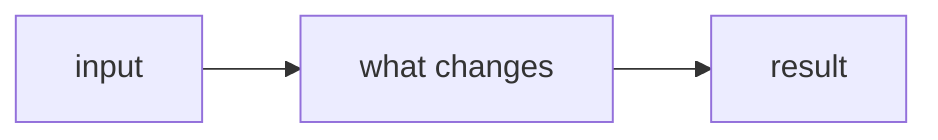

<!-- Backlog item body for `gh issue create --body-file .github/backlog-issue.md` (CONTRIBUTING.md › Backlog).
     The same sections as the backlog item form (.github/ISSUE_TEMPLATE/backlog_item.yml). Fill each table,
     add rows, delete example rows, and delete a diagram or table that doesn't apply.
     Title: type(scope): summary. Labels: type:, area:, priority:. Milestone. Board 6: status, priority, size.
     Sub-issue of a larger item: file it with `gh issue create --parent N` (or Relationships → Add parent),
     start with "Part N of M of #parent" and write "see #parent" in sections it already covers.
     The parent is closed by hand when its last part closes: a PR can't close an issue with open sub-issues.
     A follow-up of a finished item (not a part of it) links it in the text instead: "Follow-up A of #26". -->

## Problem

<!-- What's wrong or missing, and for whom, in one or two sentences. Quote the owner's words when the item comes from a request. -->

| | |
|---|---|
| Who | |
| Today | |
| Should | |

## Evidence

| Fact | Source |
|---|---|
| | <!-- path/file.go:123 (from gopls), a command's output from a real run, or an upstream document you read; nothing from memory --> |

## Solution

<!-- The design and why. The diagram shows the flow the change touches: replace it, or delete it when nothing flows. -->

| Part | Change | Files |
|---|---|---|
| | | |

| Option | For | Against |
|---|---|---|
| **A (chosen)** | | |
| B | | |

## Steps

- [ ] 

## Acceptance criteria

- [ ] <!-- checks that can be tested or observed; the PR quotes each one with its evidence -->

## Out of scope / risks

| Left out | Covered by |
|---|---|
| | |

| Risk | Mitigation |
|---|---|
| | |

## Priority and size

<!-- The reason only when the problem doesn't make it evident: impact, risk, deadline, dependency. -->

| Priority | Size | Milestone | Depends on | Why |
|---|---|---|---|---|
| | | | | |

## Open questions

<!-- Anything you couldn't verify, as a question. Delete the section if there are none. -->

| Question | Who can answer | Blocks |
|---|---|---|
| | | |
