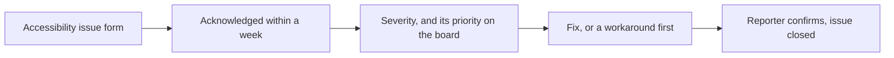

# Accessibility

hwspec should work for everyone who needs to know what's inside their machine, including people who use a screen reader, a braille display, a magnifier or only a keyboard. This file says what works today, what doesn't yet, how to report a barrier, and what every change has to keep working.

| | |
|---|---|
| **Guide** | [WCAG 2.2](https://www.w3.org/TR/WCAG22/) Level AA, applied to software as in [WCAG2ICT](https://www.w3.org/TR/wcag2ict-22/). A target that steers the work, not a claim of tested conformance |
| **Report a barrier** | the [accessibility issue form](https://github.com/jiegui2025/hwspec/issues/new?template=accessibility.yml) ([below](#reporting-a-barrier)) |
| **Response** | within a week |
| **Owner** | the maintainers, currently [@jiegui2025](https://github.com/jiegui2025) |

## The command line today

hwspec is a command-line tool that prints plain text, so it works with the terminal tools you already use: Orca, BRLTTY, Speakup, Fenrir, screen magnifiers.

| Need | What hwspec does | Where |
|---|---|---|
| Output a screen reader or braille display can follow | Plain lines, one fact per line, a label then its value. No colour, no cursor movement, no spinners or progress bars: nothing is redrawn after it's printed | `internal/output`, `internal/advisor` |
| No colour-only meaning | No colour at all. Health is written as a word (`health WARNING`, `health FAILING`) and every problem is listed again, in words, under **Needs attention** at the end | `internal/output/text.go` |
| Clean output from odd hardware | Device names come from the hardware and can contain control characters; they're removed before printing, so a device can't move the cursor or garble what your screen reader speaks | `terminalSafe` and `report.CleanString` |
| Read it your own way | `-f json` or `-f yaml` gives the same data as structured fields, described by a published schema (`hwspec schema`); `-o FILE` saves it to read at your own pace in your editor | `cmd/hwspec` |
| Help | `hwspec help`, `-h` or `--help` prints every command and option, with examples | `cmd/hwspec/main.go` |
| Errors | One line on standard error that starts with `hwspec:` and says what failed; exit status 0 on success, 1 on failure, 2 for a missing or unknown command, so scripts can check the result without reading text | `cmd/hwspec/main.go` |
| No time limits | hwspec itself never asks a question. `--full` asks for your password through your desktop's polkit agent, or on the terminal when there's none; `sudo hwspec capture` works too | `cmd/hwspec/main.go` |

## Known limitations

| Limitation | Effect | Workaround |
|---|---|---|
| Text output uses Unicode symbols: `·` between header items, `–` in ranges (`800–3700 MHz`), `×` in sizes and counts (`32 KiB×6`, `3840×2160`), `→` in `hwspec ids` | depending on its punctuation setting, a screen reader says "middle dot", "en dash", "times" or "right arrow", or skips them, so `32 KiB×6` may read as "32 KiB 6" | `-f json` or `-f yaml` gives each value its own field |
| Text output lines values up in columns with spaces | a braille display or screen reader reads the padding too | `-f yaml` has no padding |
| Mermaid diagrams in the docs render as images | a screen reader can't follow a diagram's arrows | most diagrams have their facts in the text or a table next to them too, but not all yet; older diagrams lack `accTitle` / `accDescr` |
| English only | messages and docs aren't translated | none yet |

If one of these gets in your way, please [report it](#reporting-a-barrier): reports decide what gets fixed first.

## The desktop app (planned, v0.3.0)

The [desktop app](https://github.com/jiegui2025/hwspec/issues/14) is built with GTK 4 and libadwaita, which talk to screen readers through AT-SPI. Before it ships it has to pass its own accessibility check (part I of #14):

| Requirement | Means |
|---|---|
| Every control has an accessible name | GTK's accessible label, or a relation to its visible label |
| Everything works from the keyboard | a logical focus order, a visible focus indicator, no keyboard traps |
| Adaptive layout | usable at 200% text size and on narrow windows |
| Tested with Orca | at least one full pass through capture, review, compare and export |

## Reporting a barrier

Report anything that makes hwspec or its docs harder to use than it should be. You don't need to tell us about a disability or any other personal information; what you were trying to do, and what happened, is enough.

The flow below shows how a report is handled; the table after it says the same in words.

| Step | What happens |
|---|---|
| 1. Open an issue | with the [accessibility issue form](https://github.com/jiegui2025/hwspec/issues/new?template=accessibility.yml): what you were doing, the command or docs page, what happened, your assistive technology and version if you use one, and how badly it affects you |
| 2. Acknowledged | within a week, with the next steps and any workaround we know |
| 3. Prioritised | the severity below sets the item's priority on the [project board](https://github.com/users/jiegui2025/projects/6) |
| 4. Fixed | updates go on the issue whenever the plan changes |
| 5. Closed | we ask you to confirm the fix works for you before closing, if you're willing |

| Severity | Means | Priority |
|---|---|---|
| **Critical** | you can't do a core task at all: capture, read a capture, get advice, share a redacted capture | P1 |
| **Serious** | a core task is much harder, but there's a workaround | P2 |
| **Moderate** | annoying or inconsistent | P3 |
| **Minor** | small effect on use | P3 |

Security problems go through [SECURITY.md](SECURITY.md) instead, and conduct problems through the [Code of Conduct](CODE_OF_CONDUCT.md).

## For contributors

A pull request that changes what hwspec prints, its docs, or the desktop app keeps the points below. Reviewers check them like any other acceptance criterion.

| Change | Keep |
|---|---|
| Text output | meaning in words, never in colour, position or a symbol alone; nothing animated or redrawn. If colour is ever added, only on a terminal, never when `NO_COLOR` is set, and never as the only signal |
| New data | it appears in JSON and YAML too, not only in the text output |
| Error messages | say what failed and what to do next; non-zero exit status |
| Docs | headings in order (no skipped levels); link text that says where it goes, not "here"; alt text on every image; a sentence before every Mermaid diagram saying what it shows, and `accTitle` / `accDescr` in new diagrams; tables with a header row; commands in code blocks |
| Desktop app | the [requirements above](#the-desktop-app-planned-v030), checked with Orca |

## Feedback

Suggestions about this statement or how we work are welcome as an issue or a pull request.
