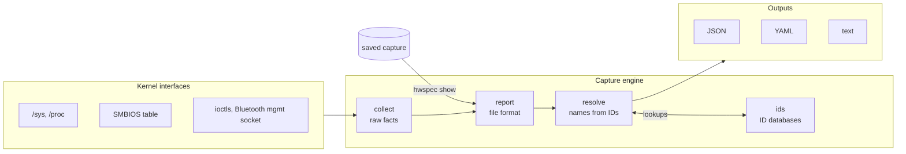
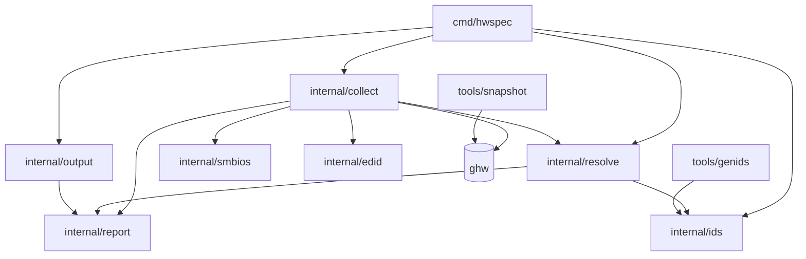
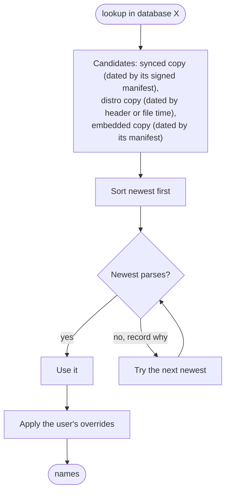

# Architecture

hwspec turns what the Linux kernel knows about a machine into a stable, portable file. This page shows how the code is organised and the rules that keep it that way; the reasons behind each major choice are in the [decision records](docs/adr/).

## Data flow

| Step | Package | Does | Never does |
|---|---|---|---|
| 1 | `collect` | reads raw facts: IDs, sizes, versions, states | names things from databases |
| 2 | `report` | defines the file format; redaction | carries behaviour beyond redaction |
| 3 | `resolve` | fills names from raw IDs, after every capture **and** when a saved capture is shown | changes raw IDs |
| 4 | `ids` | loads ID databases, picks the newest source, applies overrides, signed sync | touches the network outside `ids update` |
| 5 | `output` | writes JSON, YAML, terminal-safe text; reads captures back | accepts files that aren't hwspec captures |

## Packages

| Package | Responsibility | Depends on |
|---|---|---|
| `cmd/hwspec` | CLI parsing, `pkexec` re-run, wiring | everything below |
| `internal/collect` | reading kernel interfaces into a `report.Report` | `report`, `resolve`, `smbios`, `edid`, `ghw` |
| `internal/resolve` | IDs → names on a report | `ids`, `report` |
| `internal/ids` | ID databases, overrides, sync, decoders (JEDEC, OUI, CPU) | standard library only |
| `internal/report` | the file format and redaction | standard library only |
| `internal/output` | serialisation | `report` |
| `internal/smbios`, `internal/edid` | pure parsers for binary tables | standard library only |
| `tools/genids` | build time: upstream sources → signed ID database bundle | `ids` |

## Choosing an ID database source

Future dates are ignored, and a synced copy without a readable manifest isn't used, so no source can pin itself as newest.

## Rules

| Rule | In practice |
|---|---|
| **The file format is a public interface** | additive changes only, unless `schema_version` is bumped with an ADR; raw IDs always stored next to names |
| **Never guess** | unreadable values are omitted, empty or "unknown", never a plausible default; the reason goes in `warnings` |
| **Collectors degrade, they don't fail** | a missing file, permission error or absent subsystem leaves fields empty; only a broken invariant is an error |
| **No external tools in the capture path** | kernel interfaces only, except optional `smartctl` (from root-owned system directories, with a timeout) for SATA health |
| **Captures never touch the network** | only `hwspec ids update` does, and it installs only signed, verified data |
| **Root is opt-in and minimal** | `--full` re-runs a root-owned binary under `pkexec`; the unprivileged parent writes the file and applies the user's overrides |
| **Untrusted text is sanitised** | names from devices, captures and databases lose control characters before reaching a terminal |
| **Parsers are pure** | SMBIOS, EDID, NVMe SMART, Bluetooth management replies and ID files are parsed from bytes and tested without hardware |
| **Testable seams** | collectors read through one root path (fixture trees stand in for machines); syscalls and subprocesses sit behind swappable functions |

## Distribution

| Artifact | How it's built | How it's verified |
|---|---|---|
| Static binaries (amd64, arm64) | `CGO_ENABLED=0`, tag-triggered release workflow | `SHA256SUMS`, build provenance attestation (`gh attestation verify`) |
| Nix flake | `buildGoModule`, pinned nixpkgs | CI builds and runs it on every PR |
| ID databases | embedded in the binary; weekly signed bundle (`ids-latest`) | ed25519 signature checked against a key built into hwspec |

## Planned

| Area | Tracking |
|---|---|
| Advisor: upgrades, firmware, drivers, needs-attention list, maintenance reminders | [#5](https://github.com/jiegui2025/hwspec/issues/5) (design), #6–#11 |
| Continuous deployment with post-deploy verification in VMs | [#22](https://github.com/jiegui2025/hwspec/issues/22) |
| Desktop app | [ADR 0007](docs/adr/0007-desktop-ui.md), #13, #14 |
