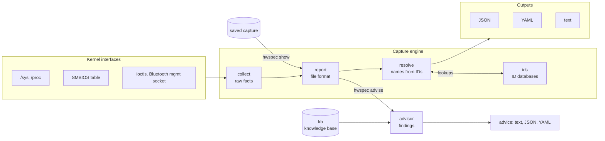
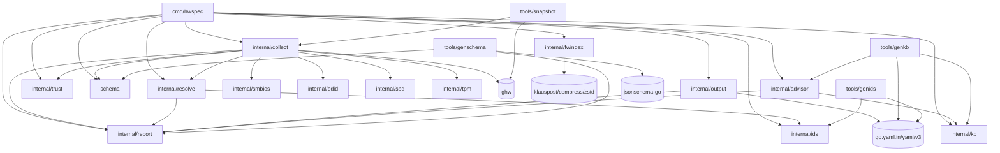

# Architecture

hwspec turns what the Linux kernel knows about a machine into a stable, portable file. This page shows how the code is organised and the rules that keep it that way; the reasons behind each major choice are in the [decision records](docs/adr/).

## Data flow

| Step | Package | Does | Never does |
|---|---|---|---|
| 1 | `collect` | reads raw facts: IDs, sizes, versions, states | names things from databases |
| 2 | `report` | defines the file format; redaction; sanitising untrusted strings | names devices or reads hardware |
| 3 | `resolve` | fills names from raw IDs, after every capture **and** when a saved capture is shown | changes raw IDs |
| 4 | `ids` | loads ID databases, picks the newest source, applies overrides, signed sync | touches the network outside `ids update` |
| 5 | `output` | writes JSON, YAML, terminal-safe text; reads captures back | accepts files that aren't hwspec captures |
| 6 | `advisor` (`hwspec advise`) | applies the knowledge base's rules to a capture: findings with evidence, actions and sources ([ADR 0009](docs/adr/0009-advisor.md)) | reads files, the network or the clock; guesses where the capture lacks a field |

## Packages

The `depguard` rules in [`.golangci.yml`](.golangci.yml) enforce this table in CI (test files excepted).

| Package | Responsibility | Depends on |
|---|---|---|
| `cmd/hwspec` | CLI parsing, `pkexec` re-run, wiring; for `advise`, the maintenance record (read safely, the invoking user's under `sudo`) | everything below |
| `internal/trust` | "can only root change this file?" checks (for `--full` and `smartctl`) | `x/sys/unix` |
| `internal/collect` | reading kernel interfaces into a `report.Report` | `report`, `resolve`, `smbios`, `edid`, `spd`, `tpm`, `trust`, `schema`, `ghw`, `x/sys/unix` |
| `internal/resolve` | IDs → names on a report | `ids`, `report` |
| `internal/ids` | ID databases, overrides, sync, decoders (JEDEC, OUI, CPU) | standard library only |
| `internal/report` | the file format, redaction, sanitising | standard library only |
| `schema` | the file format's JSON Schema (`capture-vN.json`, embedded) and its URL | standard library only |
| `internal/output` | serialisation | `report`, `go.yaml.in/yaml/v3` (the maintained fork of `gopkg.in/yaml.v3`, which is archived) |
| `internal/advisor` | turns a capture into advice: checks registered by name, findings, text rendering ([ADR 0009](docs/adr/0009-advisor.md)); pure | `report`, `kb` |
| `internal/kb` | the advisor knowledge base: sources, rules, validation, the embedded copy; pure | standard library only |
| `internal/fwindex` | the firmware index `hwspec firmware update` keeps ([ADR 0012](docs/adr/0012-firmware-index.md)): LVFS's catalogue verified against the built-in LVFS CA (jcat, CMS), linux-firmware's WHENCE, the cache; only `fetch.go` reaches the network | `github.com/klauspost/compress/zstd` |
| `internal/smbios`, `internal/edid`, `internal/spd` | pure parsers for binary tables (SMBIOS, monitor EDID, RAM module SPD) | standard library only |
| `internal/tpm` | the one TPM 2.0 command hwspec sends (GetCapability, under `--full`) and its reply; pure | standard library only |
| `tools/genids` | build time: upstream sources → signed ID database bundle | `ids`, `go.yaml.in/yaml/v3` |
| `tools/genkb` | build time: `kb/**/*.yaml` → `internal/kb/data/advisor-v1.json.gz`, validated | `kb`, `advisor`, `go.yaml.in/yaml/v3` |
| `tools/snapshot` | development: records a machine as a scrubbed test fixture (`internal/collect/testdata/machines`) | `collect`, `ghw` |
| `tools/genschema` | build time: `report` structs → `schema/capture-vN.json`; CI: the compatibility check | `report`, `schema`, `jsonschema-go` (never linked into `hwspec`) |
| `internal/smbios/smbiostest` | tests only: builds SMBIOS tables | standard library only |

## Choosing an ID database source

| Source | Guard against pinning itself as "newest" |
|---|---|
| Distro copy | a future header date is ignored; a future file time ranks it oldest; a file with fewer entries than the database's minimum (truncated, trimmed) is skipped, with the reason in `hwspec ids` |
| Synced copy | dated only by its signed manifest; unused if the manifest is unreadable; CI refuses future dates before signing; skipped below the minimum entry count too |
| Embedded copy | dated by its manifest, checked by `genids verify` at build time |

## Rules

| Rule | In practice | Enforced by |
|---|---|---|
| **The file format is a public interface** | additive changes only, unless `schema_version` is bumped with an ADR (CI compares the JSON Schema with the base's); raw IDs always stored next to names | CI step "The capture and advice formats stay compatible" (`genschema check`, each format apart); `TestCommittedSchemaIsCurrent` (each schema matches its types); `TestAdviceValidatesAgainstItsSchema`; review for changes in meaning (PR template checkbox) |
| **Never guess** | unreadable values are omitted, empty or "unknown", never a plausible default; the reason goes in `warnings` | review; `TestIdenticalModulesAreNotGuessed`, `TestUnreadableSMBIOSIsReported`, the recorded machines' `expected.json` |
| **Collectors degrade, they don't fail** | a missing file, permission error or absent subsystem leaves fields empty; only a broken invariant is an error | `TestBareSystemReportsWhatIsMissing`, the scenario tests |
| **No external tools in the capture path** | kernel interfaces only, except optional `smartctl` (from root-owned system directories, with a timeout) for SATA health | depguard `no-subprocesses` (`os/exec` only in `collect/health.go` and the CLI); `TestCapturesRunNoProgramButSmartctl`, `TestSmartctlIsOnlyTakenFromRootOwnedPlaces` |
| **Captures never touch the network** | only `hwspec ids update` and `hwspec firmware update` ([ADR 0012](docs/adr/0012-firmware-index.md), from #10 part 2) do, and each installs only signed, verified data; `capture` and `advise` never do | depguard `no-network` (`net` only in `ids/sync.go` and `fwindex/fetch.go`) and `collect`; `TestCapturesNeverTouchTheNetwork` (watches `http.DefaultTransport`) with `TestRequestsOnlyGoThroughTheDefaultTransport` in `ids` and `fwindex` (no other way out; the check is `internal/netrule`) and `TestCollectSendsNoPackets` (`collect`'s sockets only talk to the kernel); CI's distro runs use `--network=none` |
| **Root is opt-in and minimal** | `--full` re-runs a root-owned binary under `pkexec`; the unprivileged parent writes the file and applies the user's overrides | `TestFullCaptureElevatesOnlyARootOwnedBinary`, `TestFullCaptureRunsTheRootChildThroughPkexec`, `TestWritableOrMissingFilesAreNotTrusted` |
| **Untrusted text is sanitised** | names from devices, captures and databases lose control characters before reaching a terminal | `TestSanitizeCleansEveryStringInTheReport`, `TestSanitizeEntersEveryMap` (any map's keys and values), `TestNamesNeverCarryControlCharacters`, `TestTextOutputIsTerminalSafe` |
| **Shared captures carry no identifiers** | `--redact` clears what ties a capture to one machine or person (serials, UUIDs, MAC and Bluetooth addresses, hostname, personal paths and labels) and keeps manufacture dates to the month; every string field is classified as kept, redacted or month in `internal/report/testdata/redaction.txt` | `TestRedactionClassifiesEveryString` (a new string field fails until it's classified, and Redact must do what the file says) |
| **Parsers are pure** | SMBIOS, EDID, NVMe SMART, Bluetooth management replies and ID files are parsed from bytes and tested without hardware | depguard `stdlib-only` and `parsers-are-pure` (no `os`, `io/ioutil`, `net`, `syscall`, `unsafe`) and forbidigo (no `time.Now`, no file-system walks) for SMBIOS, EDID, SPD, the knowledge base and the advisor; byte-level tests for the parsers that live in `collect` and `ids`: `TestNVMeWarningBitsAndEndurance`, `TestNVMeCountersSaturate`, `TestSmartctlVerdictsAndEndurance`, `TestBluetoothManagementReplies`, `TestMalformedIDsAreRejectedWithAReason`, `TestJEDECCodeShapes` |
| **Testable seams** | collectors read every file through one root path, and syscalls/subprocesses sit behind swappable functions (saved and restored together, captures serialised). `collect.CollectRecorded` replays a machine recorded by `tools/snapshot`: its files, its answers to calls, its empty directories and unreadable files | `TestRecordedMachines`, `TestCollectRecordedRefusesBrokenRecordings`, `TestSaveHooksCoversEverySeam` (every function-valued package variable in `collect` is saved and restored by `saveHooks`) |

## Distribution

| Artifact | How it's built | How it's verified |
|---|---|---|
| Static binaries (amd64, arm64) | `CGO_ENABLED=0`, reproducible tarballs; `v*` tags publish after the owner approves the `production` environment, and each merge to `main` that passes CI replaces the `edge` pre-release | `SHA256SUMS` and build provenance attestations (`gh attestation verify`); after each publish, `verify.yml` re-checks them and runs the published binaries in containers (amd64, arm64): for releases it also proves tampered copies fail and runs every distro and the systemd, OpenRC and sysvinit VMs (amd64); an edge publish runs one container per architecture, since its tree passed every distro and the VM paths in CI (nightly for the rest) ([Edge builds and verification](CONTRIBUTING.md#edge-builds-and-verification)) |
| Nix flake | `buildGoModule`, pinned nixpkgs | CI builds and runs it on PRs that change the flake, Go code or CI |
| ID databases | embedded in the binary; weekly signed bundle (`ids-latest`) | ed25519 signature checked against a key built into hwspec |

## Planned

The ranked plan is the [roadmap](README.md#roadmap); these items change the architecture:

| Area | Tracking |
|---|---|
| Advisor: a knowledge base and rules that turn a capture into advice (drivers, firmware, upgrades, maintenance) | [ADR 0009](docs/adr/0009-advisor.md) ([#5](https://github.com/jiegui2025/hwspec/issues/5)); [#7](https://github.com/jiegui2025/hwspec/issues/7)–[#11](https://github.com/jiegui2025/hwspec/issues/11), [#25](https://github.com/jiegui2025/hwspec/issues/25) build it |
| Desktop app | [ADR 0007](docs/adr/0007-desktop-ui.md), [#13](https://github.com/jiegui2025/hwspec/issues/13), [#14](https://github.com/jiegui2025/hwspec/issues/14) |
| Feature parity with Defenestra Chassis: what hwspec adds (sensors-only captures, GPU clocks, device roles, PCI IRQs and resources), leaves to the app, or rules out (a root daemon) | [#26](https://github.com/jiegui2025/hwspec/issues/26) (the comparison and the owner's decisions); [#87](https://github.com/jiegui2025/hwspec/issues/87)–[#91](https://github.com/jiegui2025/hwspec/issues/91) build it; [#90](https://github.com/jiegui2025/hwspec/issues/90) asks for an ADR before D-Bus sources |
