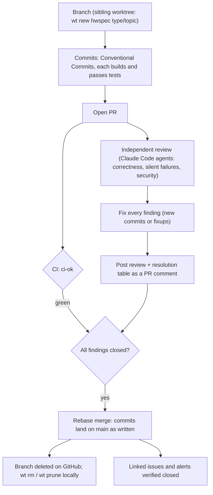
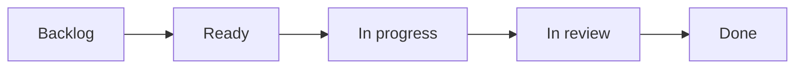
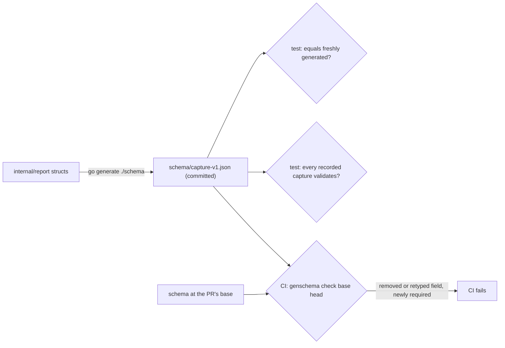
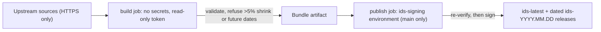
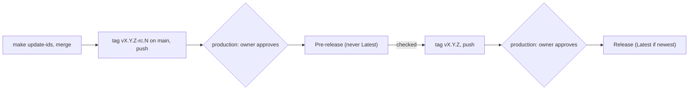
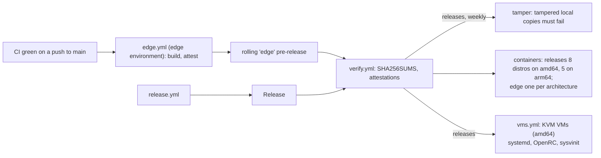

# Contributing to hwspec

Thanks for helping. Bug reports with a `hwspec capture --redact` attached, hardware we don't detect yet, name corrections and accessibility barriers are all valuable.

Everyone taking part follows the [Code of Conduct](CODE_OF_CONDUCT.md); report a problem privately to GitHub Support, as it [describes](CODE_OF_CONDUCT.md#reporting-an-issue), since this repository has no private channel to its maintainers. Changes to what hwspec prints, its docs or the desktop app keep the [accessibility checklist](ACCESSIBILITY.md#for-contributors).

## Development

Go 1.26 or newer. Everything runs without root; collectors that need root are tested against fixture trees.

**Go version policy:** hwspec supports the Go releases the Go team supports (the latest two). `go.mod`'s `go` line is the older of the two, CI tests both, and it moves up when a new Go release ships or a dependency requires it. Update `go.mod` and the `test` matrix in `.github/workflows/ci.yml` together. Release binaries are static, so this only matters when building from source.

```sh
make build    # build/hwspec, static
make test     # go vet + tests
make lint     # golangci-lint (same version and config as CI)
make cover    # tests with coverage, and the coverage gate
```

Read [ARCHITECTURE.md](ARCHITECTURE.md) before larger changes. Design decisions are recorded in [docs/adr/](docs/adr/); a change that alters one needs a new ADR, started from [the template](docs/adr/template.md).

## Pull requests

Every change reaches `main` through this flow; the `main` ruleset enforces the PR, the `ci-ok` check and rebase merging.



| Rule | Why |
|---|---|
| **Rebase merges only** | History keeps each logical change; `git bisect` works per commit |
| **Every commit** follows [Conventional Commits](https://www.conventionalcommits.org/) (`type(scope): summary`) | Each lands on `main` and in the release notes; CI's `commits` job checks them |
| **Every commit builds and passes tests** | Bisectability; fold fixes into the commit they fix (`git commit --fixup`, then `git rebase -i --autosquash`) |
| **Independent review before merge**, all findings fixed, review posted on the PR | A second pair of eyes with no context bias; the record stays with the change |
| **One feature or fix per PR** | Reviewable size |
| **The PR body follows the [template](.github/pull_request_template.md)** | Reviewers find the acceptance evidence and the proof that tests fail without the change in one place |
| **The sidebar is complete and the PR closes its issue** (below) | Merging closes the right issue and keeps the board true |
| **No rebase just because `main` moved** | The `main` ruleset doesn't require an up-to-date branch (owner, 2026-10-06): a PR with a green `ci-ok` and no conflict merges as it is. A merged tree that differs from its PR head gets `main`'s full CI, and edge publishes only when that is green; if `main` goes red, two PRs clashed: fix or revert before merging anything else. Rebase for a conflict; to refresh a PR against `main` without one, GitHub's GraphQL `updatePullRequestBranch` with `updateMethod: REBASE` does it server-side (the REST `update-branch` endpoint merges instead, and a merge commit fails the `commits` check) |
| **Critical or large changes need two more things** (below) | The checks that matter most where a mistake costs most |

### Critical and large changes

Most PRs merge on `ci-ok` and the review. A PR that is **critical** or **large** also needs a clean [CodeQL](https://github.com/jiegui2025/hwspec/security/code-scanning) analysis of its head, and its privileged workflows must pin every action by full commit SHA (owner, 2026-10-06). CodeQL runs on every PR anyway; for the others its result is advisory.

| A PR is | When it changes |
|---|---|
| **critical** | the privileged path: `cmd/hwspec` (the pkexec re-run, writing files as root), `internal/trust`; untrusted input: the binary parsers (`internal/smbios`, `internal/edid`, `internal/spd`), reading captures (`internal/output`), sanitising and redaction (`internal/report/{sanitize,redact}.go`), the knowledge base (`internal/kb`); the signed bundle (`internal/ids` sync, manifest, keys; `tools/genids`); release and signing (`release.yml`, `edge.yml`, `ids.yml`, `verify.yml`, `scripts/verify-release*.sh`); or `SECURITY.md`'s claims |
| **large** | more than 500 lines outside tests, test data and generated files (`schema/`, `internal/ids/data/`, `internal/kb/data/`) |

| Extra condition | How it's checked |
|---|---|
| CodeQL found nothing new on the PR head | the reviewer, before merging: the CodeQL checks on the head are green and code scanning shows no open alert for the PR |
| Actions pinned by full SHA in the privileged workflows | automatically: [`scripts/check-pinned-actions.sh`](scripts/check-pinned-actions.sh) in the `actionlint` job, for every workflow that has a write permission, a secret or an environment, and for every reusable workflow and local action (they run with their caller's token) |

### Commits

Set the template once: `git config commit.template .github/commit-template.txt`. CI's `commits` job ([`scripts/check-commits.sh`](scripts/check-commits.sh)) checks every commit in the PR:

| Part | Rule | Checked |
|---|---|---|
| Subject | `type(scope): summary`, at most 72 characters in all (100 for Dependabot, which writes its own), no full stop | ✅ error |
| Mood | imperative: "add", not "added", "adds" or "the …" | partly: a word list catches articles and past or third-person verbs, not noun phrases |
| Types | `feat`, `fix`, `docs`, `test`, `refactor`, `perf`, `build`, `ci`, `chore`, `style`, `revert`; `fix` is a bug users see (a CI bug is `ci`, a test-only change `test`); a revert is `revert: <the reverted subject>`, not git's `Revert "…"` | ✅ error |
| Scope | the package or area: `cli`, `collect`, `report`, `output`, `ids`, `genids`, `advisor`, `kb`, … `release`, `edge`, `vm`, `readme`, `contributing`, `adr` ([template](.github/commit-template.txt)) | review |
| Body | blank line 2; *why* (what was wrong, with evidence), *what* (as behaviour), *proof* (the test, and that it fails without the change); wrapped at 72; required for `feat`, `fix`, `refactor`, `perf` | ✅ error; wrap: warning |
| Footers | `Refs #N` or `Fixes #N`, one issue per line (GitHub closes only the first of `Fixes #1, #2`); `BREAKING CHANGE: …` with `type!`; `Co-Authored-By:` | ✅ `!` needs the footer; a closing keyword anywhere else (any case, with or without a colon): warning |
| Fixup, squash, WIP | folded in before merging | ✅ error |

### Sidebar and linked issues

Before merging, a PR's sidebar matches its tracking issue, so the merge closes the issue and the board stays right:

| Field | Value |
|---|---|
| Development | the issue, through `Fixes #N` on its own line after the body's sections, one line per issue (an attribution line may follow). Check with `gh pr view N --json closingIssuesReferences`: it must list exactly the intended issues |
| Labels | the issue's `type:`, `area:` and `priority:` labels, plus `type: devops` when the PR changes `.github/` or CI; `status:` and `good first issue` stay on the issue |
| Milestone | the issue's |
| Assignee | whoever drives the PR (the owner, for PRs Claude sessions open) |
| Reviewers | automatic: `.github/CODEOWNERS` requests the owner on every PR they didn't open. GitHub can't request a review from a PR's author, and Claude sessions open PRs as the owner, so those PRs are gated by draft → ready and the independent review instead |
| Projects | board 6, *In review* (by hand until [#53](https://github.com/jiegui2025/hwspec/issues/53)) |

| Pitfall | Avoid it |
|---|---|
| An issue needs several PRs | split it into [sub-issues](https://docs.github.com/en/issues/tracking-your-work-with-issues/using-issues/adding-sub-issues) (`gh issue create --parent N`), one per PR: each PR says `Fixes #<sub-issue>` and `Refs #<parent>`. Close the parent **by hand** when its last sub-issue closes, with a comment listing the PRs: GitHub doesn't link a closing keyword to an issue with open sub-issues (seen on #26 and #92, [#93](https://github.com/jiegui2025/hwspec/issues/93)) |
| A closing keyword in prose | GitHub links *fix*, *close* or *resolve* (any form) followed by `#N` anywhere in the body, tables included, and closes that issue on merge (#40, #47, #78). Write `Refs #N` or reword |

### Review comments

The independent review is posted as one comment per round: *Review* (`| # | Severity | Where | Finding | Fix |`), then the author's *Resolutions* (`| # | Resolution |`), then the reviewer's re-verification. Severities: **blocking** (the PR goes back to draft), important, minor; every row is fixed or explicitly accepted with the reason, and every review thread on the PR is resolved before merging (the `main` ruleset requires it).

### What CI runs

CI runs only what a change needs ([`scripts/changed-areas.sh`](scripts/changed-areas.sh)): every required check runs when the change can affect what it checks (#189). `ci-ok` is the single required check, and skipped jobs count as passed. Every job has a timeout, so a hang fails in minutes rather than holding the check for hours.

| The PR changes | Jobs |
|---|---|
| Go code, `go.mod`/`go.sum`, embedded data, lint config, Makefile | lint, tests (race and coverage gate on stable Go; plain on the oldest supported Go), govulncheck, static builds, 8-distro smoke tests (one job, in parallel), Nix |
| …code the VM checks exercise: `cmd/hwspec`, `internal/trust`, the system, platform, PCI and firmware collectors and their shared reads (`internal/collect/{collect,system,platform,pci,firmwaretables,sysfs}.go`), `go.mod`/`go.sum`, `vendor/` | the above, plus the 7 VMs (tests alone don't boot them) |
| `flake.nix` / `flake.lock` only | Nix |
| the VM harness (`scripts/vm-*.sh`, `vms.yml`) | static builds, the 7 VMs, actionlint |
| `verify.yml` or `scripts/verify-release*.sh` | the tamper test against the live `edge` release (`verify-release`), actionlint |
| CI's own definition: `ci.yml`, `.github/actions/**`, `scripts/changed-areas*.sh` | everything, plus actionlint and the scripts' own tests |
| any other workflow, `.github/actionlint.yaml` or CI script | actionlint and the scripts' own tests (and, for the docs scripts, the docs checks) |
| Markdown | Mermaid rendering check for the files whose diagrams the PR touched ([`scripts/changed-diagrams.sh`](scripts/changed-diagrams.sh); a prose edit renders nothing; every file when the renderer or its image changes), ADR index check (every `docs/adr` record is listed) |
| anything | commit messages, PR title |

Pushes to `main` run everything except the VMs and the tamper test: the VMs boot nightly and for releases, the tamper test weekly and for releases (`verify.yml`). **Every night, and by hand from the Actions tab, CI runs everything but the tamper test, VMs included**: the backstop for checks a PR skipped because its paths couldn't affect them, and for drift no commit causes (Go `stable`, `:latest` distro images, the runner image, new vulnerability advisories). A nightly failure blocks nothing and is reported to the owner; fix it in a PR like any other. A push whose tree is exactly the head of the merged PR it came from, whose CI run passed (this workflow's own `ci-ok`, not a check of that name from another app), runs only `changes` and `ci-ok`: that tree was just tested. When `main` moved while the PR was open, the merged tree differs from the head, so the push runs in full and catches a clash between the two.

Jobs run on a pinned runner image, `ubuntu-24.04`, so the CI environment changes only when we choose. The [Canary workflow](.github/workflows/canary.yml) runs the tests on the next image (`ubuntu-26.04`) daily, and by hand from the Actions tab, to show breakage early; it never blocks a PR, and moving to the new image is its own PR.

## Backlog

Work is tracked as issues on the [project board](https://github.com/users/jiegui2025/projects/6); the [roadmap](README.md#roadmap) shows the milestones. Every issue is **backed by evidence and carries its full solution**, so anyone can pick it up without re-researching it.



Once [#53](https://github.com/jiegui2025/hwspec/issues/53) lands, new issues and PRs join the board automatically, a PR that closes an issue moves it to In review, and merging moves both to Done. Until then, add PRs and move statuses by hand.

| An issue has | What it means |
|---|---|
| **Problem** | what's wrong or missing, for whom |
| **Evidence** | a table of facts, each with its source: `path/file.go:123`, output of a real run, or an upstream document that was actually read; nothing from memory |
| **Solution** | the design and why, the packages and files it touches, a Mermaid diagram where it helps |
| **Steps** and **Acceptance criteria** | small concrete tasks; checks that can be tested or observed |
| **Out of scope / risks** | what the item deliberately leaves out (with the issue that covers it), and what could go wrong |
| **Priority and size** | a `priority:` label and a board size on every item; the reason in the issue when the problem doesn't make it evident |
| **Open questions** | anything that couldn't be verified, stated as a question, never as a fact |

An item one PR can't deliver is split into sub-issues of it (`gh issue create --parent N --body-file .github/backlog-issue.md`), one per PR, each with its own acceptance criteria ("Part 2 of 3 of #5"); sections the parent already covers say "see #parent". The parent is closed by hand once all its parts are. Work a finished item *leads to* (follow-ups, not parts) is linked in the text ("Follow-up A of #26"), not as a sub-issue, so the item's own PR can still close it.

| Field | Values |
|---|---|
| Priority | **P0** broken for users, now · **P1** next up (release blockers, deadlines) · **P2** planned · **P3** nice to have |
| Size | **XS** < 1 hour · **S** ≤ ½ day · **M** 1–2 days · **L** 3–5 days · **XL** > 1 week (split it) |
| Milestone | the release it ships in; none means unscheduled |
| Labels | `type: …`, `area: …`, `priority: P0`–`priority: P3`; `status: triage` until refined; `status: blocked`, `status: needs decision`, `status: deferred` where they apply |
| Title | `type(scope): summary` with the commit types above, plus `research` and `data` for issues; their PRs use `docs(adr)` for research and `fix(ids)` / `feat(ids)` for data |

Reports from the bug, feature and name-correction forms are triaged into this shape. Maintainers file new items with the [backlog item form](.github/ISSUE_TEMPLATE/backlog_item.yml) in the browser, or from the command line with the same sections: `gh issue create --body-file .github/backlog-issue.md` ([body](.github/backlog-issue.md)).

Every template (issue forms, the backlog body, the [PR template](.github/pull_request_template.md), the [ADR template](docs/adr/template.md)) opens with its tables and, where something flows, a Mermaid skeleton: fill the rows, delete the examples and anything that doesn't apply. The exceptions are deliberate: the accessibility form keeps plain fields, since editing a table in a text box is hard with a screen reader, and the commit template is plain text, since git doesn't render Markdown.

## Tests

Tests describe **behaviour**, not lines: "a laptop whose battery holds 80% of its design capacity reports 80% health", not "call `batteries()`". Collectors are tested three ways:

| How | Where | When to add one |
|---|---|---|
| Recorded machines | `internal/collect/testdata/machines/<name>/` (record with `go run ./tools/snapshot internal/collect/testdata/machines/<name>/root`, then add facts in `machines_facts_test.go` and run `go test ./internal/collect -run RecordedMachines -update`) | new hardware you own; review the recording, `TestRecordingsHoldNoIdentifiers` checks it too |
| Synthetic machines | `internal/collect/scenarios_test.go` | hardware you can describe but not record (root-only data, other architectures) |
| Real kernel | `internal/collect/kernel_test.go` | thin wrappers around syscalls |

Tests whose coverage depends on the machine's hardware call `hostTest(t)`; CI's coverage run sets `HWSPEC_SKIP_HOST_TESTS=1` so the gate measures the same code everywhere, and runs them in a separate step. CI fails below the coverage threshold in `.github/workflows/ci.yml`.

## File format

The capture format is a public interface. Adding fields is fine; renaming, removing or changing the meaning of a field needs a `schema_version` bump and an ADR.



| When you | Do |
|---|---|
| change a struct or `json` tag in `internal/report` | run `go generate ./schema` and commit `schema/capture-v1.json` (the drift test fails until you do) |
| add a field | nothing else: the schema allows unknown fields, so older v1 readers keep working |
| rename, remove or retype a field | that's a new format: bump `report.SchemaVersion` to N, add `schema/capture-vN.json` (point `schema.URL` and the embed at it), and write an ADR. Older `capture-v*.json` files are frozen from then on |

The CI step ("The capture format stays compatible") runs `go run ./tools/genschema check BASE/schema schema`. Within a version only two changes pass: an added property and a dropped requirement. Everything else fails: a removed property, a changed type set (a field that may now be `null` included), a newly required property, any other keyword added, removed or changed (`minimum`, `enum`, `format`, …, known or not), and any change to an older `capture-vN.json`. "Changes meaning" can't be seen in a schema: that stays a review item ([ADR 0003](docs/adr/0003-capture-format.md), amendment).

## Dependencies

Dependabot opens weekly update PRs; they follow the same flow (review, then rebase merge).

| Update | Extra step |
|---|---|
| Go module | The Nix `vendorHash` changes: the `nix` check fails and prints `got: sha256-…`. Put it in `flake.nix` **in the same commit** as the update, so every commit builds. |
| Go module requiring a newer Go | Raise `go.mod` and the CI `test` matrix together (see the Go version policy). |
| GitHub Action | Actions are pinned by commit SHA with the version in a comment; Dependabot updates both. |

## ID databases

`make update-ids` refreshes the copies embedded in the binary (do this before a release). The weekly [ids workflow](.github/workflows/ids.yml) publishes the signed bundle that `hwspec ids update` installs:



| Item | Where |
|---|---|
| Signing key (private) | `HWSPEC_IDS_SIGNING_KEY` secret in the `ids-signing` environment, usable only from `main` |
| Public key | `internal/ids/key.go` (`SigningPublicKey`), trusted through `trustedKeys` in `internal/ids/manifest.go` |
| Key rotation | add the new public key to `trustedKeys`, release, then replace the environment secret; remove the old key in a later release |
| Expected shrink of a database | after checking the upstream change, run the ids workflow by hand (Actions → ID databases → Run workflow) with **allow_shrink** ticked; scheduled runs never allow it |
| The advisor knowledge base | the bundle also carries every committed `internal/kb/data/advisor-v*.json.gz`, as committed (CI checks it against `kb/`), dated by its `version` (the UTC time its content last changed) and counted by its rules. Before signing, the publish job checks it is the committed file byte for byte. A week where neither it nor upstream changed publishes nothing. `hwspec ids update` installs the format this build reads, with the same signature checks, if its version and rule count are the manifest's; `hwspec advise` uses the newer of it and the built-in copy and falls back to the built-in one, with a warning, if the synced copy doesn't parse or doesn't match the manifest. A rule count more than 5% below the previous bundle's needs the **allow_shrink** input, as for a database |

## Releases



| Step | Detail |
|---|---|
| Refresh the ID databases | `make update-ids`, then merge through a PR |
| Release candidate first | tag `vX.Y.Z-rc.N` on `main`; tags with a `-` publish as **pre-releases**, never as Latest |
| Checks before approval | a `checks` job without write permissions refuses a tag that isn't on `main`, or whose commit has no passing `ci-ok`, and runs govulncheck. Tag after `main`'s CI run for that commit has finished: a tag pushed earlier fails `checks` (safe; re-run the job once `ci-ok` is green). The release job then builds, signs and publishes without running the tests, which CI ran on that commit, and without keeping git credentials |
| Approve | the release job runs in the `production` environment: it waits until the owner approves it in the run's page; only `v*` tags may deploy there |
| Live-ISO check | before the final tag, boot the MX Linux 25.x live ISO with sysvinit and the Linux Mint 22.x live ISO, run the candidate's binary (`hwspec capture -f json`, and `--full`), and attach both captures to the release issue: neither distro has an image CI can boot unattended |
| Final release | tag `vX.Y.Z` on the same commit once the candidate checks out; GitHub marks it Latest when it's the newest version, so a patch to an older line doesn't take Latest |
| What's published | `hwspec-vX.Y.Z-linux-{amd64,arm64}.tar.gz` (binary, LICENSE, README), `SHA256SUMS`, provenance attestations |
| Reproducible | byte-identical tarballs from a git checkout of the tag, with the release job's Go, GNU tar and gzip: [Reproduce a release](#reproduce-a-release) |

Tags can't be moved or deleted (ruleset *Protect release tags*), so a bad candidate is replaced by the next `-rc.N`.

### Reproduce a release

`make release` packs deterministically (GNU tar, sorted entries, owner 0, the commit time as every mtime, `gzip -n`), so anyone can rebuild a release and compare it with the published `SHA256SUMS`. Releases only: `edge` builds don't log their toolchain.

| A rebuild needs | Why | Otherwise |
|---|---|---|
| a git checkout of the tag, and `git` in the build environment | Go stamps the module version, `vcs.revision`, `vcs.time` and `vcs.modified` into the binary from git, and the Makefile takes `SOURCE_DATE_EPOCH` (every file's mtime) from `git log` | a build from `git archive`, a source tarball, or an image without `git` (such as `golang:*-alpine`) differs, silently |
| only that tag fetched | Go stamps the highest version tag on the commit, and a final release is tagged on its candidate's commit | `git clone --branch v0.1.0-rc.1` also fetches `v0.1.0`, and the rebuild says `v0.1.0` |
| the job's Go, GNU tar and gzip | the release job's *Toolchain* step prints all three | a different Go gives a different binary. The official `golang` image's tar and gzip reproduced `v0.1.0-rc.1` |

With podman (docker works the same, without `:Z`), where `1.27.1` is the job's `go version` without the `go` prefix:

```sh
git init -q hwspec-vX.Y.Z && cd hwspec-vX.Y.Z
git fetch -q --no-tags --depth=1 https://github.com/jiegui2025/hwspec.git +refs/tags/vX.Y.Z:refs/tags/vX.Y.Z
git checkout -q vX.Y.Z
podman run --rm -v "$PWD:/src:Z" -w /src docker.io/library/golang:1.27.1 \
  sh -c 'git config --global --add safe.directory /src && make -s release VERSION=vX.Y.Z'
gh release download vX.Y.Z -R jiegui2025/hwspec -p SHA256SUMS -O - | diff - build/SHA256SUMS
```

No output from `diff` means the published tarballs were built from this tag. Who built them is a separate check: their attestations ([Verifying downloads](SECURITY.md#verifying-downloads)).

### Edge builds and verification



| Workflow | Does |
|---|---|
| `edge.yml` | after CI passes on `main`: builds that commit, attests it, and replaces the `edge` pre-release (never Latest) |
| `verify.yml` | after every publish: downloads the assets as a user would, checks `SHA256SUMS`, checks each tarball's attestation was signed by this repository's `release.yml` (or `edge.yml`) for that tag (or `main`) on a GitHub-hosted runner. **Releases** (and any run by hand) then get everything: tampered local copies of the assets must fail the same checks, the published binary runs in every distro container on amd64 and arm64 runners, and in the VMs. **Edge publishes** run the binary in one container per architecture (Ubuntu): their tree already ran in all 8 distros in its PR, and the VMs in its PR or the nightly run (#190). **Weekly**, the tamper test runs against the live `edge` release, since the verifier can drift with `gh` and the attestation service. |
| `vms.yml` | boots each pinned cloud image below under KVM and runs `scripts/vm-run.sh` on it. Also runs in CI, with the binary just built, when a PR changes Go code, the VM harness (`scripts/vm-*.sh`, `vms.yml`) or CI itself. |
| `vm-images.yml` | weekly: every pinned image URL still exists, and `vms.yml`'s matrix matches `scripts/vm-run.sh --list` |

The VMs boot under UEFI (q35, OVMF). `scripts/vm-run.sh` passes the binary to the guest on the cloud-init seed disk, and `scripts/vm-check.sh` runs it there. Results come back on a second serial port, and the host checks them:

| Image | Init (`os.init`) | PID 1 must be | How the check starts |
|---|---|---|---|
| Ubuntu 24.04, Ubuntu 26.04, Debian 13, Fedora 44, Arch | systemd (`systemd`) | `…/systemd`, with `/run/systemd/system` | cloud-init `runcmd` |
| Alpine 3.24 | OpenRC under busybox init (`init`) | `/bin/busybox`, no `/run/systemd/system` | cloud-init `runcmd` |
| Debian 13, switched to `sysvinit-core` | sysvinit (`init`) | `…/sbin/init`, no `/run/systemd/system`, `INIT: version` on the console | boot 1 (with network): cloud-init swaps the init system and installs an init script; boot 2: that script runs the check |

hwspec always runs with no way out, and each VM asserts it: the check fails if the guest has a default route. Boots that install packages reach the outside world for apt: boot 1 of the sysvinit image, and `debian-13`, which installs pkexec and then takes its links down before the check. Every other boot has an isolated NIC (QEMU `restrict=on,ipv6=off`): DHCP works, there is no route out, and nothing leaves the VM. Without `ipv6=off`, QEMU's router advertisement still gives the guest an IPv6 default route.

| Check | As |
|---|---|
| `hwspec version` is the expected version: the release (or `edge-<commit>`) in `verify.yml`, `ci-<commit>` in CI | user (`tester`, created in the guest) |
| `capture -f json`: schema 1, `virtualization` `vm`, `boot_mode` `uefi`, the image's `os.init`, memory, every PCI device named, not privileged | user |
| `capture --full`: exits 0, `privileged` | root |
| `capture --full` through pkexec, no login session (a test polkit rule grants `tester` where polkit runs): the outcome each image expects in `scripts/vm-run.sh`. Debian 13 installs `pkexec` first and must get a privileged capture; the others have no pkexec (the cloud images ship none, and sysvinit-core removes polkitd, which needs a logind) and must stop with hwspec's own explanation. A hang, a crash or a different outcome fails | user |

- **Run one locally:** `scripts/vm-run.sh debian-13-sysvinit ./hwspec [VERSION]`.
  - Needs `/dev/kvm`, QEMU, OVMF and genisoimage.
  - The firmware defaults to Ubuntu's `ovmf` paths. Elsewhere, set `OVMF_CODE` and `OVMF_VARS` (Arch's `edk2-ovmf`: `/usr/share/edk2/x64/OVMF_CODE.4m.fd` and `OVMF_VARS.4m.fd`).
  - Logs and captures go to `vm-out/`.
- **Refreshing an image:** the images are pinned by URL and checksum in `scripts/vm-run.sh`'s `pin`. When `vm-images.yml` reports one gone (or to move on):
  1. Take a dated URL from the distro's image directory.
  2. Take its checksum from the distro's signed `SHA256SUMS`/`SHA512SUMS`/`CHECKSUM` file.
  3. Run that image locally.
  4. Commit as `ci(vm): …`.

- `verify.yml` runs after publishing, so it **detects** a bad release rather than preventing it. Failures name their kind:
  - `FAIL (checksums)` or `FAIL (attestation)`: the release is wrong. Fix it, then delete or supersede that release.
  - `FAIL (error)`: anything that isn't gh's definite "no" (no attestation for the digest, or one from another commit, ref or signer). It means the check couldn't run: auth, rate limit, outage, no network, or a gh message not seen before. That says nothing about the release: fix the cause and re-run.
- The checksum and attestation checks live in `scripts/verify-release.sh`. `scripts/verify-release_test.sh TAG REPO [COMMIT]` proves they catch tampering, on local copies of a real release's assets. Nothing published changes.
  - It runs in `verify.yml` for releases, runs by hand and weekly against `edge`, pinned to the commit `integrity` verified. It stops with an error if the tag moves or disappears while it runs (checked again after the download).
  - It runs in CI, against the live `edge` release, on PRs that change `verify.yml` or these scripts. That job depends on `edge` existing. If `edge` is missing (a fork, deleted by hand, or a publish that died between delete and create), it fails with `release 'edge' not found`. The next push to `main` whose CI passes republishes it, or re-run the Edge workflow for `main`'s tip.
  - Each case must fail at the expected check, **and** for the expected reason, so an outage can't pass as "tampering caught":

  | Case | Must fail at | Because |
  |---|---|---|
  | untouched assets (checked first and last) | nothing: they pass | |
  | a tarball changed | checksums | doesn't match `SHA256SUMS` |
  | a tarball changed and `SHA256SUMS` rewritten to match | attestation | `HTTP 404 … /attestations/sha256:…` |
  | a tarball added, or one missing from `SHA256SUMS` | checksums | `SHA256SUMS lists …` |
  | another file added | checksums | `unexpected file` |
  | attested at another commit | attestation | `expected SourceRepositoryDigest` |
  | signed by the other workflow (`edge.yml` vs `release.yml`) | attestation | `verifying with issuer` |
  | a malformed tag; the attestation API answering 503; gh with no network ("no valid Sigstore verifiers") | error | |

  - Coverage limits: `--signer-workflow` and `--source-ref` cover each other in the "other workflow" case, and no self-hosted attestation exists to test `--deny-self-hosted-runners`. A static check makes sure the script passes all four flags.
  - The `release.yml` path (`refs/tags/vX.Y.Z`) first runs live with the first release candidate (#3).
- `edge` is deleted and recreated on every publish. Turning on GitHub's immutable releases would break that, so the edge flow has to change before that setting does.
