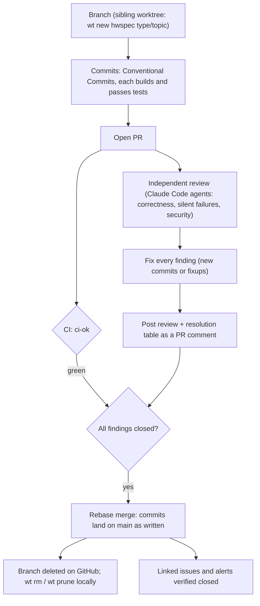
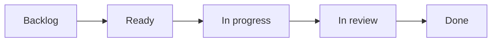
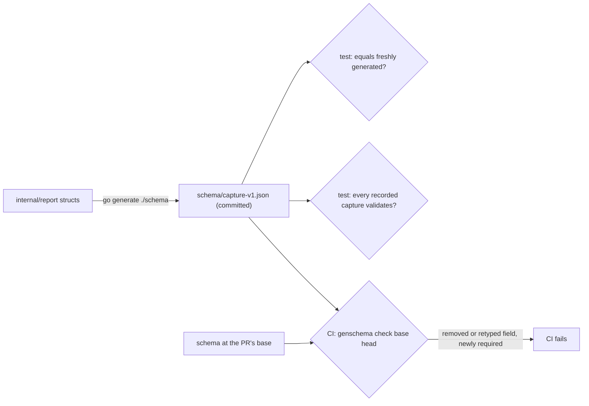
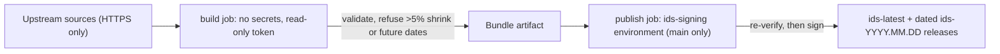
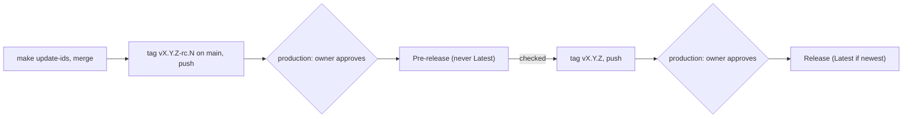
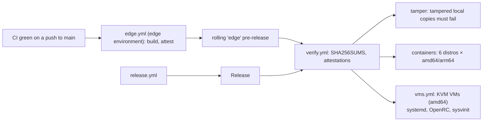

# Contributing to hwspec

Thanks for helping. Bug reports with a `hwspec capture --redact` attached, hardware we don't detect yet, and name corrections are all valuable.

## Development

Go 1.26 or newer. Everything runs without root; collectors that need root are tested against fixture trees.

**Go version policy:** hwspec supports the Go releases the Go team supports (the latest two). `go.mod`'s `go` line is the older of the two, CI tests both, and it moves up when a new Go release ships or a dependency requires it. Update `go.mod` and the `test` matrix in `.github/workflows/ci.yml` together. Release binaries are static, so this only matters when building from source.

```sh
make build    # build/hwspec, static
make test     # go vet + tests
make lint     # golangci-lint (same version and config as CI)
make cover    # tests with coverage, and the coverage gate
```

Read [ARCHITECTURE.md](ARCHITECTURE.md) before larger changes. Design decisions are recorded in [docs/adr/](docs/adr/); a change that alters one needs a new ADR.

## Pull requests

Every change reaches `main` through this flow; the `main` ruleset enforces the PR, the `ci-ok` check and rebase merging.



| Rule | Why |
|---|---|
| **Rebase merges only** | History keeps each logical change; `git bisect` works per commit |
| **Every commit** follows [Conventional Commits](https://www.conventionalcommits.org/) (`type(scope): summary`) | Each lands on `main` and in the release notes; CI's `commits` job checks them |
| **Every commit builds and passes tests** | Bisectability; fold fixes into the commit they fix (`git commit --fixup`, then `git rebase -i --autosquash`) |
| **Independent review before merge**, all findings fixed, review posted on the PR | A second pair of eyes with no context bias; the record stays with the change |
| **One feature or fix per PR** | Reviewable size |

Commit types: `feat`, `fix`, `docs`, `test`, `refactor`, `perf`, `build`, `ci`, `chore`, `style`, `revert`.

### What CI runs

CI runs only what a change needs ([`scripts/changed-areas.sh`](scripts/changed-areas.sh)); `ci-ok` is the single required check, and skipped jobs count as passed.

| The PR changes | Jobs |
|---|---|
| Go code, `go.mod`/`go.sum`, embedded data, lint config, Makefile | lint, tests + coverage gate, govulncheck, static builds, 6-distro smoke tests, Nix, the 7 VMs |
| `flake.nix` / `flake.lock` only | Nix |
| the VM harness (`scripts/vm-*.sh`, `vms.yml`) | static builds, the 7 VMs |
| `verify.yml` or `scripts/verify-release*.sh` | everything in the next row, plus the tamper test against the live `edge` release (`verify-release`) |
| `.github/workflows/**`, `.github/actionlint.yaml` or CI scripts (`scripts/changed-areas*.sh`, `check-commits.sh`, `check-mermaid.sh`, `verify-release*.sh`) | everything above except the tamper test, plus actionlint |
| Markdown | Mermaid rendering check (every diagram must render), ADR index check (every `docs/adr` record is listed) |
| anything | commit messages, PR title |

Pushes to `main` run everything except the VMs and the tamper test: `edge.yml` → `verify.yml` runs both on the published build.

Jobs run on a pinned runner image, `ubuntu-24.04`, so the CI environment changes only when we choose. A `canary-26-04` job runs the tests on the next image (`ubuntu-26.04`) to show breakage early; it never blocks a PR, and moving to the new image is its own PR.

## Backlog

Work is tracked as issues on the [project board](https://github.com/users/jiegui2025/projects/6); the [roadmap](README.md#roadmap) shows the milestones. Every issue is **backed by evidence and carries its full solution**, so anyone can pick it up without re-researching it.



Once [#53](https://github.com/jiegui2025/hwspec/issues/53) lands, new issues and PRs join the board automatically, a PR that closes an issue moves it to In review, and merging moves both to Done. Until then, add PRs and move statuses by hand.

| An issue has | What it means |
|---|---|
| **Problem** | what's wrong or missing, for whom |
| **Evidence** | a table of facts, each with its source: `path/file.go:123`, output of a real run, or an upstream document that was actually read; nothing from memory |
| **Solution** | the design and why, the packages and files it touches, a Mermaid diagram where it helps |
| **Steps** and **Acceptance criteria** | small concrete tasks; checks that can be tested or observed |
| **Priority and size** | P0–P3 and XS–XL, each with its reason |
| **Open questions** | anything that couldn't be verified, stated as a question, never as a fact |

| Field | Values |
|---|---|
| Priority | **P0** broken for users, now · **P1** next up (release blockers, deadlines) · **P2** planned · **P3** nice to have — always with the reason in the issue |
| Size | **XS** < 1 hour · **S** ≤ ½ day · **M** 1–2 days · **L** 3–5 days · **XL** > 1 week (split it) |
| Milestone | the release it ships in; none means unscheduled |
| Labels | `type: …`, `area: …`, `priority: P0`–`priority: P3`; `status: triage` until refined; `status: blocked`, `status: needs decision`, `status: deferred` where they apply |
| Title | `type(scope): summary` with the commit types above, plus `research` and `data` for issues |

Reports from the bug, feature and name-correction forms are triaged into this shape; maintainers file new items with the [backlog item form](.github/ISSUE_TEMPLATE/backlog_item.yml).

## Tests

Tests describe **behaviour**, not lines: "a laptop whose battery holds 80% of its design capacity reports 80% health", not "call `batteries()`". Collectors are tested three ways:

| How | Where | When to add one |
|---|---|---|
| Recorded machines | `internal/collect/testdata/machines/<name>/` (record with `go run ./tools/snapshot internal/collect/testdata/machines/<name>/root`, then add facts in `machines_facts_test.go` and run `go test ./internal/collect -run RecordedMachines -update`) | new hardware you own; review the recording, `TestRecordingsHoldNoIdentifiers` checks it too |
| Synthetic machines | `internal/collect/scenarios_test.go` | hardware you can describe but not record (root-only data, other architectures) |
| Real kernel | `internal/collect/kernel_test.go` | thin wrappers around syscalls |

Tests whose coverage depends on the machine's hardware call `hostTest(t)`; CI's coverage run sets `HWSPEC_SKIP_HOST_TESTS=1` so the gate measures the same code everywhere, and runs them in a separate step. CI fails below the coverage threshold in `.github/workflows/ci.yml`.

## File format

The capture format is a public interface. Adding fields is fine; renaming, removing or changing the meaning of a field needs a `schema_version` bump and an ADR.



| When you | Do |
|---|---|
| change a struct or `json` tag in `internal/report` | run `go generate ./schema` and commit `schema/capture-v1.json` (the drift test fails until you do) |
| add a field | nothing else: the schema allows unknown fields, so older v1 readers keep working |
| rename, remove or retype a field | that's a new format: bump `report.SchemaVersion` to N, add `schema/capture-vN.json` (point `schema.URL` and the embed at it), and write an ADR. Older `capture-v*.json` files are frozen from then on |

The CI step ("The capture format stays compatible") runs `go run ./tools/genschema check BASE/schema schema`. Within a version only two changes pass: an added property and a dropped requirement. Everything else fails: a removed property, a changed type set (a field that may now be `null` included), a newly required property, any other keyword added, removed or changed (`minimum`, `enum`, `format`, …, known or not), and any change to an older `capture-vN.json`. "Changes meaning" can't be seen in a schema: that stays a review item ([ADR 0003](docs/adr/0003-capture-format.md), amendment).

## Dependencies

Dependabot opens weekly update PRs; they follow the same flow (review, then rebase merge).

| Update | Extra step |
|---|---|
| Go module | The Nix `vendorHash` changes: the `nix` check fails and prints `got: sha256-…`. Put it in `flake.nix` **in the same commit** as the update, so every commit builds. |
| Go module requiring a newer Go | Raise `go.mod` and the CI `test` matrix together (see the Go version policy). |
| GitHub Action | Actions are pinned by commit SHA with the version in a comment; Dependabot updates both. |

## ID databases

`make update-ids` refreshes the copies embedded in the binary (do this before a release). The weekly [ids workflow](.github/workflows/ids.yml) publishes the signed bundle that `hwspec ids update` installs:



| Item | Where |
|---|---|
| Signing key (private) | `HWSPEC_IDS_SIGNING_KEY` secret in the `ids-signing` environment, usable only from `main` |
| Public key | `internal/ids/key.go` (`SigningPublicKey`), trusted through `trustedKeys` in `internal/ids/manifest.go` |
| Key rotation | add the new public key to `trustedKeys`, release, then replace the environment secret; remove the old key in a later release |
| Expected shrink of a database | rerun the workflow with `HWSPEC_ALLOW_SHRINK=1` after checking the upstream change |

## Releases



| Step | Detail |
|---|---|
| Refresh the ID databases | `make update-ids`, then merge through a PR |
| Release candidate first | tag `vX.Y.Z-rc.N` on `main`; tags with a `-` publish as **pre-releases**, never as Latest |
| Approve | the release job runs in the `production` environment: it waits until the owner approves it in the run's page; only `v*` tags may deploy there |
| Live-ISO check | before the final tag, boot the MX Linux 25.x live ISO with sysvinit and the Linux Mint 22.x live ISO, run the candidate's binary (`hwspec capture -f json`, and `--full`), and attach both captures to the release issue: neither distro has an image CI can boot unattended |
| Final release | tag `vX.Y.Z` on the same commit once the candidate checks out; GitHub marks it Latest when it's the newest version, so a patch to an older line doesn't take Latest |
| What's published | `hwspec-vX.Y.Z-linux-{amd64,arm64}.tar.gz` (binary, LICENSE, README), `SHA256SUMS`, provenance attestations |
| Reproducible | byte-identical tarballs from a git checkout of the tag, with the release job's Go, GNU tar and gzip: [Reproduce a release](#reproduce-a-release) |

Tags can't be moved or deleted (ruleset *Protect release tags*), so a bad candidate is replaced by the next `-rc.N`.

### Reproduce a release

`make release` packs deterministically (GNU tar, sorted entries, owner 0, the commit time as every mtime, `gzip -n`), so anyone can rebuild a release and compare it with the published `SHA256SUMS`. Releases only: `edge` builds don't log their toolchain.

| A rebuild needs | Why | Otherwise |
|---|---|---|
| a git checkout of the tag, and `git` in the build environment | Go stamps the module version, `vcs.revision`, `vcs.time` and `vcs.modified` into the binary from git, and the Makefile takes `SOURCE_DATE_EPOCH` (every file's mtime) from `git log` | a build from `git archive`, a source tarball, or an image without `git` (such as `golang:*-alpine`) differs, silently |
| only that tag fetched | Go stamps the highest version tag on the commit, and a final release is tagged on its candidate's commit | `git clone --branch v0.1.0-rc.1` also fetches `v0.1.0`, and the rebuild says `v0.1.0` |
| the job's Go, GNU tar and gzip | the release job's *Toolchain* step prints all three | a different Go gives a different binary. The official `golang` image's tar and gzip reproduced `v0.1.0-rc.1` |

With podman (docker works the same, without `:Z`), where `1.27.1` is the job's `go version` without the `go` prefix:

```sh
git init -q hwspec-vX.Y.Z && cd hwspec-vX.Y.Z
git fetch -q --no-tags --depth=1 https://github.com/jiegui2025/hwspec.git +refs/tags/vX.Y.Z:refs/tags/vX.Y.Z
git checkout -q vX.Y.Z
podman run --rm -v "$PWD:/src:Z" -w /src docker.io/library/golang:1.27.1 \
  sh -c 'git config --global --add safe.directory /src && make -s release VERSION=vX.Y.Z'
gh release download vX.Y.Z -R jiegui2025/hwspec -p SHA256SUMS -O - | diff - build/SHA256SUMS
```

No output from `diff` means the published tarballs were built from this tag. Who built them is a separate check: their attestations ([Verifying downloads](SECURITY.md#verifying-downloads)).

### Edge builds and verification



| Workflow | Does |
|---|---|
| `edge.yml` | after CI passes on `main`: builds that commit, attests it, and replaces the `edge` pre-release (never Latest) |
| `verify.yml` | after every publish: downloads the assets as a user would, checks `SHA256SUMS`, checks each tarball's attestation was signed by this repository's `release.yml` (or `edge.yml`) for that tag (or `main`) on a GitHub-hosted runner, checks that tampered local copies of those assets fail the same checks, then runs the published binary in the distro containers on amd64 and arm64 runners, and in the VMs. Run it by hand from the Actions tab for any tag. |
| `vms.yml` | boots each pinned cloud image below under KVM and runs `scripts/vm-run.sh` on it. Also runs in CI, with the binary just built, when a PR changes Go code, the VM harness (`scripts/vm-*.sh`, `vms.yml`) or CI itself. |
| `vm-images.yml` | weekly: every pinned image URL still exists, and `vms.yml`'s matrix matches `scripts/vm-run.sh --list` |

The VMs boot under UEFI (q35, OVMF). `scripts/vm-run.sh` passes the binary to the guest on the cloud-init seed disk, and `scripts/vm-check.sh` runs it there. Results come back on a second serial port, and the host checks them:

| Image | Init (`os.init`) | PID 1 must be | How the check starts |
|---|---|---|---|
| Ubuntu 24.04, Ubuntu 26.04, Debian 13, Fedora 44, Arch | systemd (`systemd`) | `…/systemd`, with `/run/systemd/system` | cloud-init `runcmd` |
| Alpine 3.24 | OpenRC under busybox init (`init`) | `/bin/busybox`, no `/run/systemd/system` | cloud-init `runcmd` |
| Debian 13, switched to `sysvinit-core` | sysvinit (`init`) | `…/sbin/init`, no `/run/systemd/system`, `INIT: version` on the console | boot 1 (with network): cloud-init swaps the init system and installs an init script; boot 2: that script runs the check |

hwspec always runs with no way out, and each VM asserts it: the check fails if the guest has a default route. Boots that install packages reach the outside world for apt: boot 1 of the sysvinit image, and `debian-13`, which installs pkexec and then takes its links down before the check. Every other boot has an isolated NIC (QEMU `restrict=on,ipv6=off`): DHCP works, there is no route out, and nothing leaves the VM. Without `ipv6=off`, QEMU's router advertisement still gives the guest an IPv6 default route.

| Check | As |
|---|---|
| `hwspec version` is the expected version: the release (or `edge-<commit>`) in `verify.yml`, `ci-<commit>` in CI | user (`tester`, created in the guest) |
| `capture -f json`: schema 1, `virtualization` `vm`, `boot_mode` `uefi`, the image's `os.init`, memory, every PCI device named, not privileged | user |
| `capture --full`: exits 0, `privileged` | root |
| `capture --full` through pkexec, no login session (a test polkit rule grants `tester` where polkit runs): the outcome each image expects in `scripts/vm-run.sh`. Debian 13 installs `pkexec` first and must get a privileged capture; the others have no pkexec (the cloud images ship none, and sysvinit-core removes polkitd, which needs a logind) and must stop with hwspec's own explanation. A hang, a crash or a different outcome fails | user |

- **Run one locally:** `scripts/vm-run.sh debian-13-sysvinit ./hwspec [VERSION]`.
  - Needs `/dev/kvm`, QEMU, OVMF and genisoimage.
  - The firmware defaults to Ubuntu's `ovmf` paths. Elsewhere, set `OVMF_CODE` and `OVMF_VARS` (Arch's `edk2-ovmf`: `/usr/share/edk2/x64/OVMF_CODE.4m.fd` and `OVMF_VARS.4m.fd`).
  - Logs and captures go to `vm-out/`.
- **Refreshing an image:** the images are pinned by URL and checksum in `scripts/vm-run.sh`'s `pin`. When `vm-images.yml` reports one gone (or to move on):
  1. Take a dated URL from the distro's image directory.
  2. Take its checksum from the distro's signed `SHA256SUMS`/`SHA512SUMS`/`CHECKSUM` file.
  3. Run that image locally.
  4. Commit as `ci(vm): …`.

- `verify.yml` runs after publishing, so it **detects** a bad release rather than preventing it. Failures name their kind:
  - `FAIL (checksums)` or `FAIL (attestation)`: the release is wrong. Fix it, then delete or supersede that release.
  - `FAIL (error)`: anything that isn't gh's definite "no" (no attestation for the digest, or one from another commit, ref or signer). It means the check couldn't run: auth, rate limit, outage, no network, or a gh message not seen before. That says nothing about the release: fix the cause and re-run.
- The checksum and attestation checks live in `scripts/verify-release.sh`. `scripts/verify-release_test.sh TAG REPO [COMMIT]` proves they catch tampering, on local copies of a real release's assets. Nothing published changes.
  - It runs in `verify.yml` after every publish, pinned to the commit `integrity` verified. It stops with an error if the tag moves or disappears while it runs (checked again after the download).
  - It runs in CI, against the live `edge` release, on PRs that change `verify.yml` or these scripts. That job depends on `edge` existing. If `edge` is missing (a fork, deleted by hand, or a publish that died between delete and create), it fails with `release 'edge' not found`. The next push to `main` whose CI passes republishes it, or re-run the Edge workflow for `main`'s tip.
  - Each case must fail at the expected check, **and** for the expected reason, so an outage can't pass as "tampering caught":

  | Case | Must fail at | Because |
  |---|---|---|
  | untouched assets (checked first and last) | nothing: they pass | |
  | a tarball changed | checksums | doesn't match `SHA256SUMS` |
  | a tarball changed and `SHA256SUMS` rewritten to match | attestation | `HTTP 404 … /attestations/sha256:…` |
  | a tarball added, or one missing from `SHA256SUMS` | checksums | `SHA256SUMS lists …` |
  | another file added | checksums | `unexpected file` |
  | attested at another commit | attestation | `expected SourceRepositoryDigest` |
  | signed by the other workflow (`edge.yml` vs `release.yml`) | attestation | `verifying with issuer` |
  | a malformed tag; the attestation API answering 503; gh with no network ("no valid Sigstore verifiers") | error | |

  - Coverage limits: `--signer-workflow` and `--source-ref` cover each other in the "other workflow" case, and no self-hosted attestation exists to test `--deny-self-hosted-runners`. A static check makes sure the script passes all four flags.
  - The `release.yml` path (`refs/tags/vX.Y.Z`) first runs live with the first release candidate (#3).
- `edge` is deleted and recreated on every publish. Turning on GitHub's immutable releases would break that, so the edge flow has to change before that setting does.
