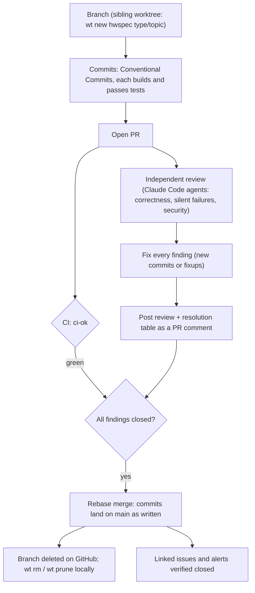
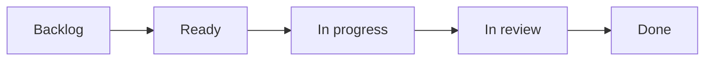
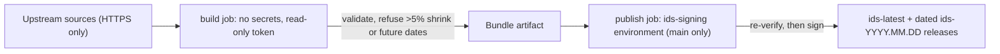

# Contributing to hwspec

Thanks for helping. Bug reports with a `hwspec capture --redact` attached, hardware we don't detect yet, and name corrections are all valuable.

## Development

Go 1.26 or newer. Everything runs without root; collectors that need root are tested against fixture trees.

**Go version policy:** hwspec supports the Go releases the Go team supports (the latest two). `go.mod`'s `go` line is the older of the two, CI tests both, and it moves up when a new Go release ships or a dependency requires it. Update `go.mod` and the `test` matrix in `.github/workflows/ci.yml` together. Release binaries are static, so this only matters when building from source.

```sh
make build    # build/hwspec, static
make test     # go vet + tests
make lint     # golangci-lint (same version and config as CI)
make cover    # tests with coverage, and the coverage gate
```

Read [ARCHITECTURE.md](ARCHITECTURE.md) before larger changes. Design decisions are recorded in [docs/adr/](docs/adr/); a change that alters one needs a new ADR.

## Pull requests

Every change reaches `main` through this flow; the `main` ruleset enforces the PR, the `ci-ok` check and rebase merging.



| Rule | Why |
|---|---|
| **Rebase merges only** | History keeps each logical change; `git bisect` works per commit |
| **Every commit** follows [Conventional Commits](https://www.conventionalcommits.org/) (`type(scope): summary`) | Each lands on `main` and in the release notes; CI's `commits` job checks them |
| **Every commit builds and passes tests** | Bisectability; fold fixes into the commit they fix (`git commit --fixup`, then `git rebase -i --autosquash`) |
| **Independent review before merge**, all findings fixed, review posted on the PR | A second pair of eyes with no context bias; the record stays with the change |
| **One feature or fix per PR** | Reviewable size |

Commit types: `feat`, `fix`, `docs`, `test`, `refactor`, `perf`, `build`, `ci`, `chore`, `style`, `revert`.

### What CI runs

CI runs only what a change needs ([`scripts/changed-areas.sh`](scripts/changed-areas.sh)); `ci-ok` is the single required check, and skipped jobs count as passed.

| The PR changes | Jobs |
|---|---|
| Go code, `go.mod`/`go.sum`, embedded data, lint config, Makefile | lint, tests + coverage gate, govulncheck, static builds, 6-distro smoke tests, Nix |
| `flake.nix` / `flake.lock` only | Nix |
| `.github/workflows/**` or CI scripts | everything, plus actionlint |
| Markdown | Mermaid rendering check (every diagram must render) |
| anything | commit messages, PR title |

Pushes to `main` run everything.

## Backlog

Work is tracked as issues on the [project board](https://github.com/users/jiegui2025/projects/6); the [roadmap](README.md#roadmap) shows the milestones. Every issue is **backed by evidence and carries its full solution**, so anyone can pick it up without re-researching it.



Once [#53](https://github.com/jiegui2025/hwspec/issues/53) lands, new issues and PRs join the board automatically, a PR that closes an issue moves it to In review, and merging moves both to Done. Until then, add PRs and move statuses by hand.

| An issue has | What it means |
|---|---|
| **Problem** | what's wrong or missing, for whom |
| **Evidence** | a table of facts, each with its source: `path/file.go:123`, output of a real run, or an upstream document that was actually read; nothing from memory |
| **Solution** | the design and why, the packages and files it touches, a Mermaid diagram where it helps |
| **Steps** and **Acceptance criteria** | small concrete tasks; checks that can be tested or observed |
| **Priority and size** | P0–P3 and XS–XL, each with its reason |
| **Open questions** | anything that couldn't be verified, stated as a question, never as a fact |

| Field | Values |
|---|---|
| Priority | **P0** broken for users, now · **P1** next up (release blockers, deadlines) · **P2** planned · **P3** nice to have — always with the reason in the issue |
| Size | **XS** < 1 hour · **S** ≤ ½ day · **M** 1–2 days · **L** 3–5 days · **XL** > 1 week (split it) |
| Milestone | the release it ships in; none means unscheduled |
| Labels | `type: …`, `area: …`, `priority: P0`–`priority: P3`; `status: triage` until refined; `status: blocked`, `status: needs decision`, `status: deferred` where they apply |
| Title | `type(scope): summary` with the commit types above, plus `research` and `data` for issues |

Reports from the bug, feature and name-correction forms are triaged into this shape; maintainers file new items with the [backlog item form](.github/ISSUE_TEMPLATE/backlog_item.yml).

## Tests

Tests describe **behaviour**, not lines: "a laptop whose battery holds 80% of its design capacity reports 80% health", not "call `batteries()`". Collectors are tested three ways:

| How | Where | When to add one |
|---|---|---|
| Recorded machines | `internal/collect/testdata/machines/<name>/` (record with `go run ./tools/snapshot internal/collect/testdata/machines/<name>/root`, then add facts in `machines_facts_test.go` and run `go test ./internal/collect -run RecordedMachines -update`) | new hardware you own; review the recording, `TestRecordingsHoldNoIdentifiers` checks it too |
| Synthetic machines | `internal/collect/scenarios_test.go` | hardware you can describe but not record (root-only data, other architectures) |
| Real kernel | `internal/collect/kernel_test.go` | thin wrappers around syscalls |

Tests whose coverage depends on the machine's hardware call `hostTest(t)`; CI's coverage run sets `HWSPEC_SKIP_HOST_TESTS=1` so the gate measures the same code everywhere, and runs them in a separate step. CI fails below the coverage threshold in `.github/workflows/ci.yml`.

## File format

The capture format is a public interface. Adding fields is fine; renaming, removing or changing the meaning of a field needs a `schema_version` bump and an ADR.

## Dependencies

Dependabot opens weekly update PRs; they follow the same flow (review, then rebase merge).

| Update | Extra step |
|---|---|
| Go module | The Nix `vendorHash` changes: the `nix` check fails and prints `got: sha256-…`. Put it in `flake.nix` **in the same commit** as the update, so every commit builds. |
| Go module requiring a newer Go | Raise `go.mod` and the CI `test` matrix together (see the Go version policy). |
| GitHub Action | Actions are pinned by commit SHA with the version in a comment; Dependabot updates both. |

## ID databases

`make update-ids` refreshes the copies embedded in the binary (do this before a release). The weekly [ids workflow](.github/workflows/ids.yml) publishes the signed bundle that `hwspec ids update` installs:



| Item | Where |
|---|---|
| Signing key (private) | `HWSPEC_IDS_SIGNING_KEY` secret in the `ids-signing` environment, usable only from `main` |
| Public key | `internal/ids/key.go` (`SigningPublicKey`), trusted through `trustedKeys` in `internal/ids/manifest.go` |
| Key rotation | add the new public key to `trustedKeys`, release, then replace the environment secret; remove the old key in a later release |
| Expected shrink of a database | rerun the workflow with `HWSPEC_ALLOW_SHRINK=1` after checking the upstream change |

## Releases

Maintainers: run `make update-ids`, merge, then tag `vX.Y.Z` on `main` and push the tag. The release workflow builds, attests and publishes.
