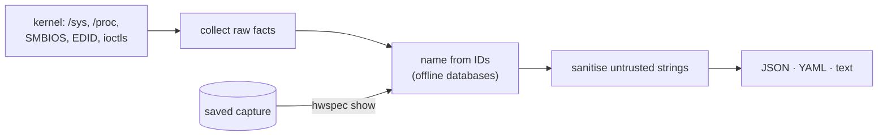
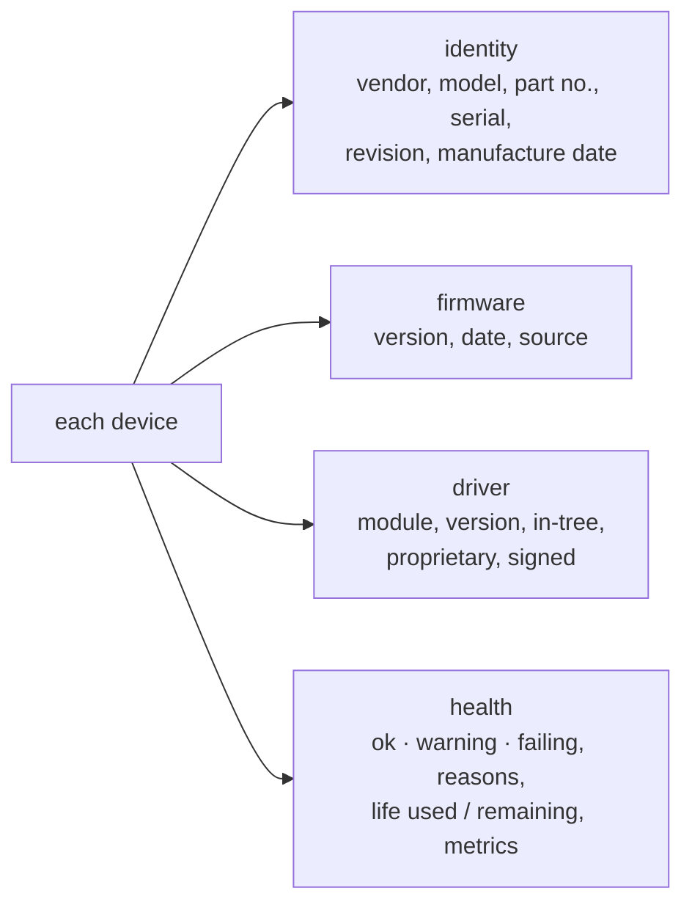
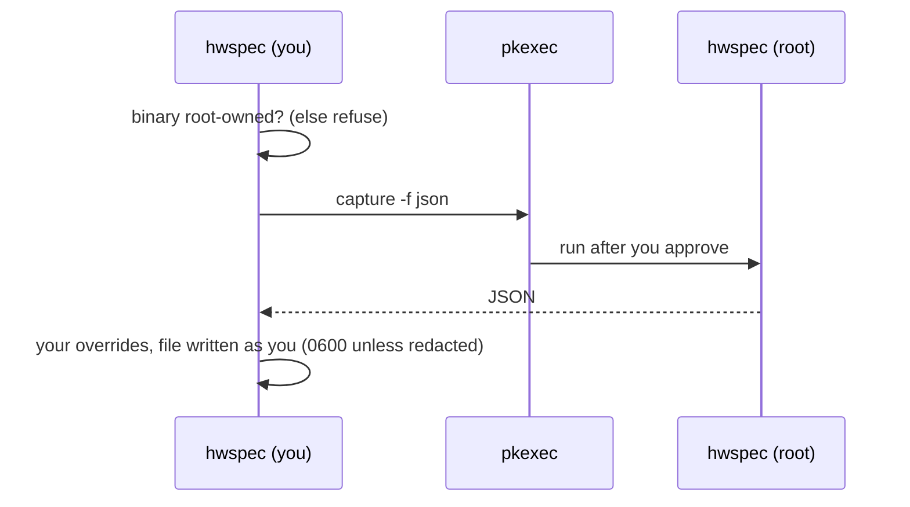
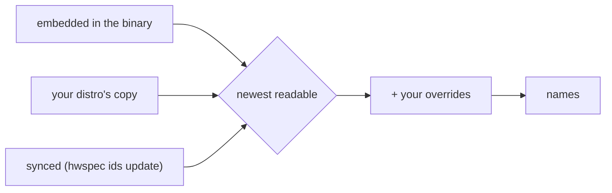
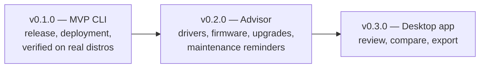

# hwspec

[](https://github.com/jiegui2025/hwspec/actions/workflows/ci.yml)
[](https://github.com/jiegui2025/hwspec/releases/tag/ids-latest)
[](LICENSE)

**Capture a Linux machine's complete hardware specification to a JSON, YAML or text file. One static binary, any distro, works offline.**

```console
$ hwspec capture -f text
hwspec v0.1.0  ·  captured 2026-10-05 12:00 UTC  ·  limited (not root)

System
  Machine    HP EliteDesk 800 G5 Desktop Mini
  Chassis    Mini Tower
  Board      HP 8595
  Firmware   HP R21 Ver. 02.27.00 07/28/2026
  OS         CachyOS, kernel 7.2.8-1-cachyos (x86_64, uefi, Secure Boot off)

CPU
  Model      Intel(R) Core(TM) i5-9500T CPU @ 2.20GHz
  Codename   Coffee Lake (Skylake cores)
  Cores      6 cores / 6 threads
  Clock      800–3700 MHz (intel_pstate built in)
  Cache      L1d 32 KiB×6, L1i 32 KiB×6, L2 256 KiB×6, L3 9 MiB×1
  Microcode  0xfa
  Health     health OK, 0 throttle events

Memory
  Total      31.1 GiB usable
  SPD 7-0050 16 GiB DDR4 SODIMM Avant Technology J642GU44J2320NL

Storage
  nvme0n1    SAMSUNG MZVLB256HAHQ-000L7 238.5 GiB nvme, fw 1L2QEXD7, nvme 1.0

Graphics
  GPU        Intel Corporation CoffeeLake-S GT2 [UHD Graphics 630], 350–1100 MHz (350 MHz at capture), i915
  Display    DELL S2721QS, 3840×2160 @ 60 Hz, 27.0", card1-DP-3

Network
  eno1       Intel Corporation Ethernet Connection (7) I219-LM, ethernet, up, 1000 Mb/s, fw 0.5-4, e1000e
  …

Not captured
  - dmi product_serial, product_uuid, chassis_serial, board_serial: needs root (run with --full)
  - drive health (SMART): needs root (run with --full)
  - memory modules (SMBIOS): needs root (run with --full)
```

## Why hwspec

| | hwspec | lshw | inxi | dmidecode | hwinfo |
|---|---|---|---|---|---|
| Install | one static binary | distro package (C++) | distro package (Perl, calls helper tools) | distro package (C) | distro package (C) |
| Same result on every distro (incl. NixOS, Alpine) | ✅ CI-tested on 8 ([which](#tested-distros)) | depends on version | depends on installed tools | depends on version | depends on version |
| Structured output | JSON/YAML, versioned schema | JSON/XML | JSON/XML (`--output`) | text | text |
| Names hardware offline, signed ID updates | ✅ | distro ID files | distro ID files | — | own database |
| Keeps raw IDs to re-name old captures | ✅ | IDs in output | partial | — | IDs in output |
| Memory modules, NVMe health, EDID, Bluetooth, codecs, CPU codenames | ✅ all | partial | most, via helper tools | memory and firmware tables | partial |
| Reports what it couldn't read | ✅ a `warnings` list | root warning | per-field markers | — | — |
| Share safely | ✅ `--redact` | ✅ `-sanitize` | ✅ `-z` filter | — | — |

## How it works



It reads the kernel's interfaces directly instead of parsing `lshw`, `dmidecode` or `lspci` output, which may not be installed. Details: [ARCHITECTURE.md](ARCHITECTURE.md).

## What it captures

Every device carries the same four blocks wherever the hardware exposes them ([ADR 0008](docs/adr/0008-device-detail-blocks.md)):



| Device | Identity | Firmware | Driver | Health / longevity |
|---|---|---|---|---|
| System, board | model, SKU, serial¹, UUID¹; expansion slots and onboard devices as the firmware lists them¹ | BIOS/UEFI version, date; Intel ME (CSME) and embedded controller firmware; TPM spec version | — | — |
| CPU | model, signature, codename, microarchitecture; socket package (LGA, BGA…), socketed or soldered¹ | microcode | frequency scaling | thermal throttling since boot |
| RAM modules | maker, part no., serial, manufacture date (SPD, no root needed); slot, type, speed, rank, and every slot used or empty (SMBIOS¹) | — | — | ECC errors (EDAC) |
| Disks | model, serial | ✅ | controller (nvme, ahci, usb-storage…) | SMART¹: status, % life used/left, hours, data written, errors |
| GPUs, monitors | model, revision; monitor serial and manufacture date (EDID) | AMD/NVIDIA video BIOS | ✅; hardware clock range and the measured clock at capture (i915, amdgpu) | — |
| Network, Wi-Fi, Bluetooth | model, MAC and its vendor | via ethtool | ✅ | error and drop rates |
| Audio | card, codec chips | — | ✅ | — |
| Batteries | model, serial, manufacture date | — | — | wear %, cycles, est. cycles until 80% |
| PCI and USB devices | IDs, names, serial, revision; the bridge each PCI device sits behind (absent on a root bus) | USB device release | ✅ per interface | — |
| Soldered or removable | for memory modules, storage, network, display, audio and wireless devices: onboard, socket or slot (which one when it can tell), with the evidence and how sure; the firmware's slot table needs root¹, onboard labels don't | — | — | — |

Plus: OS, kernel, boot mode, Secure Boot, VM/container; CPU cores, caches, clocks, flags; partitions; PCIe links; IOMMU groups; sensors (temperatures, fans, voltages, power). Text output ends with a **Needs attention** list of every warning and failure, with reasons.

¹ Needs root: `--full`. Life estimates only come from the hardware's own wear indicators and say how they were computed; rated values (TBW, rated cycles) come later from model data ([#25](https://github.com/jiegui2025/hwspec/issues/25)).

## Install

| Method | Command |
|---|---|
| Release binary (amd64, arm64), from v0.1.0 | download a tarball from [releases](https://github.com/jiegui2025/hwspec/releases), `tar xzf hwspec-*.tar.gz`, then `sudo install -m755 hwspec /usr/local/bin/` |
| From source (Go 1.26+) | `make build && sudo make install` |
| Nix flakes / NixOS | `nix run github:jiegui2025/hwspec -- capture -f text` |

Install to a root-owned location (as above) if you want `--full`; see [Root access](#root-access).

### Tested distros

| Distro | How | When |
|---|---|---|
| Ubuntu 24.04, Debian 12, Fedora, Arch, Alpine, NixOS | the static binary in the distro's container, amd64 and arm64 (Arch: amd64) | every PR that changes Go code, and every published build |
| LMDE 7, Devuan 6 (excalibur, no systemd) | container, amd64 | same |
| Ubuntu 24.04 and 26.04, Debian 13, Fedora 44, Arch | KVM virtual machine, systemd | every published build, and PRs that change Go code or the VM checks |
| Alpine 3.24 | VM, OpenRC | same |
| Debian 13 switched to `sysvinit-core` | VM, sysvinit | same |
| Linux Mint 22.x | Ubuntu 24.04 underneath (Mint's own container image is Ubuntu's userland); the live ISO is checked by hand before a release | each release |
| MX Linux | live ISO booted with sysvinit, checked by hand before a release (MX has no container or cloud image) | each release |

Each run checks the capture's schema and the names it resolves; the VMs also check the init system, UEFI boot, VM detection and `--full` (see [CONTRIBUTING](CONTRIBUTING.md#edge-builds-and-verification)).

## Usage

| Command | Does |
|---|---|
| `hwspec capture -o spec.json` | capture to JSON (format follows the extension: `.json`, `.yaml`, `.txt`) |
| `hwspec capture -f text` | readable summary on stdout |
| `hwspec capture --full -o spec.json` | include root-only data (asks via polkit) |
| `hwspec capture --redact -o share.json` | strip serials, UUIDs, MACs, hostname, personal paths (captures of one machine stay linkable: see [SECURITY.md](SECURITY.md#what-redaction-doesnt-do)) |
| `hwspec show spec.json` | summarise a capture, with names refreshed from today's databases |
| `hwspec show old.json -o new.json [--redact]` | re-export a capture with refreshed names (optionally redacted) |
| `hwspec advise [spec.json] [--full] [--redact]` | advice about this machine or a saved capture: devices that need attention, what to do, and the sources behind it ([ADR 0009](docs/adr/0009-advisor.md); the rules grow with the advisor issues on the roadmap) |
| `hwspec ids` | which ID database sources are in use |
| `hwspec ids lookup pci 8086:3e92` | resolve one ID |
| `hwspec ids update [--check]` | install the latest signed databases |
| `hwspec schema` | print the capture format's JSON Schema |

### Root access



| Without root | With `--full` |
|---|---|
| Everything except the items below; skipped items listed in `warnings` | + memory modules (SMBIOS), serial numbers and UUID, drive health |

`--full` only elevates a binary **only root can modify**, so malware running as you can't swap it before you approve the prompt. Otherwise run `sudo hwspec capture …`; the file is handed back to you.

## Hardware ID databases

Captures store raw IDs; names come from eight databases. HD Audio codecs need none: the kernel names them.

| Database | Translates | Upstream | Licence |
|---|---|---|---|
| `pci` | PCI vendors, devices, subsystems, classes | [pci-ids.ucw.cz](https://pci-ids.ucw.cz) | GPL-2.0-or-later or BSD-3-Clause |
| `usb` | USB vendors, products, classes | [linux-usb.org](http://www.linux-usb.org/usb-ids.html), via the [hwdata](https://github.com/vcrhonek/hwdata) mirror (HTTPS) | GPL-2.0-or-later or BSD-3-Clause |
| `pnp` | Monitor makers (EDID) | [hwdata](https://github.com/vcrhonek/hwdata) | GPL-2.0-or-later |
| `oui` | MAC address prefixes | [IEEE registry](https://standards-oui.ieee.org/) | public listing |
| `jedec` | Memory makers (JEP106), including codes like `80CE` or HP's `Unknown - [0xF785]` | [i2c-tools](https://git.kernel.org/pub/scm/utils/i2c-tools/i2c-tools.git) `decode-dimms` | GPL-2.0-or-later |
| `amdgpu` | AMD GPU retail names by device and revision | [libdrm](https://gitlab.freedesktop.org/mesa/drm) | MIT |
| `bluetooth` | Bluetooth chip makers (SIG company IDs) | [Bluetooth SIG assigned numbers](https://bitbucket.org/bluetooth-SIG/public) | published by the Bluetooth SIG |
| `cpu` | CPU codename and core microarchitecture | Linux kernel [`intel-family.h`](https://github.com/torvalds/linux/blob/master/arch/x86/include/asm/intel-family.h), [`amd.c`](https://github.com/torvalds/linux/blob/master/arch/x86/kernel/cpu/amd.c), plus [a curated list](tools/genids/cpu-curated.ids) that cites a source for every entry | GPL-2.0 (kernel); curated list GPL-3.0-or-later |

### Where names come from



| Source | Dated by | Notes |
|---|---|---|
| Embedded | its manifest | always available, offline |
| Distro (`/usr/share/hwdata`, `/usr/share/libdrm`, …) | version header, else file date | updated by your package manager |
| Synced (`~/.local/share/hwspec/ids/`) | its signed manifest | `hwspec ids update` |
| Overrides (`~/.config/hwspec/overrides.ids`) | applied last | `hwspec ids template` prints a starting file |

### Keeping the databases current

A [weekly workflow](.github/workflows/ids.yml) rebuilds all eight databases from upstream and publishes a signed bundle as [`ids-latest`](https://github.com/jiegui2025/hwspec/releases/tag/ids-latest).

| `hwspec ids update` step | Guarantee |
|---|---|
| verify the manifest's ed25519 signature | only bundles signed by the key built into hwspec |
| compare with installed and built-in data | no rollback to older data |
| download only changed databases; check size, SHA-256, contents | nothing unverified is installed |
| replace each file atomically, manifest last | an interrupted update leaves only verified files; the next update completes it |

Only the HTTP request leaves the machine; captures never touch the network. `HWSPEC_IDS_URL` (or `--url`) selects a mirror.

### Correcting a name

Add a line to `~/.config/hwspec/overrides.ids`, then please submit the correction upstream too (e.g. [pci-ids.ucw.cz](https://pci-ids.ucw.cz)):

```
pci 8086:3e92 = UHD Graphics 630
usb 046d:c52b = Logitech Unifying Receiver
jedec F785 = Avant Technology
oui 04:0E:3C = HP Inc.
```

## File format

| Aspect | Rule |
|---|---|
| Format | JSON (canonical) or YAML with the same field names |
| Versioning | `schema_version` (currently 1) changes only when a field is renamed, removed or changes meaning; new fields can appear without a bump |
| Units | bytes, °C, or named in the field (`_mhz`, `_mts`, `_mbps`) |
| Missing data | omitted, empty or "unknown", with the reason in `warnings`; never guessed |
| Before v0.1.0 | captures from `v0.1.0-rc.1` and earlier hold a partition's GPT partition UUID in `uuid`, and labels and filesystem types with `_` turned into spaces. From v0.1.0, `uuid` is the filesystem UUID (`lsblk`'s UUID column), the new `partuuid` is the partition UUID, and values are as udev records them ([#142](https://github.com/jiegui2025/hwspec/issues/142)) |
| Reference | the Go structs in [internal/report/report.go](internal/report/report.go), published as a JSON Schema (draft 2020-12): [schema/capture-v1.json](schema/capture-v1.json), also printed by `hwspec schema`. Captures from this version on name it in a `$schema` key, so editors can validate them; older v1 captures lack the key and still validate. Unknown fields are allowed, so v1 readers accept files from newer v1 builds. CI fails a schema change other than an added field or a dropped requirement; a field that changes meaning is a review item ([ADR 0003](docs/adr/0003-capture-format.md)) |

## Roadmap



Items are listed in board rank: priority first, then dependencies (a P1 that waits on others comes after them). The [project board](https://github.com/users/jiegui2025/projects/6) holds the same ranking and each item's status; every issue carries its evidence, full solution and acceptance criteria ([how backlog items are written](CONTRIBUTING.md#backlog)).

### v0.1.0 — MVP CLI: a signed, verified first release

| # | Item | Priority | Size |
|---|---|---|---|
| [#53](https://github.com/jiegui2025/hwspec/issues/53) | chore(board): add PRs to the board and move linked issues automatically | P1 | XS |
| [#38](https://github.com/jiegui2025/hwspec/issues/38) | chore: back up the ID-signing key offline | P1 | XS |
| [#3](https://github.com/jiegui2025/hwspec/issues/3) | chore: release v0.1.0 | P1 | S |

### v0.2.0 — Advisor: turn a capture into advice

| # | Item | Priority | Size |
|---|---|---|---|
| [#81](https://github.com/jiegui2025/hwspec/issues/81) | feat(ids): ship the advisor knowledge base in the signed bundle | P1 | S |
| [#7](https://github.com/jiegui2025/hwspec/issues/7) | feat(advisor): needs-attention list for devices without drivers or firmware | P1 | L |
| [#129](https://github.com/jiegui2025/hwspec/issues/129) | data(kb): memory slots, population rules and speed range per model | P1 | S |
| [#25](https://github.com/jiegui2025/hwspec/issues/25) | data(advisor): reference database of replacement and upgrade part numbers | P1 | L |
| [#119](https://github.com/jiegui2025/hwspec/issues/119) | feat(capture): #103 part 2, each device's mounting from the evidence | P1 | M |
| [#103](https://github.com/jiegui2025/hwspec/issues/103) | feat(capture): tell soldered from socketed for memory, Wi-Fi, SSD, GPU (and CPU) | P1 | L |
| [#122](https://github.com/jiegui2025/hwspec/issues/122) | feat(capture): #114 part 2, TPM manufacturer and firmware version under --full | P1 | M |
| [#114](https://github.com/jiegui2025/hwspec/issues/114) | feat(capture): firmware for every component that has it (CSME, EC, TPM, codecs), never silently absent | P1 | M |
| [#43](https://github.com/jiegui2025/hwspec/issues/43) | feat(capture): remaining firmware sources (amdgpu blocks, Intel GuC/HuC, Bluetooth HCI revision) and missing SPD EEPROMs | P1 | L |
| [#107](https://github.com/jiegui2025/hwspec/issues/107) | feat(advisor): memory upgrade answers: slots, population rules, speed range | P1 | L |
| [#130](https://github.com/jiegui2025/hwspec/issues/130) | research(firmware): ADR 0012, an online firmware index (hwspec firmware update) | P1 | M |
| [#10](https://github.com/jiegui2025/hwspec/issues/10) | feat(advisor): firmware versions and update paths | P1 | L |
| [#83](https://github.com/jiegui2025/hwspec/issues/83) | feat(schema): publish the advice document's JSON Schema | P2 | S |
| [#5](https://github.com/jiegui2025/hwspec/issues/5) | research(advisor): advisor design (ADR 0009) | P1 | M |
| [#101](https://github.com/jiegui2025/hwspec/issues/101) | feat(cli): Markdown report with tables and Mermaid diagrams (-f md) | P2 | M |
| [#105](https://github.com/jiegui2025/hwspec/issues/105) | feat(capture): a power section: supplies with their rated output, CPU and GPU power limits | P2 | M |
| [#115](https://github.com/jiegui2025/hwspec/issues/115) | feat(capture): which USB-C ports can charge the machine, with their PD capabilities and location | P2 | S |
| [#111](https://github.com/jiegui2025/hwspec/issues/111) | feat(capture): Wi-Fi radio generation, bands and chains from nl80211 | P2 | M |
| [#112](https://github.com/jiegui2025/hwspec/issues/112) | feat(capture): best mode offered on each connected display output | P2 | S |
| [#113](https://github.com/jiegui2025/hwspec/issues/113) | feat(capture): RTC coin-cell status | P2 | XS |
| [#108](https://github.com/jiegui2025/hwspec/issues/108) | feat(advisor): storage upgrade answers: bus stack, slot interface, path max rate | P2 | M |
| [#109](https://github.com/jiegui2025/hwspec/issues/109) | feat(advisor): display answers: GPU output maximum vs the installed display | P2 | M |
| [#110](https://github.com/jiegui2025/hwspec/issues/110) | feat(advisor): Wi-Fi upgrade answers: generation, chains, antennas, what fits | P2 | M |
| [#124](https://github.com/jiegui2025/hwspec/issues/124) | feat(advisor): battery, CPU and desktop GPU upgrade answers | P2 | M |
| [#8](https://github.com/jiegui2025/hwspec/issues/8) | feat(advisor): driver and configuration alternatives for better performance | P2 | L |
| [#9](https://github.com/jiegui2025/hwspec/issues/9) | feat(advisor): upgrade and replacement options for key components (tracking: #107–#110, #124) | P2 | M |
| [#11](https://github.com/jiegui2025/hwspec/issues/11) | feat(advisor): maintenance reminders | P2 | L |
| [#18](https://github.com/jiegui2025/hwspec/issues/18) | feat(capture): SATA and USB (SAT) drive health without smartctl | P2 | L |
| [#137](https://github.com/jiegui2025/hwspec/issues/137) | feat(capture): report an integrated GPU as part of the CPU package, not soldered on | P2 | S |
| [#12](https://github.com/jiegui2025/hwspec/issues/12) | feat(cli): hwspec diff to compare captures | P3 | M |
| [#35](https://github.com/jiegui2025/hwspec/issues/35) | data(advisor): correct firmware-reported chassis types from model data | P3 | S |
| [#168](https://github.com/jiegui2025/hwspec/issues/168) | fix(capture): a root filesystem mounted as /dev/root gets no mount point | P3 | S |
| [#182](https://github.com/jiegui2025/hwspec/issues/182) | fix(kb): exact keys, DMI placeholders in matches, a self-contained old reader | P3 | S |

### v0.3.0 — Desktop app: a native Linux app ([ADR 0007](docs/adr/0007-desktop-ui.md))

| # | Item | Priority | Size |
|---|---|---|---|
| [#13](https://github.com/jiegui2025/hwspec/issues/13) | research(ui): desktop app spike: memory, large lists, Flatpak host access and --full (ADR 0007) | P2 | L |
| [#87](https://github.com/jiegui2025/hwspec/issues/87) | feat(capture): sensors-only capture for live views | P2 | S |
| [#14](https://github.com/jiegui2025/hwspec/issues/14) | feat(ui): desktop app to review, compare and export captures (tracking) | P2 | XL |
| [#102](https://github.com/jiegui2025/hwspec/issues/102) | research(render): preview and PDF export of the Markdown report, outside the core binary (ADR 0011) | P3 | M |
| [#98](https://github.com/jiegui2025/hwspec/issues/98) | feat(cli): visual Markdown report with Mermaid diagrams, a renderer and PDF export (tracking: #101, #102) | P2 | L |

### Unscheduled: when capacity allows; deferred items are marked

| # | Item | Priority | Size |
|---|---|---|---|
| [#17](https://github.com/jiegui2025/hwspec/issues/17) | chore(ids): refresh the embedded ID databases automatically, and refuse stale ones at release | P2 | S |
| [#20](https://github.com/jiegui2025/hwspec/issues/20) | feat(packaging): .deb, .rpm and AUR hwspec-bin from the release workflow | P2 | M |
| [#132](https://github.com/jiegui2025/hwspec/issues/132) | research: architecture and performance review of the whole codebase | P2 | M |
| [#143](https://github.com/jiegui2025/hwspec/issues/143) | fix(capture): don't report unknown or invalid values as facts | P2 | S |
| [#145](https://github.com/jiegui2025/hwspec/issues/145) | fix(cli): bound capture input size, explain captures from newer builds | P2 | S |
| [#148](https://github.com/jiegui2025/hwspec/issues/148) | refactor(cli): interleaved flags, per-command formats, shared helpers | P2 | S |
| [#149](https://github.com/jiegui2025/hwspec/issues/149) | test: guards so new fields can't skip redaction, sanitising or seams | P2 | S |
| [#151](https://github.com/jiegui2025/hwspec/issues/151) | fix(capture): --full drive health: check disks concurrently, bound slow reads | P2 | S |
| [#154](https://github.com/jiegui2025/hwspec/issues/154) | docs(schema): document every field, allow annotations, pin vocabularies | P2 | S |
| [#155](https://github.com/jiegui2025/hwspec/issues/155) | fix(ids): known-answer checks before the weekly bundle is signed | P2 | S |
| [#161](https://github.com/jiegui2025/hwspec/issues/161) | feat(cli): hwspec bug: a redacted report bundle and a pre-filled issue link | P2 | M |
| [#165](https://github.com/jiegui2025/hwspec/issues/165) | chore: architecture review follow-ups (tracking) | P2 | XL |
| [#96](https://github.com/jiegui2025/hwspec/issues/96) | feat(capture): peripheral and UPS batteries, from the kernel and read-only D-Bus | P3 | M |
| [#91](https://github.com/jiegui2025/hwspec/issues/91) | feat(capture): PCI IRQs and resources, and an IOMMU group listing | P3 | S |
| [#100](https://github.com/jiegui2025/hwspec/issues/100) | fix(capture): warn when a sysfs directory cannot be listed | P3 | S |
| [#99](https://github.com/jiegui2025/hwspec/issues/99) | feat(capture): GPU clocks for Intel xe and NVIDIA | P3 | M |
| [#86](https://github.com/jiegui2025/hwspec/issues/86) | ci: check PR bodies and sidebar fields automatically | P3 | S |
| [#89](https://github.com/jiegui2025/hwspec/issues/89) | feat(ids): device roles from USB interface classes and a sourced ID list | P3 | M |
| [#15](https://github.com/jiegui2025/hwspec/issues/15) | ci: update the Nix vendorHash automatically on Dependabot Go module PRs | P3 | S |
| [#16](https://github.com/jiegui2025/hwspec/issues/16) | chore: keep the committed genids binary in history, and block new build artifacts in CI | P3 | XS |
| [#30](https://github.com/jiegui2025/hwspec/issues/30) | ci: automate the independent Claude Code review on every PR *(deferred)* | P3 | M |
| [#52](https://github.com/jiegui2025/hwspec/issues/52) | ci: keep CI running when GitHub-hosted runners are unavailable *(deferred)* | P3 | L |
| [#28](https://github.com/jiegui2025/hwspec/issues/28) | feat: Windows and macOS support *(deferred)* | P3 | XL |
| [#57](https://github.com/jiegui2025/hwspec/issues/57) | ci: move the pinned runner image to ubuntu-26.04 | P3 | XS |
| [#136](https://github.com/jiegui2025/hwspec/issues/136) | fix(capture): list memory modules whose size the firmware reports as unknown | P3 | S |
| [#138](https://github.com/jiegui2025/hwspec/issues/138) | feat(capture): tell soldered UFS storage apart | P3 | S |
| [#147](https://github.com/jiegui2025/hwspec/issues/147) | perf(kb): parse the knowledge base in one pass | P3 | S |
| [#150](https://github.com/jiegui2025/hwspec/issues/150) | refactor(collect): name devices once, in the CLI | P3 | S |
| [#156](https://github.com/jiegui2025/hwspec/issues/156) | refactor(ids): split ID formats, the lookup set and the signed bundle | P3 | M |
| [#157](https://github.com/jiegui2025/hwspec/issues/157) | ci: keep flake.lock current | P3 | XS |
| [#160](https://github.com/jiegui2025/hwspec/issues/160) | fix(capture): keep Thunderbolt/USB4 dock devices out of the slot matching | P3 | S |
| [#162](https://github.com/jiegui2025/hwspec/issues/162) | feat(cli): hwspec share: contribute a research-redacted capture | P3 | M |
| [#179](https://github.com/jiegui2025/hwspec/issues/179) | ci(vm): stop the ubuntu-24.04 VM waiting 33 s for snapd seeding | P3 | S |
| [#181](https://github.com/jiegui2025/hwspec/issues/181) | ci: render the diagrams in under 30 s (pull or cache the mermaid image) | P3 | S |
| [#184](https://github.com/jiegui2025/hwspec/issues/184) | fix(snapshot): don't copy /proc/self a second time under the recorder's PID | P3 | XS |

## Building

| Command | Does |
|---|---|
| `make build` | `build/hwspec`, static (CGO off) |
| `make test` / `make lint` / `make cover` | tests, golangci-lint, coverage gate |
| `make release` | amd64 + arm64 tarballs with `SHA256SUMS` |
| `make update-ids` | refresh the embedded ID databases from upstream |

| Path | What |
|---|---|
| `cmd/hwspec` | CLI, including the `pkexec` re-run for `--full` |
| `internal/collect` | one collector per area, reading sysfs/procfs and the udev database; the CPU topology via [ghw](https://github.com/jaypipes/ghw) |
| `internal/ids` | ID databases, overrides, sync, JEDEC/OUI/CPU decoding |
| `internal/resolve` | names from raw IDs, for new and saved captures |
| `internal/report`, `internal/output` | the file format, redaction, sanitising; JSON/YAML/text |
| `internal/smbios`, `internal/edid`, `internal/spd`, `internal/trust` | binary parsers (SMBIOS, EDID, RAM SPD); root-ownership checks |
| `tools/genids` | ID bundle builder |
| `tools/snapshot` | records a machine as a scrubbed test fixture |

## Contributing

| Read | For |
|---|---|
| [CONTRIBUTING.md](CONTRIBUTING.md) | development, tests, the PR and review flow |
| [ARCHITECTURE.md](ARCHITECTURE.md), [docs/adr/](docs/adr/) | how the code is organised and why |
| [SECURITY.md](SECURITY.md) | reporting a vulnerability |
| [CODE_OF_CONDUCT.md](CODE_OF_CONDUCT.md) | how we treat each other, and reporting a problem privately |
| [ACCESSIBILITY.md](ACCESSIBILITY.md) | using hwspec with assistive technology, known limitations, reporting a barrier |
| [Roadmap](#roadmap), [project board](https://github.com/users/jiegui2025/projects/6) | what's next, defects and maintenance |

## Licence

GPL-3.0-or-later; see [LICENSE](LICENSE). The embedded ID databases keep their own licences, listed above.
