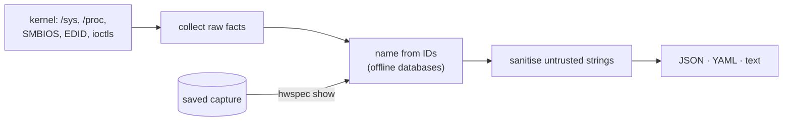
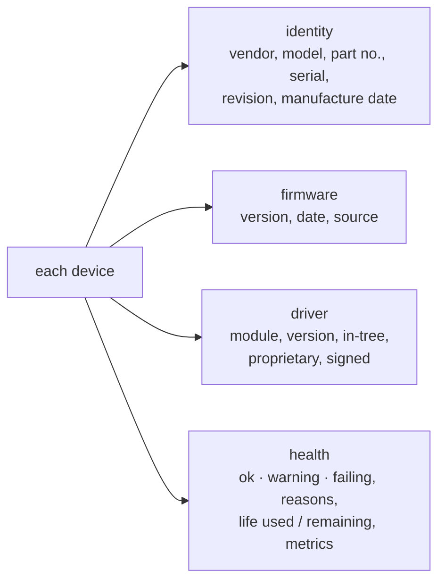
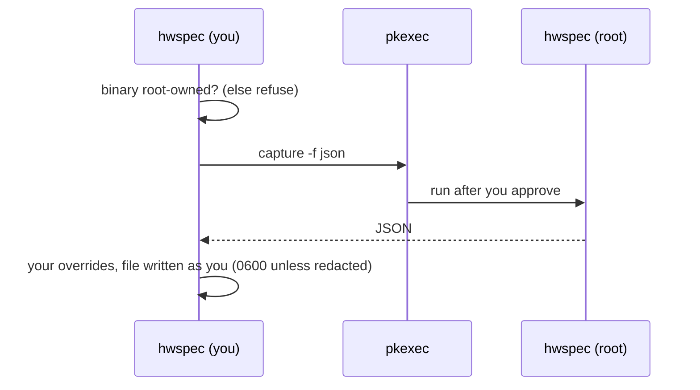
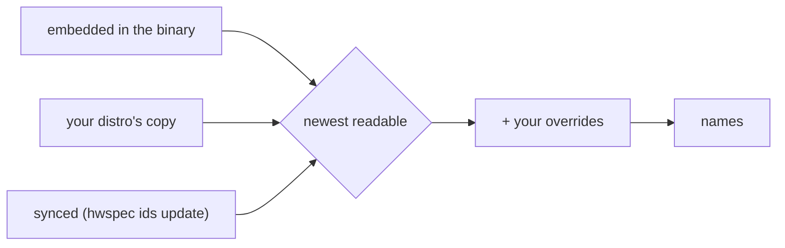

# hwspec

[](https://github.com/jiegui2025/hwspec/actions/workflows/ci.yml)
[](https://github.com/jiegui2025/hwspec/releases/tag/ids-latest)
[](LICENSE)

**Capture a Linux machine's complete hardware specification to a JSON, YAML or text file. One static binary, any distro, works offline.**

```console
$ hwspec capture --full -f text
System
  Machine    HP EliteDesk 800 G5 Desktop Mini
  BIOS       HP R21 Ver. 02.27.00 07/28/2026
  OS         CachyOS, kernel 7.2.8-1-cachyos (x86_64, uefi, Secure Boot off)

CPU
  Model      Intel(R) Core(TM) i5-9500T CPU @ 2.20GHz
  Codename   Coffee Lake (Skylake cores)
  Cores      6 cores / 6 threads

Memory
  Total      32 GiB installed, 31.1 GiB usable
  DIMM1      16 GiB DDR4 SODIMM 2667 MT/s (rated 3200) Avant Technology J642GU44J2320NL

Storage
  nvme0n1    SAMSUNG MZVLB256HAHQ-000L7 238.5 GiB nvme, health OK, 4% worn, 2541 h on

Graphics
  Display    Dell Inc. DELL S2721QS, 3840×2160 @ 60 Hz, 27.0" (card1-DP-3)

Bluetooth
  hci0       Intel Corp. AX200 Bluetooth, Bluetooth 5.2
...
```

## Why hwspec

| | hwspec | lshw | inxi | dmidecode | hwinfo |
|---|---|---|---|---|---|
| Install | one static binary | distro package (C++) | distro package (Perl, calls helper tools) | distro package (C) | distro package (C) |
| Same result on every distro (incl. NixOS, Alpine) | ✅ CI-tested on 6 | depends on version | depends on installed tools | depends on version | depends on version |
| Structured output | JSON/YAML, versioned schema | JSON/XML | JSON/XML (`--output`) | text | text |
| Names hardware offline, signed ID updates | ✅ | distro ID files | distro ID files | — | own database |
| Keeps raw IDs to re-name old captures | ✅ | IDs in output | partial | — | IDs in output |
| Memory modules, NVMe health, EDID, Bluetooth, codecs, CPU codenames | ✅ all | partial | most, via helper tools | memory and firmware tables | partial |
| Reports what it couldn't read | ✅ a `warnings` list | root warning | per-field markers | — | — |
| Share safely | ✅ `--redact` | ✅ `-sanitize` | ✅ `-z` filter | — | — |

## How it works



It reads the kernel's interfaces directly instead of parsing `lshw`, `dmidecode` or `lspci` output, which may not be installed. Details: [ARCHITECTURE.md](ARCHITECTURE.md).

## What it captures

Every device carries the same four blocks wherever the hardware exposes them ([ADR 0008](docs/adr/0008-device-detail-blocks.md)):



| Device | Identity | Firmware | Driver | Health / longevity |
|---|---|---|---|---|
| System, board | model, SKU, serial¹, UUID¹ | BIOS/UEFI version, date | — | — |
| CPU | model, signature, codename, microarchitecture | microcode | frequency scaling | thermal throttling since boot |
| RAM modules | maker, part no., serial, manufacture date (SPD, no root needed); slot, type, speed, rank (SMBIOS¹) | — | — | ECC errors (EDAC) |
| Disks | model, serial | ✅ | controller (nvme, ahci, usb-storage…) | SMART¹: status, % life used/left, hours, data written, errors |
| GPUs, monitors | model, revision; monitor serial and manufacture date (EDID) | AMD/NVIDIA video BIOS | ✅ | — |
| Network, Wi-Fi, Bluetooth | model, MAC and its vendor | via ethtool | ✅ | error and drop rates |
| Audio | card, codec chips | — | ✅ | — |
| Batteries | model, serial, manufacture date | — | — | wear %, cycles, est. cycles until 80% |
| PCI and USB devices | IDs, names, serial, revision | USB device release | ✅ per interface | — |

Plus: OS, kernel, boot mode, Secure Boot, VM/container; CPU cores, caches, clocks, flags; partitions; PCIe links; IOMMU groups; sensors (temperatures, fans, voltages, power). Text output ends with a **Needs attention** list of every warning and failure, with reasons.

¹ Needs root: `--full`. Life estimates only come from the hardware's own wear indicators and say how they were computed; rated values (TBW, rated cycles) come later from model data ([#25](https://github.com/jiegui2025/hwspec/issues/25)).

## Install

| Method | Command |
|---|---|
| Release binary (amd64, arm64), from v0.1.0 | download a tarball from [releases](https://github.com/jiegui2025/hwspec/releases), `tar xzf hwspec-*.tar.gz`, then `sudo install -m755 hwspec /usr/local/bin/` |
| From source (Go 1.26+) | `make build && sudo make install` |
| Nix flakes / NixOS | `nix run github:jiegui2025/hwspec -- capture -f text` |

Install to a root-owned location (as above) if you want `--full`; see [Root access](#root-access).

## Usage

| Command | Does |
|---|---|
| `hwspec capture -o spec.json` | capture to JSON (format follows the extension: `.json`, `.yaml`, `.txt`) |
| `hwspec capture -f text` | readable summary on stdout |
| `hwspec capture --full -o spec.json` | include root-only data (asks via polkit) |
| `hwspec capture --redact -o share.json` | strip serials, UUIDs, MACs, hostname, personal paths (captures of one machine stay linkable: see [SECURITY.md](SECURITY.md#what-redaction-doesnt-do)) |
| `hwspec show spec.json` | summarise a capture, with names refreshed from today's databases |
| `hwspec show old.json -o new.json [--redact]` | re-export a capture with refreshed names (optionally redacted) |
| `hwspec ids` | which ID database sources are in use |
| `hwspec ids lookup pci 8086:3e92` | resolve one ID |
| `hwspec ids update [--check]` | install the latest signed databases |

### Root access



| Without root | With `--full` |
|---|---|
| Everything except the items below; skipped items listed in `warnings` | + memory modules (SMBIOS), serial numbers and UUID, drive health |

`--full` only elevates a binary **only root can modify**, so malware running as you can't swap it before you approve the prompt. Otherwise run `sudo hwspec capture …`; the file is handed back to you.

## Hardware ID databases

Captures store raw IDs; names come from eight databases. HD Audio codecs need none: the kernel names them.

| Database | Translates | Upstream | Licence |
|---|---|---|---|
| `pci` | PCI vendors, devices, subsystems, classes | [pci-ids.ucw.cz](https://pci-ids.ucw.cz) | GPL-2.0-or-later or BSD-3-Clause |
| `usb` | USB vendors, products, classes | [linux-usb.org](http://www.linux-usb.org/usb-ids.html), via the [hwdata](https://github.com/vcrhonek/hwdata) mirror (HTTPS) | GPL-2.0-or-later or BSD-3-Clause |
| `pnp` | Monitor makers (EDID) | [hwdata](https://github.com/vcrhonek/hwdata) | GPL-2.0-or-later |
| `oui` | MAC address prefixes | [IEEE registry](https://standards-oui.ieee.org/) | public listing |
| `jedec` | Memory makers (JEP106), including codes like `80CE` or HP's `Unknown - [0xF785]` | [i2c-tools](https://git.kernel.org/pub/scm/utils/i2c-tools/i2c-tools.git) `decode-dimms` | GPL-2.0-or-later |
| `amdgpu` | AMD GPU retail names by device and revision | [libdrm](https://gitlab.freedesktop.org/mesa/drm) | MIT |
| `bluetooth` | Bluetooth chip makers (SIG company IDs) | [Bluetooth SIG assigned numbers](https://bitbucket.org/bluetooth-SIG/public) | published by the Bluetooth SIG |
| `cpu` | CPU codename and core microarchitecture | Linux kernel [`intel-family.h`](https://github.com/torvalds/linux/blob/master/arch/x86/include/asm/intel-family.h), [`amd.c`](https://github.com/torvalds/linux/blob/master/arch/x86/kernel/cpu/amd.c), plus [a curated list](tools/genids/cpu-curated.ids) | GPL-2.0 (kernel); curated list GPL-3.0-or-later |

### Where names come from



| Source | Dated by | Notes |
|---|---|---|
| Embedded | its manifest | always available, offline |
| Distro (`/usr/share/hwdata`, `/usr/share/libdrm`, …) | version header, else file date | updated by your package manager |
| Synced (`~/.local/share/hwspec/ids/`) | its signed manifest | `hwspec ids update` |
| Overrides (`~/.config/hwspec/overrides.ids`) | applied last | `hwspec ids template` prints a starting file |

### Keeping the databases current

A [weekly workflow](.github/workflows/ids.yml) rebuilds all eight databases from upstream and publishes a signed bundle as [`ids-latest`](https://github.com/jiegui2025/hwspec/releases/tag/ids-latest).

| `hwspec ids update` step | Guarantee |
|---|---|
| verify the manifest's ed25519 signature | only bundles signed by the key built into hwspec |
| compare with installed and built-in data | no rollback to older data |
| download only changed databases; check size, SHA-256, contents | nothing unverified is installed |
| replace each file atomically, manifest last | an interrupted update leaves only verified files; the next update completes it |

Only the HTTP request leaves the machine; captures never touch the network. `HWSPEC_IDS_URL` (or `--url`) selects a mirror.

### Correcting a name

Add a line to `~/.config/hwspec/overrides.ids`, then please submit the correction upstream too (e.g. [pci-ids.ucw.cz](https://pci-ids.ucw.cz)):

```
pci 8086:3e92 = UHD Graphics 630
usb 046d:c52b = Logitech Unifying Receiver
jedec F785 = Avant Technology
oui 04:0E:3C = HP Inc.
```

## File format

| Aspect | Rule |
|---|---|
| Format | JSON (canonical) or YAML with the same field names |
| Versioning | `schema_version` (currently 1) changes only when a field is renamed, removed or changes meaning; new fields can appear without a bump |
| Units | bytes, °C, or named in the field (`_mhz`, `_mts`, `_mbps`) |
| Missing data | omitted, empty or "unknown", with the reason in `warnings`; never guessed |
| Reference | the Go structs in [internal/report/report.go](internal/report/report.go); a JSON Schema is planned ([#37](https://github.com/jiegui2025/hwspec/issues/37)) |

## Building

| Command | Does |
|---|---|
| `make build` | `build/hwspec`, static (CGO off) |
| `make test` / `make lint` / `make cover` | tests, golangci-lint, coverage gate |
| `make release` | amd64 + arm64 tarballs with `SHA256SUMS` |
| `make update-ids` | refresh the embedded ID databases from upstream |

| Path | What |
|---|---|
| `cmd/hwspec` | CLI, including the `pkexec` re-run for `--full` |
| `internal/collect` | one collector per area, reading sysfs/procfs; CPU and block devices via [ghw](https://github.com/jaypipes/ghw) |
| `internal/ids` | ID databases, overrides, sync, JEDEC/OUI/CPU decoding |
| `internal/resolve` | names from raw IDs, for new and saved captures |
| `internal/report`, `internal/output` | the file format, redaction, sanitising; JSON/YAML/text |
| `internal/smbios`, `internal/edid`, `internal/spd`, `internal/trust` | binary parsers (SMBIOS, EDID, RAM SPD); root-ownership checks |
| `tools/genids` | ID bundle builder |

## Contributing

| Read | For |
|---|---|
| [CONTRIBUTING.md](CONTRIBUTING.md) | development, tests, the PR and review flow |
| [ARCHITECTURE.md](ARCHITECTURE.md), [docs/adr/](docs/adr/) | how the code is organised and why |
| [SECURITY.md](SECURITY.md) | reporting a vulnerability |
| [Project board](https://github.com/users/jiegui2025/projects/6) | roadmap, defects and maintenance |

## Licence

GPL-3.0-or-later; see [LICENSE](LICENSE). The embedded ID databases keep their own licences, listed above.
