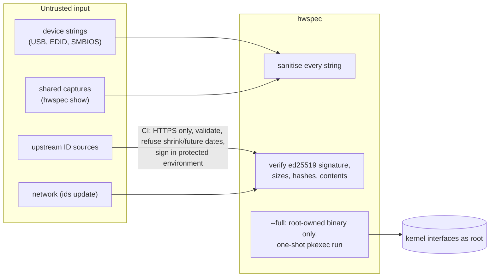

# Security policy

## Reporting a vulnerability

| | |
|---|---|
| **How** | privately, through [GitHub security advisories](https://github.com/jiegui2025/hwspec/security/advisories/new), not public issues |
| **Response** | within a week |
| **Disclosure** | fix released as soon as ready, then the advisory is published, with credit unless you prefer otherwise |
| **Supported versions** | the latest release |

## Trust boundaries

## What's in scope

| Area | Protection | Where |
|---|---|---|
| Privileged run (`--full`) | only a binary that root alone can change is elevated (owner and every parent directory checked, sticky directories allowed, FUSE refused); fixed arguments; the unprivileged parent writes the file | `cmd/hwspec`, `internal/trust` |
| Running as root via `sudo` | `smartctl` only from root-owned system directories, with a timeout; output files written atomically and handed to the invoking user; devices written into, never replaced | `internal/collect`, `cmd/hwspec` |
| `hwspec ids update` | signature over the exact manifest bytes, rollback refused (vs installed and built-in data), size + SHA-256 + parse of every file, file names whitelisted, size limits, atomic install | `internal/ids` |
| ID bundle publishing | HTTPS-only fetches; >5% shrink and future dates refused; build job without secrets; signing only in the `ids-signing` environment (main branch), after independent re-verification | `.github/workflows/ids.yml`, `tools/genids` |
| Untrusted text | control and Unicode format characters removed from every string, in every output format | `internal/report`, `internal/ids`, `internal/output` |
| Parsing | bounds-checked SMBIOS, EDID, NVMe log page and Bluetooth reply parsers; YAML alias and depth limits | `internal/smbios`, `internal/edid`, `internal/collect` |
| Privacy | `--redact` (on `capture` and `show`) removes serials, UUIDs, MAC addresses (also inside interface names), hostname, personal mount points and labels; captures are `0600` unless redacted | `internal/report` |

## Verifying downloads

| Artifact | Check |
|---|---|
| Release tarball | `sha256sum -c SHA256SUMS` and `gh attestation verify hwspec-vX.Y.Z-linux-amd64.tar.gz --repo jiegui2025/hwspec` |
| ID database bundle | automatic: `hwspec ids update` refuses anything not signed by the key in `internal/ids/key.go` |
