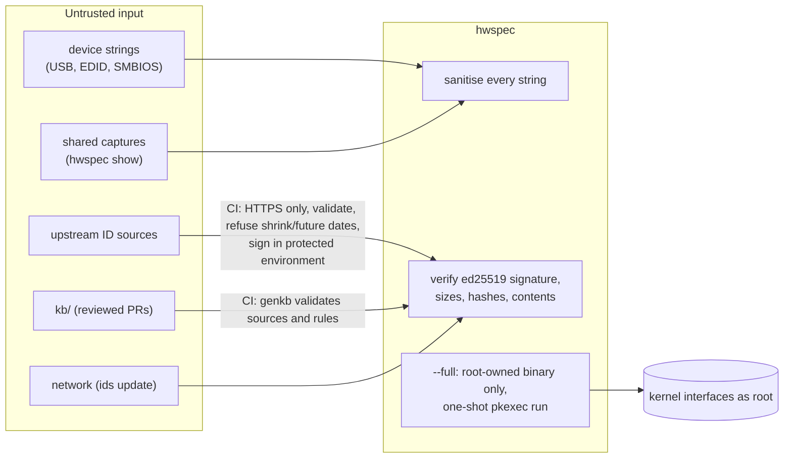

# Security policy

## Reporting a vulnerability

| | |
|---|---|
| **How** | privately, through [GitHub security advisories](https://github.com/jiegui2025/hwspec/security/advisories/new), not public issues |
| **Response** | within a week |
| **Disclosure** | fix released as soon as ready, then the advisory is published, with credit unless you prefer otherwise |
| **Supported versions** | the latest release |

## Trust boundaries

## What's in scope

| Area | Protection | Where |
|---|---|---|
| Privileged run (`--full`) | only a binary that root alone can change is elevated (owner and every parent directory checked, sticky directories allowed, FUSE refused); fixed arguments; the unprivileged parent writes the file | `cmd/hwspec`, `internal/trust` |
| Running as root via `sudo` | `smartctl` only from root-owned system directories, with a timeout; output files written only where the invoking user could have written them: only in their own directory or a sticky world-writable one such as `/tmp`, and replacing an existing file only if it is theirs (a typo such as `-o /etc/hosts` is refused); the directory is opened once and everything after is relative to it, so swapping it for a symlink can't redirect the write; written atomically, flushed to disk before the rename, and handed to that user; devices and pipes written into, never replaced, only if they are theirs, checked before opening (opening a device can have effects) and again on the opened descriptor. Granting only `hwspec` in sudoers is not a supported way to limit what a user can do as root | `internal/collect`, `cmd/hwspec` |
| `hwspec ids update` | signature over the exact manifest bytes, rollback refused (vs installed and built-in data), size + SHA-256 + parse of every file, file names whitelisted, size limits; each file replaced atomically, manifest last | `internal/ids` |
| ID bundle publishing | HTTPS-only fetches; >5% shrink and future dates refused; build job without secrets; signing only in the `ids-signing` environment (main branch), after independent re-verification | `.github/workflows/ids.yml`, `tools/genids` |
| Advisor knowledge base (with #80, #81) | compiled by `tools/genkb` in reviewed PRs (CI checks it against `kb/`) and published weekly as committed, in the same signed bundle, so it reaches released binaries between releases; parsed with size limits, and a rule a binary can't fully understand is skipped, never applied in part; a copy that doesn't parse falls back to the built-in one; its text, including suggested `commands`, is sanitised when rendered and only shown, never run | `tools/genkb`, `internal/kb`, `internal/ids`, `internal/advisor`, `cmd/hwspec` |
| Untrusted text | control and Unicode format characters removed from every string and map key, in every output format; the text output's "Needs attention" list is labelled as the capture's own record, since `show` may display someone else's file; the knowledge base refuses such characters in every text field, claim value and key, and advice text is cleaned again when printed | `internal/report`, `internal/ids`, `internal/output`, `internal/kb`, `internal/advisor` |
| Parsing | bounds-checked SMBIOS, EDID, SPD, NVMe log page and Bluetooth reply parsers (SPD fuzzed); YAML alias and depth limits (yaml.v3) | `internal/smbios`, `internal/edid`, `internal/spd`, `internal/collect`, `internal/output` |
| Privacy | `--redact` (on `capture`, `show` and `advise`) removes every serial number (all identity blocks), UUIDs, MAC addresses (also inside interface names), hostname, personal mount points and labels, and keeps manufacture dates to the month; captures are `0600` unless redacted, advice always (it names the machine's devices); redacted advice doesn't name the maintenance record's path | `internal/report`, `cmd/hwspec` |

### What redaction doesn't do

| Kept after `--redact` | Why it's kept | Consequence |
|---|---|---|
| Models, part numbers, SKU | the point of a hardware report | identify the machine *type*, not the machine |
| Firmware and driver versions, microcode | needed for update advice | change with updates |
| Manufacture month (days and weeks are shortened to it), counters (power-on hours, data written, battery cycles) | needed for maintenance and wear advice | together they can **link** redacted captures of one machine to each other, or to an unredacted one |

Redaction removes direct identifiers; it doesn't make captures of the same machine unlinkable. Don't share redacted captures where linking them matters.

## Verifying downloads

| Artifact | Check |
|---|---|
| Release tarball | `sha256sum -c --ignore-missing SHA256SUMS` and `gh attestation verify hwspec-vX.Y.Z-linux-amd64.tar.gz --repo jiegui2025/hwspec` |
| ID database bundle | automatic: `hwspec ids update` refuses anything not signed by a key in `trustedKeys` (`internal/ids/manifest.go`) |
