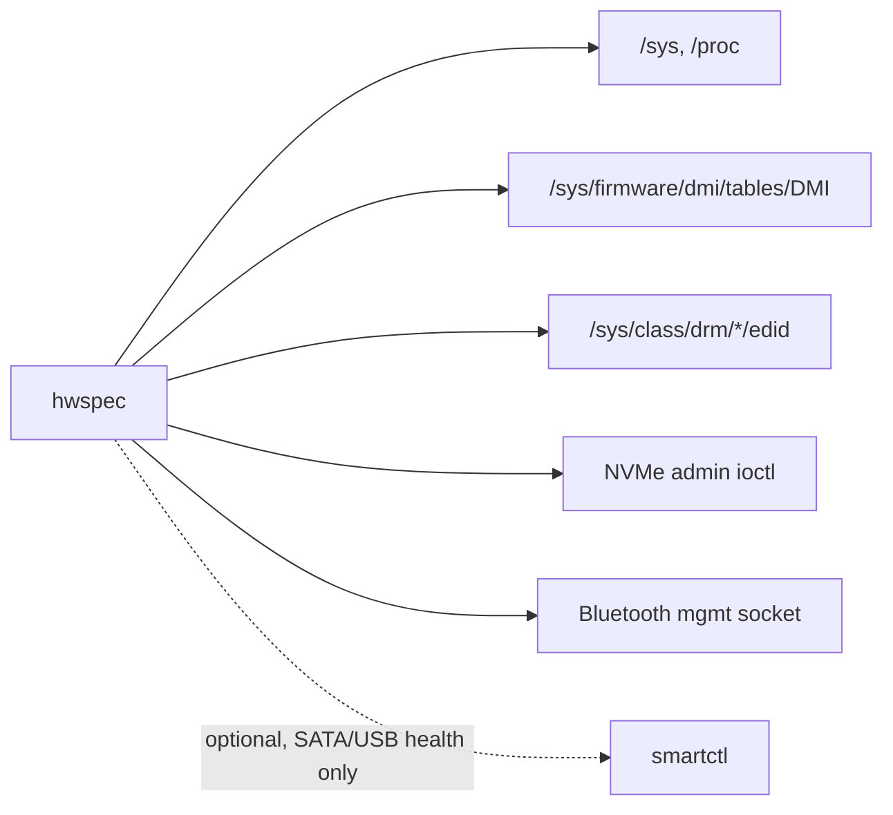

# 2. Read kernel interfaces directly, not other tools

**Status:** Accepted (2026-10-05) · reformatted as tables and diagrams on 2026-10-05, decision unchanged

## Context

`lshw`, `dmidecode`, `lspci`, `inxi` and `hwinfo` aren't installed everywhere, differ between versions, and their text output is brittle to parse.

## Decision

| Source | Read directly | Exception |
|---|---|---|
| Devices, CPU, memory, network, sensors | `/sys`, `/proc` | — |
| Memory modules, serials | raw SMBIOS table | — |
| Monitors | EDID blobs | — |
| NVMe health | admin-command ioctl | — |
| Bluetooth controllers | kernel management socket | — |
| SATA/USB drive health | — | `smartctl` when installed: ATA pass-through is large and device-specific |

## Consequences

| ✅ | ⚠️ |
|---|---|
| Same results on every distro, no runtime dependencies | we own the parsers (SMBIOS, EDID, NVMe SMART, mgmt replies), so they need thorough byte-fixture tests |
| | new hardware classes need new readers |
