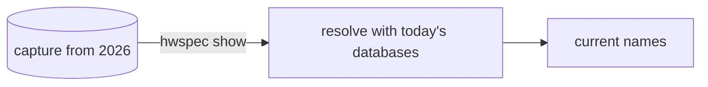

# 3. JSON capture format with raw IDs, additive schema

**Status:** Accepted (2026-10-05)

## Context

Captures are shared, archived and compared over years, and read by other tools and the planned desktop app.

## Decision

| Aspect | Rule |
|---|---|
| Canonical format | JSON; YAML from the same structure with the same field names |
| Identifiers | every named item keeps its raw IDs next to the names (PCI/USB IDs, JEDEC codes, EDID manufacturer IDs, CPU signature) |
| Evolution | `schema_version` changes only when a field is renamed, removed or changes meaning; adding fields is always allowed |
| Missing data | omitted, empty or "unknown", never guessed; the reason goes in `warnings` |
| Units | bytes, °C, or named in the field (`_mhz`, `_mts`, `_mbps`) |

## Consequences

| ✅ | ⚠️ |
|---|---|
| Old captures get newer names (`hwspec show`) | the structs in `internal/report` are the specification: changes are API changes |
| Consumers can rely on fields not disappearing within a schema version | |
