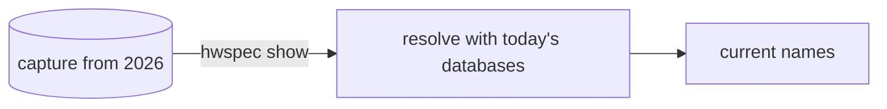

# 3. JSON capture format with raw IDs, additive schema

**Status:** Accepted (2026-10-05) · reformatted as tables and diagrams on 2026-10-05, decision unchanged · amended 2026-10-06: published JSON Schema (#37) · amended 2026-10-07: the advice document follows the same rules (#83)

## Context

Captures are shared, archived and compared over years, and read by other tools and the planned desktop app.

## Decision

| Aspect | Rule |
|---|---|
| Canonical format | JSON; YAML from the same structure with the same field names |
| Identifiers | every named item keeps its raw IDs next to the names (PCI/USB IDs, JEDEC codes, EDID manufacturer IDs, CPU signature) |
| Evolution | `schema_version` changes only when a field is renamed, removed or changes meaning; adding fields is always allowed |
| Missing data | omitted, empty or "unknown", never guessed; the reason goes in `warnings` |
| Units | bytes, °C, or named in the field (`_mhz`, `_mts`, `_mbps`) |

## Consequences

| ✅ | ⚠️ |
|---|---|
| Old captures get newer names (`hwspec show`) | the structs in `internal/report` are the specification: changes are API changes |
| Consumers can rely on fields not disappearing within a schema version | |

## Amendment (2026-10-06): a published JSON Schema

The structs stay the specification; a JSON Schema generated from them is published so consumers have a machine-readable contract, and CI enforces the evolution rule (#37).

| Aspect | Rule |
|---|---|
| Schema | `schema/capture-vN.json` (draft 2020-12), generated from `internal/report` by `tools/genschema`; `hwspec schema` prints the current one |
| `$id` and `$schema` | the schema's `$id` is its raw file on `main` (`https://raw.githubusercontent.com/jiegui2025/hwspec/main/schema/capture-v1.json`): a vN file only ever grows, so `main` is stable. Captures name it in a `$schema` key (an added field; captures from before it lack the key and still validate) |
| What the schema allows | unknown properties everywhere (newer vN builds add fields); only `schema_version`, `tool` and `tool.name` required; `null` for slices, maps and pointers, as Go writes them |
| Breaking, within a version | anything but adding a property or dropping a requirement: a removed property, a changed type set (adding `null` included), a newly required property, or any other keyword added, removed or changed. `genschema check` fails the PR on these |
| Not visible in a schema | a field that "changes meaning": still a review item |
| Freeze | bumping `SchemaVersion` to N adds `capture-vN.json`; every older file is frozen from then on (CI fails if one changes or disappears) |

**Amendment (2026-10-07, #83):** the advice document `hwspec advise -f json` writes (ADR 0009) is a public interface under the same rules. Its schema is `schema/advice-vN.json`, generated from `internal/advisor` by `tools/genschema` and printed by `hwspec schema advice`. The document names it in `$schema`, and `advice_version` is its version. `genschema check` compares each format's files on its own. One difference: the fields Go always writes stay required, since the document is never hand-made; a requirement may still be dropped, never added. Evidence is pinned as exactly `{path, value}` or `{path, absent: true}`, with the path in the capture's JSON grammar (`pci[16].class_code`). `category`, `severity` and `confidence` are open strings: newer builds may add values, which readers rank last.
