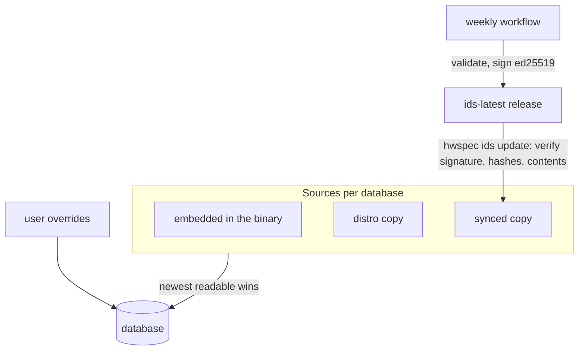

# 4. Offline ID databases, newest source wins, signed sync

**Status:** Accepted (2026-10-05) · reformatted as tables and diagrams on 2026-10-05, decision unchanged

## Context

Readable names need eight ID databases (pci.ids, usb.ids, pnp.ids, IEEE OUI, JEDEC, amdgpu.ids, Bluetooth company IDs, CPU codenames). Distros ship some of them, at different ages and paths, and some not at all. Captures must work offline.

## Decision

| Part | Decision |
|---|---|
| Offline | every database is embedded (about 1 MB compressed) |
| Choice | per database, the newest of embedded / distro / synced; dated by manifest, header or file time (future distro dates ignored; manifest dates checked before signing); fall back if unreadable |
| Corrections | the user's overrides file is applied last |
| Updates | weekly bundle built deterministically from upstream (HTTPS only), refused if a database shrinks >5% or is future-dated, re-verified, then signed in a protected environment |
| Client checks | signature against a built-in key, no rollback (vs installed and built-in data), size + SHA-256 + parse of every file; each file replaced atomically, manifest last |

## Consequences

| ✅ | ⚠️ |
|---|---|
| Names work on any system, offline, and improve with distro updates or a sync | the signing key is a long-lived secret; rotation needs a release trusting both keys first |
| One trusted publication point; clients don't load volunteer-run upstream servers | |
