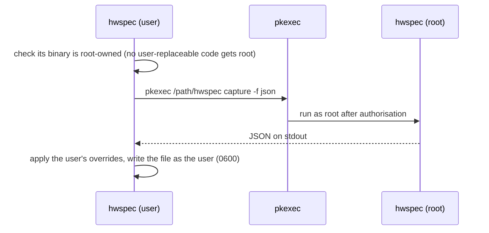

# 5. Root access by re-running under pkexec, no daemon

**Status:** Accepted (2026-10-05)

## Context

Memory modules (SMBIOS), serial numbers and drive health need root.

## Options

| Option | Root exposure | Works on sysvinit (MX Linux) | Live root features |
|---|---|---|---|
| **One-shot re-run under `pkexec`** | seconds, only when asked | ✅ | ❌ |
| Resident D-Bus root daemon (Chassis's approach) | always running | ❌ needs systemd integration | ✅ (e.g. driver binding) |

## Decision

## Consequences

| ✅ | ⚠️ |
|---|---|
| Nothing runs as root except a short capture, and only when asked | `--full` needs a root-owned install (`/usr/local/bin`); otherwise use `sudo` |
| Works with any polkit agent, including the terminal agent over SSH | no live root-only features without revisiting this decision |
