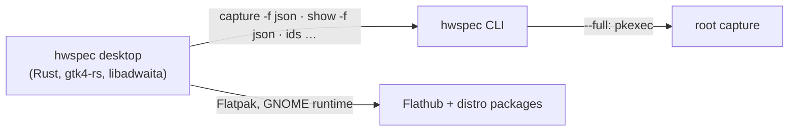

# 7. Desktop app in Rust with GTK4 and libadwaita, driving the CLI

**Status:** Proposed (2026-10-05) · reformatted as tables on 2026-10-05, proposal unchanged

## Context

| Need | Detail |
|---|---|
| What the app does | review captures, run captures (including privileged ones), browse ID databases and advisor results, compare, export |
| Quality bar | high stability and robustness, fast with large device lists, moderate memory, polished native look, room to grow |
| Platforms | Linux only for now; Windows and macOS deferred ([#28](https://github.com/jiegui2025/hwspec/issues/28)) |

## Options

| | Rust + GTK4/libadwaita | Qt 6 / QML | Slint | Go + gotk4 | Webview (Tauri/Wails) |
|---|---|---|---|---|---|
| Robustness | High (mature toolkit, memory safe) | High toolkit, C++ | Young | Single-maintainer bindings | Good |
| Performance | GPU rendering, virtualised lists | Excellent | Excellent | As GTK | Good |
| Idle RAM | ~50–80 MB | ~60–100 MB | ~20–40 MB | ~60–90 MB | ~100–200 MB |
| Look on GNOME/Cinnamon/Xfce | Native | Foreign | Neutral | Native | Web |
| Look on KDE | Acceptable | Native | Neutral | Acceptable | Web |

## Decision (proposed)

Rust with gtk4-rs and libadwaita, shipped as a Flatpak (GNOME runtime) plus distro packages. The app drives the `hwspec` binary through its JSON interface rather than linking the engine.

## Consequences

| ✅ | ⚠️ |
|---|---|
| The engine stays one tested static binary; the app is a client of a stable, versioned interface | two languages in the repository |
| Native look on the GTK desktops most target distros use | in a Flatpak, `--full` must reach the host's polkit (`flatpak-spawn --host`), which needs a sandbox exception; to be designed |
| Idle memory in the target range (verified in the [#13](https://github.com/jiegui2025/hwspec/issues/13) spike) | |
