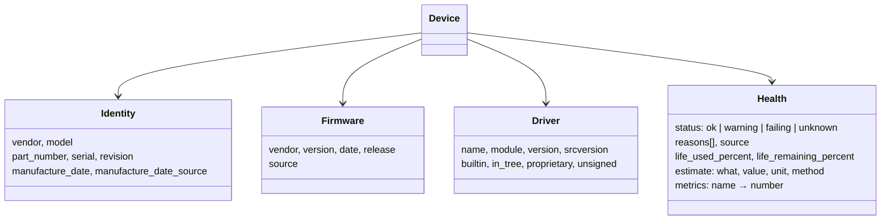

# 8. Identity, firmware, driver and health blocks on every device

**Status:** Accepted (2026-10-05) · Issue [#24](https://github.com/jiegui2025/hwspec/issues/24)

## Context

The owner's requirement: for every piece of hardware, always capture, where applicable, its **serial and part numbers**, **firmware**, **driver**, and **health / longevity** (including estimated life remaining). Captures so far held these inconsistently: a disk had `serial` and `firmware`, a GPU a `driver` string, memory modules a `serial` but no manufacture date, NICs no firmware at all.

v0.1.0 isn't released, so the format can still be restructured without breaking anyone.

## Options

| Option | Consistency | Duplication | Effort |
|---|---|---|---|
| **Shared blocks on every device, fields moved into them** | one shape everywhere | none | high, once, before release |
| Shared blocks added, old flat fields kept | one shape, plus legacy | everything twice | medium |
| Keep per-device fields, add what's missing | none | none | medium, and grows forever |

## Decision

Every device type carries up to four shared blocks. A block is present only when something in it was read.

| Device | identity | firmware | driver | health |
|---|---|---|---|---|
| System | ✅ (SKU as part number) | ✅ BIOS/UEFI | — | — |
| Board | ✅ | — | — | — |
| CPU | ✅ | ✅ microcode | ✅ frequency scaling | ✅ thermal throttle counts |
| Memory module | ✅ incl. SPD manufacture date | — | — | ✅ EDAC error counts |
| Disk | ✅ | ✅ | ✅ | ✅ SMART, life used/remaining |
| GPU | ✅ | ✅ VBIOS / driver-provided | ✅ | — |
| Display | ✅ incl. EDID manufacture date | — | — | — |
| Network | ✅ | ✅ (ethtool) | ✅ | ✅ error and drop counters |
| Bluetooth | ✅ | — | ✅ | — |
| Audio codec | ✅ | — | — (on the card) | — |
| Battery | ✅ incl. manufacture date | — | — | ✅ wear, cycles, estimate |
| USB device | ✅ | ✅ device release (`bcdDevice`) | ✅ per interface | — |
| PCI device | ✅ | — | ✅ | — |

### Health rules

| Rule | Detail |
|---|---|
| Status comes from the device's own verdict or fixed thresholds | e.g. NVMe critical-warning bits, SMART passed/failed, battery below 80% → warning |
| Life used/remaining only from hardware wear indicators | NVMe *percentage used*, SATA SSD endurance indicator, battery capacity versus design. For batteries, life remaining is the share of the conventional useful range (100% → 80% of design capacity) left |
| Estimates name their method | e.g. battery cycles until 80%: `(health − 80) ÷ wear-per-cycle measured so far` |
| Rated values (TBW, rated cycles, MTBF) aren't invented | they come later from curated model data ([#25](https://github.com/jiegui2025/hwspec/issues/25)) |
| Metrics use documented names | `power_on_hours`, `data_written_bytes`, `media_errors`, `ecc_corrected`, `rx_errors`, … (constants in `internal/report`) |

## Consequences

| ✅ | ⚠️ |
|---|---|
| One shape for every device: consumers and the desktop app handle all four topics uniformly | every collector, the resolver, redaction and the text output change at once |
| Redaction covers identity blocks generically (serials, manufacture-date-adjacent identifiers) | captures from before this change are pre-release and not migrated |
| New sources (SPD, ethtool, EDAC, `/sys/module`) slot into existing blocks | `schema_version` stays 1: the format was never released in the old shape |
