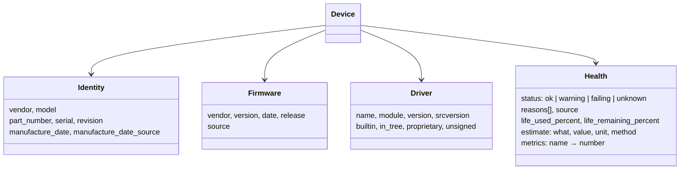

# 8. Identity, firmware, driver and health blocks on every device

**Status:** Accepted (2026-10-05) · Issue [#24](https://github.com/jiegui2025/hwspec/issues/24) · amended 2026-10-06: firmware is never silently absent ([#123](https://github.com/jiegui2025/hwspec/issues/123))

## Context

The owner's requirement: for every piece of hardware, always capture, where applicable, its **serial and part numbers**, **firmware**, **driver**, and **health / longevity** (including estimated life remaining). Captures so far held these inconsistently: a disk had `serial` and `firmware`, a GPU a `driver` string, memory modules a `serial` but no manufacture date, NICs no firmware at all.

v0.1.0 isn't released, so the format can still be restructured without breaking anyone.

## Options

| Option | Consistency | Duplication | Effort |
|---|---|---|---|
| **Shared blocks on every device, fields moved into them** | one shape everywhere | none | high, once, before release |
| Shared blocks added, old flat fields kept | one shape, plus legacy | everything twice | medium |
| Keep per-device fields, add what's missing | none | none | medium, and grows forever |

## Decision

Every device type carries up to four shared blocks. A block is present only when something in it was read.

| Device | identity | firmware | driver | health |
|---|---|---|---|---|
| System | ✅ (SKU as part number) | ✅ BIOS/UEFI | — | — |
| Board | ✅ | — | — | — |
| CPU | ✅ | ✅ microcode | ✅ frequency scaling | ✅ thermal throttle counts (recorded, not a fault on their own) |
| Memory module | ✅ incl. SPD manufacture date | — | — | ✅ EDAC error counts, all ranks added up |
| Disk | ✅ | ✅ | ✅ | ✅ SMART, life used/remaining |
| GPU | ✅ | ✅ VBIOS / driver-provided | ✅ | — |
| Display | ✅ incl. EDID manufacture date (or `model_year` when that is all the EDID gives) | — | — | — |
| Network | ✅ | ✅ (ethtool) | ✅ | ✅ error and drop counters |
| Bluetooth | ✅ | — | ✅ | — |
| Audio codec | ✅ | — | — (on the card) | — |
| Battery | ✅ incl. manufacture date | — | — | ✅ wear, cycles, estimate |
| USB device | ✅ | ✅ device release (`bcdDevice`) | ✅ per interface | — |
| PCI device | ✅ | — | ✅ | — |

### Health rules

| Rule | Detail |
|---|---|
| Status comes from the device's own verdict or fixed thresholds | e.g. NVMe critical-warning bits, SMART passed/failed, battery below 80% → warning; only cell faults (dead, over-voltage, over-current) are failing, temperature states are warnings |
| Life used/remaining only from hardware wear indicators | NVMe *percentage used*, SATA SSD endurance indicator, battery capacity versus design |
| Life used + remaining = 100 on every device | for batteries both are measured on the conventional useful range, 100% → 80% of design capacity (90% capacity = 50% used, 50% left); the raw figure is the `capacity_percent` metric |
| Errors are pinned on a part only when the match is unambiguous | EDAC labels match a module's bank locator + locator on word boundaries; a label that fits several modules is a capture warning, never a guess |
| Estimates name their method | e.g. battery cycles until 80%: `(health − 80) ÷ wear-per-cycle measured so far` |
| Rated values (TBW, rated cycles, MTBF) aren't invented | they come later from curated model data ([#25](https://github.com/jiegui2025/hwspec/issues/25)) |
| Metrics use documented names | `power_on_hours`, `data_written_bytes`, `media_errors`, `ecc_corrected`, `rx_errors`, … (constants in `internal/report`) |

## Consequences

| ✅ | ⚠️ |
|---|---|
| One shape for every device: consumers and the desktop app handle all four topics uniformly | every collector, the resolver, redaction and the text output change at once |
| Redaction covers identity blocks generically (serials, manufacture-date-adjacent identifiers) | captures from before this change are pre-release and not migrated |
| New sources (SPD, ethtool, EDAC, `/sys/module`) slot into existing blocks | `schema_version` stays 1: the format was never released in the old shape |

## Amendment (2026-10-06): firmware is never silently absent

The owner's rule (#114): a part that has firmware always says so. A missing firmware block read as "this part has no firmware" when it meant "hwspec couldn't read it", and nothing told the two apart.

| Aspect | Rule |
|---|---|
| The block | every part that has firmware carries a `firmware` block: a `version` with its `source`, or `status: "unknown"` with a `reason` (e.g. "needs --full", "the kernel doesn't expose this drive's firmware revision", "… not read yet, see #43") and no version. Nothing in between. Additive under ADR 0003: `status` and `reason` are new fields, and `version` and `source` are left out of an unknown block |
| Which parts have firmware | the table below. A part hwspec can't detect gets no block at all: the ME and EC have one exactly when they were found |
| Enforced by | a test that walks every recorded and synthetic capture and fails on a firmware-bearing part with neither a version nor an explained `unknown` (`checkFirmwareComplete`, `internal/collect`) |
| Text output | "firmware unknown (reason)" where a version would be |

| Part | Firmware | Without a version |
|---|---|---|
| System | BIOS/UEFI (DMI) | "no DMI (SMBIOS) tables …" or "the DMI tables give no BIOS version" |
| Intel ME (CSME) | `mei` `fw_ver` | when found: why the kernel gave none |
| Embedded controller | DMI EC release | a release DMI gives but that doesn't parse: "ec_firmware_release isn't in the kernel's format"; no release: no block (an EC that DMI doesn't report can't be detected) |
| TPM | 2.0: under `--full`, the TPM itself (one `TPM2_GetCapability` through `/dev/tpmrm0`, source `tpm`, [#122](https://github.com/jiegui2025/hwspec/issues/122)); otherwise udev's `tpm2_id` record of the same answer (`ID_TPM2_MODALIAS` `mf…`, `fw…`, readable by anyone, source `udev`), written alike; 1.2: the kernel's `caps` file | "udev didn't record it; asking the TPM needs --full"; under root, "the TPM didn't give it, and udev didn't record it", plus a warning; 1.2: why `caps` gave none |
| CPU | microcode | x86: `/proc/cpuinfo` gives none; elsewhere the kernel doesn't report it |
| Disk | NVMe, SCSI, MMC revision | "the drive reports …" for a placeholder, else "the kernel doesn't expose this drive's firmware revision"; a virtual disk, and a block device without a device link (md RAID, zvols), have no block |
| GPU | VBIOS (amdgpu, NVIDIA); Intel GuC, HuC, DMC ([#43](https://github.com/jiegui2025/hwspec/issues/43)) | after the driver: "no driver is bound", "the driver reports no VBIOS version", "vbios_version can't be read: …", the NVIDIA file's answer, "hwspec doesn't read Intel GPU firmware (GuC, HuC, DMC) yet", or "the DRIVER driver doesn't expose a firmware version" |
| Network adapter | ethtool | an empty answer or no support: "the driver reports no firmware version (ethtool)"; any other error: "ethtool can't ask the driver: …", with a warning |
| Bluetooth controller | HCI revision ([#43](https://github.com/jiegui2025/hwspec/issues/43)) | "hwspec doesn't read the controller's HCI revision yet" |
| USB device | device release (`bcdDevice`, which the kernel always creates) | "bcdDevice can't be read" |
| Display, battery, memory module, audio codec | not exposed by the kernel | no block |
| Other PCI devices | some expose one (a Thunderbolt controller's `nvm_version`, some adapters' `fw_ver`) | not read by hwspec yet: no block until they are |

Reasons say what happened in plain words; the issues that will read a missing version are named here, not in the captures.
