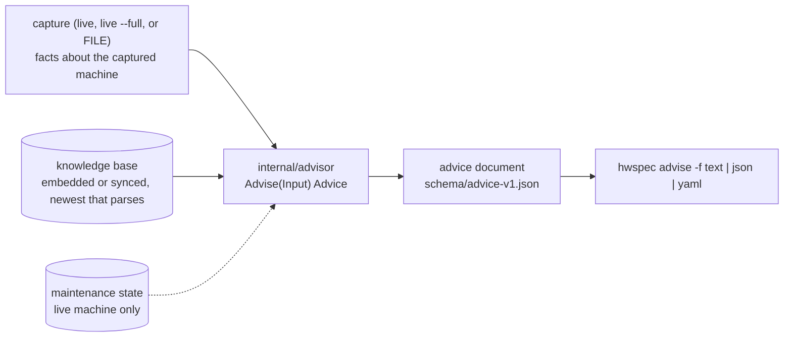

# 9. Advisor: a separate command over captures, a sourced knowledge base, no network

**Status:** Accepted (2026-10-06) · Issue [#5](https://github.com/jiegui2025/hwspec/issues/5) · amends [ADR 0004](0004-offline-id-databases.md) (the bundle also carries the knowledge base) · clarified 2026-10-06: what a check declares (#146) · amended 2026-10-06: the data sections and the processor-number match key ([#128](https://github.com/jiegui2025/hwspec/issues/128)); a version unique per content ([#185](https://github.com/jiegui2025/hwspec/pull/185))

## Context

The owner's requirements, quoted on [#5](https://github.com/jiegui2025/hwspec/issues/5):

| Requirement | Built by |
|---|---|
| Devices without a driver or firmware, with the fix | [#7](https://github.com/jiegui2025/hwspec/issues/7) |
| Better driver or configuration choices "to maximize performance" | [#8](https://github.com/jiegui2025/hwspec/issues/8) |
| Replacement and upgrade options for key components | [#9](https://github.com/jiegui2025/hwspec/issues/9), data in [#25](https://github.com/jiegui2025/hwspec/issues/25) |
| Available firmware versions and update paths | [#10](https://github.com/jiegui2025/hwspec/issues/10) |
| Maintenance reminders from the model's age (repaste, cleaning, PTM7950 pads) | [#11](https://github.com/jiegui2025/hwspec/issues/11) |

These five need one engine, one data format and one output. The constraints come from earlier records and the code:

| Constraint | Source |
|---|---|
| Captures are facts: raw IDs, nothing guessed, reasons in `warnings`; fields are only added | [ADR 0003](0003-capture-format.md), ARCHITECTURE "Never guess" |
| Devices carry up to four blocks (identity, firmware, driver, health), each present only when read | [ADR 0008](0008-device-detail-blocks.md) |
| Rated values (TBW, cycles, MTBF) come from curated model data, not invented | ADR 0008, "Health rules"; #25 |
| Captures never touch the network or run programs (except `smartctl` and `pkexec`); only `hwspec ids update` downloads, and only signed data | ARCHITECTURE Rules, [ADR 0002](0002-kernel-interfaces.md), [ADR 0004](0004-offline-id-databases.md), `.golangci.yml` `no-network`, `no-subprocesses` |
| `product_uuid` is readable by root only and redacted; `/etc/machine-id` is world-readable but "must not be used directly … should be hashed with a cryptographic, keyed hash function, using a fixed, application-specific key" | `ls -l /sys/class/dmi/id/product_uuid /etc/machine-id`; `man 5 machine-id` |
| The weekly ID bundle is built from `main` (`ids.yml` checks out no tag), so it reaches binaries released before it | `.github/workflows/ids.yml` |
| LVFS: 4,382 of 4,412 components in fwupd's cached catalogue (2026-10-05) have a proprietary *firmware* licence (`<project_license>`); the catalogue itself states no redistribution terms. LVFS's offline guide covers mirroring for one's own fleet | fwupd 2.1.8 cache; <https://lvfs.readthedocs.io/en/latest/offline.html> |

## Options

**Where advice lives**

| Option | Captures stay facts | Old captures re-evaluated with new data | Verdict |
|---|---|---|---|
| Embedded in the capture | ❌ advice ages with the knowledge base | ❌ frozen at capture time | rejected |
| **Separate `hwspec advise` and `advice` document** | ✅ | ✅ `advise old.json` | **chosen** |

**How checks and data are written**

| Option | Testable without hardware | Contributors add data without Go | Verdict |
|---|---|---|---|
| Go code only | ✅ | ❌ | rejected |
| A rule language: our own, or an existing one (CEL, Rego, expr) | ✅ | ✅ | rejected: a new dependency or language to secure, and checks such as "fits this slot" still need code |
| **Go checks, registered by name; YAML supplies their data and sources** | ✅ | ✅ for every existing check | **chosen** |

**How the knowledge base ships**

| Option | Offline | Updates without a release | Verdict |
|---|---|---|---|
| Embedded only | ✅ | ❌ | rejected |
| Downloaded when advising | ❌ breaks the network rule | ✅ | rejected |
| Its own signed channel | ✅ | ✅ | rejected: a second key, release and client path for the same guarantees |
| **Embedded, plus the signed ID bundle** | ✅ | ✅ `hwspec ids update` | **chosen**: reuses ADR 0004's signature, rollback and shrink checks |

**How maintenance state is keyed**

| Option | Works as a user | Survives `--redact` | Reveals an identifier | Verdict |
|---|---|---|---|---|
| `product_uuid` | ❌ root only | ❌ redacted | ✅ yes | rejected |
| Serials from the capture | ⚠️ not on every machine, root for most | ❌ redacted | ✅ yes | rejected |
| One unkeyed per-user file | ✅ | ✅ | ❌ | rejected: a home directory shared between machines mixes their records |
| Raw `/etc/machine-id` | ✅ | ✅ | ✅ the man page forbids it | rejected |
| **systemd's app-specific ID of `machine-id`** | ✅ | ✅ | ❌ not reversible | **chosen** |

## Decision



| Topic | Decision |
|---|---|
| Command | `hwspec advise [FILE] [--full] [--redact] [-o FILE] [-f text\|json\|yaml]`. Without FILE it captures this machine, unprivileged, or as root with `--full` (the same pkexec path as `capture --full`). It makes no network calls |
| Output | an `advice` document, never part of a capture. `show` and `capture -f text` keep only the capture's own *Needs attention (as recorded)* list (`internal/output`), so `output` never imports the advisor |
| Inputs | three kinds, by what they describe. **Capture facts** describe the captured machine (kernel command line, module options and blacklists (`kernel.module_blacklist`, each with its kind: `modprobe.d` blacklist and no-op install lines, `modprobe.blacklist=` and the kernel's `module_blacklist=`, the only command-line keys read, #212), modaliases, the modules its own kernel index names for a driverless device (`pci[].module_candidates`, and `kernel.module_index`: where the running kernel's module index is, or that only other kernels' modules are installed, or none at all, #131), fwupd's list of its devices and their firmware): `internal/collect` adds them to the capture as additive fields, with `tools/snapshot` fixtures, so they work for `advise FILE` too. **Reference data** is machine-independent: the knowledge base, and #10's LVFS catalogue as fwupd caches it on the machine running `advise`. **State** is the user's record for the live machine. Nothing else is read. fwupd's per-device answers (`GetUpgrades`) mix the two: the devices and installed versions are capture facts; which versions are available is reference data, so hwspec matches them itself rather than asking fwupd at advise time, unless #10 decides otherwise and amends this record |
| Live only | the state (and its config, below): a saved capture doesn't say which machine runs `advise`. `advise FILE` says so in a warning |
| Engine | `internal/advisor`: `Advise(Input) Advice`, pure. `Input` holds the capture, the knowledge base, the state and its config (or nil) and the time; later reference data (#10's catalogue) is added as a field. All checks live in `internal/advisor` itself, not in subpackages, so `tools/genkb` sees every check through one import |
| Checks | Go functions registered by name (each check's file registers it in `init`), each declaring what a rule for it may say: the capture fields it needs, the match keys it honours and those a rule must set, a strict decoder for its `data` (or none), the `{placeholders}` it fills, and an example rule and capture the generic tests run it on. `advisor.ValidateRule` checks a rule against these; `tools/genkb` refuses a rule that fails it, and `Advise` skips one (clarified 2026-10-06, [#146](https://github.com/jiegui2025/hwspec/issues/146)) |
| Older binaries | the bundle is built weekly from `main`, so it reaches binaries older than its rules. What this build doesn't know is handled by kind, never by failing the whole file: an unknown **top-level section** (#25's models, #10's firmware) is ignored with a warning; an unknown **field in a source or action** (descriptive) is ignored; a **source** with an unknown value (e.g. confidence) is skipped, and so is every rule citing it; a **rule** with an unknown field, match key, category or severity, or an unknown check, is skipped with a warning, never applied in part; a **claim** may carry keys this build doesn't read, but only descriptive ones (a note, a page): anything that qualifies a value (a unit, a condition, a scope) is a new `data` key, which an older check doesn't know and so skips its rule; a check's **data** is decoded strictly by the check, which skips its rule when it can't. The format is bumped (below) only when an existing field changes its meaning or type |
| Old captures | a check whose fields a capture can't have (older than the field) reports *can't evaluate (needs …)* as a warning, never a finding. Fields added after v0.1.0 must tell "absent" from "empty" (a pointer, or the collector's name in the capture), so this can be decided |
| Knowledge base | YAML in `kb/` compiled by `tools/genkb` (which imports `internal/advisor` for the check names, and is strict: anything unknown fails the build) into `advisor-v<format>.json.gz`, committed with the YAML (CI fails while they differ). The file carries its `format` and its `version`: the UTC time its content last changed, to the second (`2026-10-06T14:03:05Z`, amended 2026-10-06 for #185, below), which `genkb` keeps while the content is unchanged. `internal/kb` parses bytes and is pure; it embeds the built-in copy |
| Format | in the file name: `advisor-v1.json.gz`. A new format is a new file name, and `ids update` already skips names a binary doesn't know, so a format bump never blocks an older binary's ID updates. After a bump, the last file of each older format stays committed and is published like the current one while supported releases read it, so nothing unauthenticated is carried forward from a previous bundle (#81) |
| Shipping | the weekly bundle publishes the **committed** file as it is, so its `version` and bytes change only when `kb/` does and no new bundle goes out for nothing. `internal/ids` installs it with the bundle's checks (signature, size, SHA-256, gzip, a JSON object whose `format` matches the name) without importing `kb`, and returns the installed bytes; the shrink guard is CI's, as for the ID databases. The CLI hands `kb` the copy with the later `version` (a tie is the same content, and the embedded copy is used); a synced copy that doesn't parse, or whose `version` isn't the signed manifest's, falls back to the embedded one with a warning. #81 lists the bundle tooling this needs (`genids manifest` and `verify`, the publish step) |
| Firmware updates (#10) | **open, owned by #10.** fwupd's catalogue cache is compressed per build (zstd, else xz, else gzip; Go's standard library reads only gzip) and signed with PKCS#7; D-Bus is a socket; `fwupdmgr --json` is a subprocess. Each route breaks a current rule, so #10 amends ADR 0002, this record (its inputs), the *No external tools* rule and `.golangci.yml` first. LVFS data is never redistributed |
| Licence | contributed knowledge-base text and data are GPL-3.0-or-later (owner, 2026-10-06; [ADR 0006](0006-licence.md)). A quote stays under its source's licence: each source records it, short attributed quotes are kept as quotations, and sources whose terms forbid that (e.g. non-commercial) are linked only |
| Out of scope | translations of advice text; resident daemons ([ADR 0005](0005-privileged-rerun.md)); Windows and macOS (#28) |

### Matching

Rules match raw IDs that captures hold (ADR 0003), never display names:

| Device | Key | In captures |
|---|---|---|
| System | DMI `sys_vendor` + `product_name`, optionally `board_name` and SKU | ✅ |
| PCI | `vendor:device[:subvendor:subdevice]`, a list of them (in `data`, cited), class code prefix | ✅ |
| USB | `vid:pid` | ✅ |
| CPU | `vendor:family:model[:stepping]` as `cpu.ids` keys it: `intel:6:9e:10` (family and model hex, stepping decimal) | ✅ |
| CPU model | the processor number parsed from the CPUID brand string, e.g. `i5-9500T` from `Intel(R) Core(TM) i5-9500T CPU @ 2.20GHz` (amended 2026-10-06, owner, #128): several SKUs share a CPUID family and model. The parser reads only the forms there is evidence for (Intel Core `iN-NNNN[N]` with up to two suffix letters, so far); any other brand string matches nothing | ✅ (`cpu.identity.model`) |
| Driver | module name | ✅ |
| Modalias | glob | after #7, for devices without a driver |
| Kernel | version range, e.g. below 6.19 | ✅ (`os.kernel`) |
| Firmware | version prefix (#10) | ✅ where the device reports one |
| OS | distro `id`, `id_like` | ✅ |

### Findings

| Field | Values |
|---|---|
| `id` | the rule's ID, e.g. `pci.no-driver` |
| `category` | `needs-attention` (#7) · `performance` (#8) · `upgrade` (#9) · `firmware` (#10) · `maintenance` (#11) |
| `severity` | `critical` · `warning` · `info` |
| `device` | `{kind, key, name}`, e.g. `{"kind":"pci","key":"0000:02:00.0"}`; absent for machine-wide findings |
| `evidence` | capture paths with their values, or `absent: true`. Never identity, serial, UUID, MAC or hostname fields |
| `actions` | `{distro, text, commands, risk, undo}`: what to do, what can go wrong, how to go back. Commands are shown, never run |
| `answers` | an upgrade finding's answers (#9), one per question: `{topic, known, text, claims: [{value, src, published}]}`. `known: false` means the text says why it can't be told; `claims` are the knowledge-base values behind it, conflicting ones included (amended 2026-10-06 for #107, below; this row first named a typed `data` field). #10's versions will be added the same way |
| `sources`, `confidence` | the sources used; confidence is the weakest of them |

```json
{"advice_version": 1, "kb_version": "2026-10-06", "capture_sha256": "…", "live": true, "redacted": false,
 "rules_applied": 1, "rules_skipped": 0, "warnings": [], "findings": [
  {"id": "pci.no-driver", "category": "needs-attention", "severity": "warning",
   "device": {"kind": "pci", "key": "0000:02:00.0", "name": "Wi-Fi 6 AX200"}, "title": "…", "detail": "…",
   "evidence": [{"path": "pci[16].class_code", "value": "028000"}, {"path": "pci[16].driver", "absent": true}],
   "actions": [{"text": "…", "commands": ["modprobe -R pci:v00008086d00002723sv00008086sd00000084bc02sc80i00"]}],
   "sources": [{"id": "kernel-binding", "url": "…", "retrieved": "2026-10-06", "licence": "GPL-2.0-only", "confidence": "upstream-doc", "quote": "…"}],
   "confidence": "upstream-doc"}]}
```

| Document rule | Detail |
|---|---|
| Fields | `live`: the capture is of the machine running `advise`. `kb_version`: the used copy's `version`, the UTC time its content last changed. `capture_sha256`: SHA-256 of the capture exactly as advised, re-encoded as compact JSON by this build (after `--redact`; a live capture after naming devices), so the JSON and YAML of one capture agree. It identifies the advised content, not the file: it isn't `sha256sum FILE` |
| Order | by severity, category, rule and device: the same inputs give the same document |
| Schema | `schema/advice-v1.json`, evolved like captures (ADR 0003: fields added only) |
| Privacy | written `0600`. `--redact` redacts the capture first, so `capture_sha256` and device names come from the redacted capture |

### Provenance

The knowledge base follows #25's claims model: one registry of sources, and every rule and every data value cites them.

| Rule | Detail |
|---|---|
| Sources | `sources: {id: {url, mirror, title, doc, edition, published, retrieved, licence, confidence, quote \| link_only + locator}}`; `doc` and `edition` name a document's number and revision, `mirror` is a copy to use when the URL fails. Any YAML file may declare sources (a model file its datasheets); IDs are unique across files, so all of them form one registry |
| Citations | a rule's `src: [id, …]`; inside `data`, every leaf value is a claim list `[{value, src}]` |
| Confidence | per source, strongest first: `oem-doc` › `upstream-doc` › `measured` › `community`. A finding's is the weakest source it used. A value read from the capture itself cites the built-in source `capture` (`measured`) |
| Conflicts | claims from different sources are all kept and shown, never averaged (HP's own documents give 32 GB and 64 GB as one model's memory maximum, #25) |
| Validation | `tools/genkb` fails on an uncited rule or claim, an unknown `src`, a source without licence or confidence, a quote on a link-only source, duplicate IDs, two model files with the same match key (e.g. one DMI product twice), unknown checks, categories or severities, and malformed match keys |

```yaml
sources:
  amdgpu-params:
    url: https://docs.kernel.org/gpu/amdgpu/module-parameters.html
    retrieved: "2026-10-05"
    licence: MIT                     # quoted from amdgpu_drv.c's parameter descriptions
    confidence: upstream-doc
    quote: "SI (Southern Islands) are first generation GCN GPUs, supported by both drivers"
  amdgpu-si-default:                # the sentence is in v6.19's documentation, not v6.18's
    url: https://www.kernel.org/doc/html/v6.19/gpu/amdgpu/module-parameters.html
    retrieved: "2026-10-06"
    licence: MIT
    confidence: upstream-doc
    quote: "By default, SI dedicated GPUs are supported by amdgpu."
  amdgpu-pciidlist:
    url: https://git.kernel.org/pub/scm/linux/kernel/git/torvalds/linux.git/tree/drivers/gpu/drm/amd/amdgpu/amdgpu_drv.c
    retrieved: "2026-10-05"
    licence: MIT
    confidence: upstream-doc
    quote: "{ PCI_DEVICE(0x1002, 0x6780), .driver_data = CHIP_TAHITI },"
rules:
  - id: gpu.amd.si-on-radeon
    check: driver-alternative        # Go check, registered by name
    category: performance
    severity: info
    # SI cards only, by device ID: TeraScale and CIK cards are radeon-bound too,
    # and amdgpu can't (TeraScale) or handles them differently (CIK).
    # From 6.19 amdgpu takes SI by default.
    # driver and kernel_below are match keys #8 adds; kernel_below cites amdgpu-si-default
    match: {pci_class: ["03"], driver: radeon, kernel_below: "6.19"}
    data:
      devices: [{value: ["1002:6780", "1002:6784", "…"], src: amdgpu-pciidlist}]
      alternative: [{value: amdgpu, src: amdgpu-params}]
    src: [amdgpu-params, amdgpu-pciidlist, amdgpu-si-default]
```

### State

| Topic | Decision |
|---|---|
| File | `$XDG_STATE_HOME/hwspec/machines/<key>.json` (default `~/.local/state`), mode 0600, read and written as the unprivileged user, also under `--full`. Under `sudo` it's the invoking user's (`SUDO_UID`'s home and ownership), as output files already are |
| Key | systemd's `sd_id128_get_machine_app_specific()`: HMAC-SHA256 keyed with the 16 bytes of `machine-id`, over hwspec's application ID `3286820f-7415-4a5d-b06c-16d2c1d858fa`, the first 16 bytes made a v4 UUID, written as 32 lower-case hex digits. `systemd-id128 -a 3286820f74154a5db06c16d2c1d858fa machine-id` prints the same key |
| Contents | `{format, done: [{task, date, material?, note?}]}`, one entry per time a task was done, so history and materials (e.g. PTM7950) are kept. Comparing captures over time is #12's, from capture files |
| Config | the user's own maintenance intervals, `$XDG_CONFIG_HOME/hwspec/maintenance.yaml`, override the knowledge base's defaults; read with the state (#11) |
| Writer | `hwspec maintenance done TASK [--date] [--material] [--note] \| list \| forget`, flags and file details with #11 |
| Limits | a reinstall gets a new `machine-id`, so a new, empty state; cloned images share one until `machine-id` is regenerated. No readable `machine-id`: advice without state, plus a warning |

### Package boundaries

| Package | May import | Enforced by |
|---|---|---|
| `internal/kb` | the standard library; pure | depguard `stdlib-only`, `parsers-are-pure` |
| `internal/advisor` | the standard library, `internal/report`, `internal/kb`; pure; every check, no subpackages; renders text advice, cleaning every string. The CLI writes JSON (`encoding/json`) and YAML (`internal/output`); their strings are clean because `kb` refuses control characters in every text field, string claim value and `data` key, and captures are sanitised when read | depguard `advisor`, `parsers-are-pure`, forbidigo |
| `internal/collect` | unchanged: host facts are collected here | depguard `collect`; the no-network and no-subprocess tests |
| `internal/ids` | the standard library: it ships the knowledge base as bytes | depguard `stdlib-only` |
| `internal/output` | renders captures; for advice only its generic YAML writer, never advice text | depguard `output` |
| `tools/genkb` | the standard library, `internal/kb`, `internal/advisor`, `gopkg.in/yaml.v3` | depguard `genkb` |
| `cmd/hwspec` | reads the state, its config and `machine-id`, picks the newer knowledge base copy (falling back to the embedded one), writes advice | review |

## Consequences

| ✅ | ⚠️ |
|---|---|
| Captures stay facts; new knowledge re-evaluates old captures, and says when it can't | every new fact a check needs is a capture field first (#7, #8 add some) |
| One engine, format and output for #7–#11 | every check needs Go; contributors without Go can only add data for existing checks |
| Every claim can be traced to a source, its licence and its confidence | knowledge-base entries are slower to write |
| The knowledge base updates weekly, offline after that, and older binaries skip what they can't apply | rules for new checks help only after a release; the shrink guard can block a legitimate cleanup (override: the ids workflow's **allow_shrink** input, CONTRIBUTING) |
| No firmware metadata is redistributed | firmware update paths (#10) need a decision that amends ADR 0002 first |
| Maintenance state works without root and without revealing `machine-id` | it doesn't follow a reinstall |

## Amendment (2026-10-06): the data sections and the processor-number key

The data #25 needs (what fits a model, a device's maxima, a CPU's limits, vendor allow-lists) goes into four top-level sections of the same file, beside `sources` and `rules` (#128). Older binaries skip them with a warning, as the *Older binaries* row already provides, so the format isn't bumped.

| Section | One entry per | `match` | Groups (#25; the data parts fill their leaves) |
|---|---|---|---|
| `models` | system model | `sys_vendor` + `product_name`, optionally `board_name` and `sku` (DMI, as the kernel gives them) | `allowlist`, `chipset`, `cpu_support`, `display_ports`, `form_factor`, `gpu_slot`, `launch`, `memory`, `overclocking`, `parts`, `power`, `rtc_battery`, `storage_slots`, `wlan_slot` |
| `devices` | PCI or USB device | `bus` + `vendor:device[:subvendor:subdevice]` (lower-case hex) | `display_outputs`, `rated`, `wifi` |
| `cpus` | CPU model | `vendor` + `processor` (the processor number above) | `launch`, `memory_channels`, `memory_max_gb`, `memory_max_mts`, `memory_types`, `package`, `socket`, `tdp_w`, `unlocked` |
| `allowlists` | vendor firmware policy | `sys_vendor` + any of `product_name` (a list), `family`, `board_name` (a list), optionally `bios_version: {from, to}` (from included, to excluded) | `approved`, `behaviour`, `checks`, `error_text`, `restricted`, `restricts`, `soft` |

| Rule | Detail |
|---|---|
| Claims | every leaf of `data` is a claim list `[{value, src}]`, validated like a rule's data, and read the same way by older binaries: a claim's keys beyond `value` and `src` are descriptive only (*Older binaries* above). A qualifier of a value is a new leaf key, which the data part's strict decoder refuses, so the entry is skipped rather than applied with the qualifier ignored |
| Uniqueness | `genkb` refuses two entries of a section with the same ID or the same `match` (an allow-list's lists in any order, its range ends as the comparator reads them), and two model entries that could both match one machine with neither more specific than the other (one names the board, the other the SKU). A lookup that still finds such a tie returns no model |
| Leniency | `Parse` leaves out an entry it can't fully read (an unknown field or group, a bad claim), names it in the warnings, and keeps the others |
| Lookups | `internal/advisor` looks entries up by the capture's raw IDs: the most specific model entry, a device's subsystem entry over its chip's, the CPU by processor number, and every allow-list that applies, plus those whose range can't be judged |
| BIOS ranges | compared by a per-vendor comparator. There is one for HP's `R21 Ver. 02.27.00` form: three parts, within one firmware family. `genkb` refuses a range for a vendor without one, or with ends the comparator can't read. A capture whose version the comparator can't read or compare matches no range, and the lookup returns that policy apart, as undetermined, so a check says "can't tell", never "no policy" |
| Conflicts | all claims for a leaf are kept and shown newest document first (the source's `published`; a coarser date follows the dates within it, undated last), never merged |
| Match values | printable, without surrounding whitespace, no empty list items: a value the capture can never hold would leave the entry silently unused |
| Confirmed | an allow-list is *confirmed* only when every claim cites an `oem-doc` source, and a community report otherwise: derived from the sources, never written by hand |

## Amendment (2026-10-06): a version unique per content

A date-only `version` let two `kb/` changes on one day share it, so "the later version is the newer copy" couldn't pick right: with the embedded copy winning a tie, a binary built in the morning never took that afternoon's rules from the bundle; with the synced copy winning, a binary built later could lose to an older bundle (found in #185's review). The owner chose a timestamp (2026-10-06).

| Aspect | Rule |
|---|---|
| `version` | the UTC time the content last changed, to the second, RFC 3339 with `Z`: `2026-10-06T14:03:05Z`. Versions compare as strings. `genkb` gives a changed build the current time and keeps the version while the content is unchanged |
| Enforced by | CI (`genkb later`, against the PR's base): a compiled knowledge base whose content differs from the base's needs a later version. Two PRs built on one day and merged in either order can't share one, since the second must be regenerated after its rebase |
| Choosing a copy | the later version wins; a tie is the same content. A synced copy is used only while its bytes match the signed manifest's size and SHA-256, and its `version` is the manifest's |
| Older readers | none released: the format changed before v0.1.0, so no format bump was needed |

## Amendment (2026-10-06): upgrade answers

#107 adds the first upgrade answers (memory). They are sentences with the claims behind them, not a typed `data` field: what a person asks ("can I add a module, will it run dual-channel?") mixes facts from the capture with rules from documents that may disagree, and a typed field would have to merge them.

| Aspect | Rule |
|---|---|
| Field | a finding's `answers`: `{topic, known, text, claims}`, added to the advice format (fields only added, ADR 0003). Text output prints one line per answer, labelled by topic |
| Unknowns | every answer is given, `known: false` when it can't be told, with the reason: the capture lacks the field (`--full`), the firmware doesn't say (a slot's state, a slot table under root), the capture and the documents disagree (slot count, a slot's channel) or the documents disagree with each other (all claims shown), the knowledge base has no entry or no data for the model, or this build can't read it. An answer that rests on the documents alone (matched pairs) doesn't wait for the capture |
| Model data | a check reads its model group strictly (`decodeData`), each claim's value strictly and its other keys as descriptive (*Older binaries* above); `genkb` refuses a group a check can't read (`advisor.ValidateModel`), and a binary that can't read a newer one answers "unknown" with the reason, never part of the data. A rule code a newer knowledge base adds makes the answers that read it `known: false`, "update hwspec", never applied in part |
| Citations | an answer cites what it rests on and only that: the slot map behind a channel answer, the rule a case applies; a document that says otherwise is shown too (a module below one minimum and above another) |
| Availability | a check's `available` sees the knowledge base too: `memory.below-minimum` needs module speeds only when the model's documents give a minimum, so a capture without them isn't flagged as unevaluable for a model that has none |
| Sources | answers cite source IDs with their documents' dates, newest first; text output names each source's ID beside its URL |
