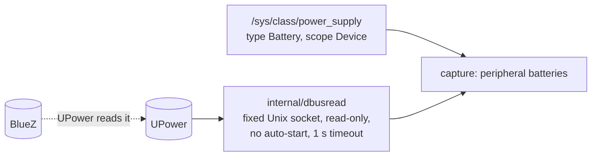

# 10. Peripheral and UPS batteries: kernel interfaces, plus read-only queries to UPower

**Status:** Accepted (2026-10-06: the owner chose to read D-Bus too, then, after the review found UPower already reads BlueZ, UPower only) · Issue [#90](https://github.com/jiegui2025/hwspec/issues/90), follow-up D of [#26](https://github.com/jiegui2025/hwspec/issues/26) · amends [ADR 0002](0002-kernel-interfaces.md)

## Context

Defenestra Chassis shows the battery of Bluetooth peripherals (BlueZ `org.bluez.Battery1`) and of UPS units (UPower), both over D-Bus (#26). hwspec reads kernel interfaces only (ADR 0002), and its rules make that testable. The owner asked for this to be researched as an ADR (2026-10-06), and chose to read D-Bus too, so headsets are covered.

| Fact | Source |
|---|---|
| The kernel reports a HID device's battery through the `power_supply` class "for HID devices that support this feature" | `drivers/hid/Kconfig`, `HID_BATTERY_STRENGTH` (Linux master, 2026-10-06) |
| Such supplies are named `hid-<id>-battery-<n>` (the id is often a Bluetooth or USB address) with scope `Device`; some drivers name theirs after the MAC (`ps-controller-battery-%pMR`) | `drivers/hid/hid-input.c` (`"hid-%s-battery-%d"`, `POWER_SUPPLY_SCOPE_DEVICE`), `drivers/hid/hid-playstation.c` |
| Scope `Device` is not only batteries: the reference machine's only such supply is a UCSI USB-C port (type `USB`) | `/sys/class/power_supply/*/{type,scope}`; UPower `EnumerateDevices` here: `line_power_ucsi_source_psy_USBC000o001` |
| The reference machine's kernel has `CONFIG_HID_BATTERY_STRENGTH=y` | `zcat /proc/config.gz` (CachyOS 7.2.9) |
| A Bluetooth LE device's battery normally comes from the GATT Battery Service (0x180F), which BlueZ's battery plugin publishes as `org.bluez.Battery1`; the kernel sees it only if the device's HID report map also carries a battery usage | BlueZ `profiles/battery/battery.c` (`BATT_UUID16 0x180f`, `BATTERY_INTERFACE "org.bluez.Battery1"`) |
| A headset's battery (HFP) reaches BlueZ from PipeWire, in the user's session, through `org.bluez.BatteryProviderManager1.RegisterBatteryProvider`: absent over SSH or on a headless machine | `strings /usr/lib/spa-0.2/bluez5/libspa-bluez5.so` (PipeWire 1.6.9) |
| **UPower already reads BlueZ:** upowerd uses `org.bluez.Battery1` and `org.bluez.Device1`, and `power_supply` | `strings /usr/lib/upowerd` (UPower 1.91.5) |
| UPS units are HID "power devices" read through hiddev (`/dev/usb/hiddev*`, `crw------- root`). UPower recognises one only if udev's hwdb tags it: `95-upower-hid.hwdb`, 110 USB IDs, "automatically generated by NUT" | <https://docs.kernel.org/hid/hiddev.html>; `ls -la /dev/usb`; `/usr/lib/udev/hwdb.d/95-upower-hid.hwdb` |
| When NUT drives a USB UPS it detaches the kernel driver, so neither hiddev nor UPower sees it; NUT serves its data over TCP (port 3493) | NUT `drivers/libusb1.c` (`libusb_set_auto_detach_kernel_driver`, `libusb_detach_kernel_driver`); NUT's `upsd` |
| A user reads UPower over the system bus without root or polkit: `EnumerateDevices` answered here; `Device` properties are read-only | `busctl --system call org.freedesktop.UPower … EnumerateDevices` (UPower 1.91.5) |
| The bus starts a service on the first call to it unless the call carries `NO_AUTO_START`; `org.freedesktop.UPower` and `org.bluez` have activation files here (both run as root) | D-Bus specification, message flags; `/usr/share/dbus-1/system-services/` |
| `github.com/godbus/dbus/v5` is BSD-2-Clause and maintained (v5.2.2; last push 2026-09). It takes the system-bus address from `DBUS_SYSTEM_BUS_ADDRESS` (default `unix:path=/var/run/dbus/system_bus_socket`), always registers `tcp` and `nonce-tcp` transports, and links `os/exec` (`dbus-launch` for the session bus). `ConnectUnix(*net.UnixConn)` authenticates and sends `Hello` on a socket the caller opened; `FlagNoAutoStart` is a message flag. `Auth` and `Hello` take no context | GitHub API, 2026-10-06; godbus v5.2.2 `conn_unix.go:21-40` (`DialUnix`, `ConnectUnix`), `transport_tcp.go` (`transports["tcp"]`), `transport_nonce_tcp.go:12`, `conn_other.go` (`execCommand("dbus-launch")`), `conn.go`, `auth.go`, `message.go` |
| `/var/run` links to `/run`; `/run/dbus/system_bus_socket` is `srw-rw-rw- root` | `ls -l` on the reference machine |
| `hwspec capture` may be run with `sudo` (documented), so a capture can run as root outside `--full` too | `README.md` (Install), `cmd/hwspec/main.go:384` |
| Rules today: *No external tools in the capture path* says "kernel interfaces only"; depguard's `collect` rule is a strict allow list; `no-network` allows `net` only in `internal/ids/sync.go`; `TestCollectSendsNoPackets` is a **static** scan of `internal/collect/*.go` only; under `--full` a root child re-runs the capture (`captureAsRoot`) | `ARCHITECTURE.md:112`, `.golangci.yml`, `internal/collect/rules_test.go:180-205`, `cmd/hwspec/main.go:381` |

## Options

| Option | HID peripherals | BLE (GATT) and headsets | USB UPS | New dependency | Privacy surface | ADR 0002 |
|---|---|---|---|---|---|---|
| A. Kernel only: `power_supply`, hiddev for UPS under `--full` | ✅ no root | ⚠️ only if the HID report map carries a battery usage; no headsets | ⚠️ root; a parser per report field | none | supply names | holds |
| B. Kernel, plus BlueZ and UPower | ✅ | ✅ | ✅ if in UPower's hwdb and not claimed by NUT | godbus | all paired devices (`GetManagedObjects`), aliases, addresses | amended |
| **B′. Kernel, plus UPower only** | ✅ | ✅ through UPower's BlueZ backend, where UPower runs | ✅ if in UPower's hwdb and not claimed by NUT | godbus, or a small stdlib client | only devices UPower lists | amended |
| C. A now, B′ later | ✅ | later | ⚠️ root | none now | supply names | holds now |
| D. `upower --dump` as a subprocess | ✅ | ✅ | as B′ | none (an external tool) | as B′ | amended, and *No external tools* too; output is text for humans, not a stable format |

| D-Bus client | For | Against |
|---|---|---|
| **godbus/dbus/v5** | complete (auth, marshalling, variants); BSD-2-Clause; maintained | reads its address from the environment and has a TCP transport and `os/exec` inside: hwspec must not use its bus-finding functions (below) |
| A stdlib-only client in `dbusread` | no dependency; nothing but a Unix socket | SASL `EXTERNAL` auth, the wire format and variant decoding for `a{sv}` to write and test (#90 asked to weigh it): several hundred lines of protocol code to own |

## Decision

**B′, with godbus** (owner, 2026-10-06: D-Bus too; then UPower only, since UPower already reads BlueZ). One destination means hwspec never lists every paired Bluetooth device, and needs no BlueZ-specific redaction.

| Part | Decision |
|---|---|
| Kernel first | `power_supply` entries of type `Battery` and scope `Device`. Where UPower describes the same supply (its `NativePath` names it), the kernel's reading is kept; UPower adds only what the kernel lacks (GATT batteries, headsets, UPS units) |
| The socket | `internal/dbusread` opens `/run/dbus/system_bus_socket` itself with `net.DialUnix` (a constant path, never from the environment), sets a deadline on it for the whole read, and hands it to `dbus.ConnectUnix` (authentication and `Hello`). It uses an **allow-list** of godbus identifiers (`ConnectUnix`, `(*Conn).Object`, `(*Conn).Close`, `(BusObject).CallWithContext` with `FlagNoAutoStart`, and the variant and object-path types); every address-taking or bus-finding function (`SystemBus*`, `ConnectSystemBus`, `Connect`, `Dial`, `DialHandler`, `SessionBus*`) and every call without flags (`GetProperty`, `StoreProperty`, `Call`) is outside it. So `DBUS_SYSTEM_BUS_ADDRESS=tcp:…` or `nonce-tcp:…` can't make a capture open a network connection, and `dbus-launch` is never run |
| Calls | read-only: `org.freedesktop.DBus.Hello` (from `Hello`), then on `org.freedesktop.UPower` only `EnumerateDevices` and `org.freedesktop.DBus.Properties.GetAll` on each device. Every call hwspec makes carries `FlagNoAutoStart` (godbus's own `Hello` to the bus daemon sends none, and the daemon is never activated): an absent UPower is not started, and `ServiceUnknown` means "UPower not running". Nothing is subscribed to or written. A device's kind comes from its `Type` property, not its object path |
| Time | the D-Bus read runs concurrently with the kernel collectors and waits at most 1 s in all: a deadline on the socket covers `Auth` and `Hello` (which take no context), and a context the calls; a capture takes about 270 ms on the reference machine, so a slow UPower can add up to about 0.7 s |
| Failure | no socket, no UPower, a refusal or the timeout: no UPower data, plus a capture warning that says which. A capture never fails because of D-Bus |
| Root | D-Bus is never read as root. Under `--full` the unprivileged parent reads UPower and merges it into the root child's capture; the child (`captureAsRoot`) is started with D-Bus off. Run directly as root (`sudo hwspec capture`), `dbusread` is skipped with a warning ("UPower not read as root; run without sudo, with --full") |
| Opt-out | `--no-dbus` on `capture` and on `advise` without a FILE (both capture live); `show` and `advise FILE` read a saved capture and never touch D-Bus |
| Capture fields | settled in #96 against ADR 0003 and ADR 0008: a `peripheral_batteries[]` list (or an extension of `batteries[]`) with an `identity` block, percentage, state and `source` (`kernel` or `upower`), plus a top-level record of whether D-Bus was read and its outcome, so "UPower not running" (unknown) differs from "no peripheral batteries" (empty), as ADR 0009 separates absent from empty |
| Privacy | never stored: D-Bus object paths, UPower `NativePath`, Bluetooth addresses (UPower `Serial` for Bluetooth devices is the address). `Model` for a Bluetooth device can be the user-chosen alias, so it is stored only as `alias` in the device's identity block (which ADR 0009 keeps out of advisor evidence), and `--redact` removes it. MAC addresses are stripped from kernel supply names before they are stored. `Redact` and the snapshot scrubber learn each form (colon, dash, underscore-separated within a word, UPower's path encoding), with a test per form |
| Dependency | `github.com/godbus/dbus/v5`, pinned in `go.mod` (checksummed by `go.sum`), allowed by depguard in `internal/dbusread` only and denied everywhere else |
| UPS | through UPower: units in its hwdb and not claimed by NUT. NUT-managed units are a known gap (NUT is TCP, against *Captures never touch the network*); hiddev directly (root) only in a later issue, for report fields with a cited definition |

### Rule changes

| Where | Change |
|---|---|
| ADR 0002 | amended: hwspec reads kernel interfaces **and** read-only answers from UPower on the system bus, through one package, optional and time-limited |
| `ARCHITECTURE.md` *No external tools in the capture path* | "kernel interfaces, plus read-only UPower queries through `internal/dbusread`"; *Enforced by* gains the tests below |
| `ARCHITECTURE.md` *Captures never touch the network* | unchanged in meaning (a fixed Unix socket); *Enforced by* gains `TestDBusReadDialsOnlyTheSystemBusSocket` |
| `ARCHITECTURE.md` Packages table and diagram | `internal/dbusread`: the only D-Bus code |
| `.golangci.yml` | `collect`'s allow list gains `internal/dbusread`; a new rule allows `github.com/godbus/dbus/v5` only in `internal/dbusread` and denies it elsewhere; `no-network` allows `net` in `internal/dbusread` (for `net.DialUnix` only) |
| `no-subprocesses` | godbus links `os/exec` for `dbus-launch`, which depguard can't see inside a dependency; the allow-list scan below admits no godbus function that can reach it |
| `ARCHITECTURE.md` *Root is opt-in* | the root child runs without D-Bus, and a capture as root skips it (tests below) |
| `ARCHITECTURE.md` *Testable seams* | recordings include UPower's answers |
| `SECURITY.md` | Privacy row: Bluetooth addresses are never stored, the alias is redacted; trust diagram: UPower's answers are untrusted text, sanitised like every other string; the `sudo` row: D-Bus skipped as root |

### Tests

| Test | Checks |
|---|---|
| `TestDBusReadDialsOnlyTheSystemBusSocket` (a source scan of `internal/dbusread`, like `TestCollectSendsNoPackets`) | exactly one `net.DialUnix`, to the constant path; every godbus identifier used is on the allow-list; no `os.Getenv`; every call passes `FlagNoAutoStart`. Mutants that call `DialHandler(address)` or `GetProperty` fail it |
| a runtime test through a seam, like `runCommand` | `dbusread` behind an interface; recordings store UPower's answers in `machine.json` (as Bluetooth management answers are), so recorded machines replay them; a fake bus on a temporary Unix socket checks the calls made, the flag, the 1 s timeout and `ServiceUnknown` |
| Root | the `--full` child's arguments disable D-Bus and the parent's UPower data is merged; at euid 0 `dbusread` isn't called and the warning is given |
| privacy | a recorded answer with every identifier form; `--redact` and the scrubber remove each |

## Consequences

| ✅ | ⚠️ |
|---|---|
| Keyboards, mice, controllers, headsets and hwdb-known UPS units report battery, without root | Bluetooth batteries need UPower running (headsets also need PipeWire in the user's session); NUT-managed UPS units are not seen |
| One package, one destination, a fixed socket: the network and subprocess rules stay checkable | A new dependency (`godbus/dbus/v5`) to keep updated (Dependabot covers Go modules), used through a narrow subset |
| Captures still work, and say why, without UPower or a system bus (containers, minimal systems) | Captures of one machine can differ by whether UPower was running; the capture records it |
| Known gap, not verified on hardware: whether a UPS also appears in `power_supply` (HID usage `0x850065`); the reference machine has no peripheral or UPS battery, only a UCSI port | #96 needs a recording with a Bluetooth or USB peripheral battery before it merges |
