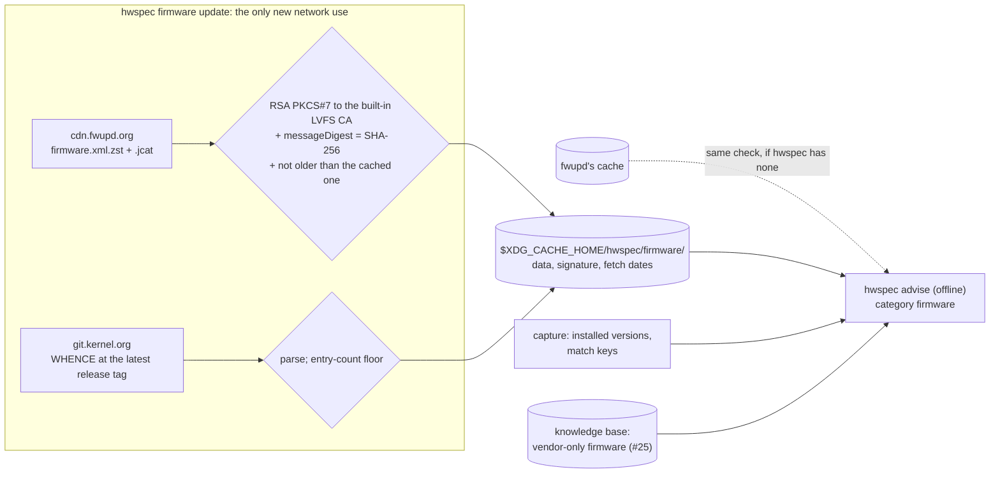

# 12. Firmware updates: an explicit online command for a verified firmware index

| | |
|---|---|
| **Status** | Accepted (2026-10-06: the owner chose design B, quoted in [#10's comment of 15:29 UTC](https://github.com/jiegui2025/hwspec/issues/10#issuecomment-6019641393), and confirmed decisions 1–4, "the recommended set" of #10's *Decisions (2026-10-06)* table, [quoted on #10](https://github.com/jiegui2025/hwspec/issues/10#issuecomment-6029836017); the coding lead set decision 5 and the defaults marked *lead*, which stand unless the owner overrules them) |
| **Issue** | [#130](https://github.com/jiegui2025/hwspec/issues/130), part 1 of [#10](https://github.com/jiegui2025/hwspec/issues/10) |
| **Amends** | [ADR 0009](0009-advisor.md) (Inputs; the *Firmware updates* row); ARCHITECTURE.md › Rules (*Captures never touch the network*) |

## Context

The owner asked for "look up tables on all available firmware versions and upgrade look up tables on those hardware require firmware maintainence" (#10), and on 2026-10-06: "we should be able to pull in the latest firmware information from the firmware repo if connected to the internet to provide quick info on whether a newer firmware is available for each hardware". Captures already record installed firmware (BIOS, microcode, NVMe, NICs, USB, VBIOS, ME, EC, TPM, GuC/HuC, Bluetooth). Nothing says whether a newer version exists. Only `hwspec ids update` may reach the network, so a firmware index needs this record first.

| Fact | Source |
|---|---|
| LVFS publishes its catalogue as `firmware.xml.{zst,xz,gz}`, all signed, **not equivalent**: `.zst` holds 4,413 components and 10,982 releases (up to 10 per component, 11,306 CVE `<issue>`s); `.xz` 9,445 releases (up to 7); `.gz` 852 components, one release each, missing 1,919 component IDs (the reference NVMe's among them) | download from `https://cdn.fwupd.org/downloads/`, counted with a parser (#10, 2026-10-06) |
| `firmware.xml.zst` is one zstd frame (8 MiB window), 20,126,680 B decompressed; `cache-control: public, max-age=14400`; contents "will not change any more frequently than every 4 hours" | `zstd -lv`; `curl -sSI`; <https://lvfs.readthedocs.io/en/latest/offline.html> |
| The `.jcat` beside it is gzip JSON plus 8 trailing bytes `IHATECDN`: one item (`firmware.xml.zst`) with a SHA-1, a SHA-256 equal to the file's, and two PKCS#7 blobs; its `Timestamp` is the publication time | decoded the CDN's and fwupd's copies; libjcat `jcat-blob.h` (blob kinds) |
| PKCS#7 blob 1: CMS SignedData, detached, RSA 3072, signer `CN=fwupd.org 2025` (Code Signing, 2025-01-16 to 2035-01-16) issued by `CN=LVFS CA`; signed attributes carry `messageDigest` = the file's SHA-256 and `signingTime` (the jcat's `Timestamp`, which itself is unsigned). `openssl cms -verify` against `LVFS-CA.pem`: "Verification successful" | `openssl cms -cmsout -print`, `-verify` (OpenSSL 3.6.5) |
| PKCS#7 blob 2: ML-DSA-87, signer `CN=fwupd.org 2025PQ`. **Its `messageDigest` is an empty OCTET STRING**, so it binds no content; OpenSSL refuses it ("messagedigest attribute wrong length") | `openssl asn1parse` (offset 7803, `l=0`) |
| The RSA signature verifies with Go's standard library alone (`encoding/asn1`, `crypto/x509` with the Code Signing EKU, `crypto/sha256`, `crypto/rsa.VerifyPKCS1v15` over the signed attributes re-tagged as SET); one changed byte in the file fails the `messageDigest` check, which is the one that matters | ~100-line prototype against fwupd's cache and a tampered copy (#10) |
| `LVFS-CA.pem` is self-signed, valid 2017-08-01 to 2047-08-01, SHA-256 fingerprint `C4:DE:E9:8E:…:3D:39:E4`; it ships with fwupd (`/etc/pki/fwupd-metadata/`), so a machine without fwupd lacks it | `openssl x509 -noout -dates -fingerprint -sha256`; `pacman -Qo` (fwupd 2.1.8) |
| Go has no PKCS#7/CMS package; `crypto/mldsa` arrived in Go 1.27, and `go.mod` stays at the older supported release (1.26) | `go list std`; `api/go1.27.txt`; CONTRIBUTING.md "Go version policy" |
| Go's standard library reads gzip only. `github.com/klauspost/compress/zstd` (v1.20.1, maintained) and what it imports are BSD-3-Clause or MIT (the repository's `LICENSE` is per directory: GitHub reports `NOASSERTION`); `internal/le` uses `unsafe` unless built with `purego`/`nounsafe`. With `WithDecoderMaxMemory(64<<20)` it decoded the catalogue | `go list -deps` in a scratch module; `LICENSE` sections and file headers; a scratch decode (#10) |
| fwupd matches devices by GUIDs derived from instance IDs; UUIDv5 in the DNS namespace over the instance ID string reproduces all three of the reference NVMe's fwupd GUIDs. Updates can be restricted by `<requires>` (`<firmware>` comparisons, `<hardware>` CHIDs, `<id>` the fwupd version) | `uuid.uuid5(NAMESPACE_DNS, id)` vs `fwupdmgr get-devices --json`; <https://lvfs.readthedocs.io/en/latest/metainfo.html> |
| **Cross-OEM match:** the HP machine's Samsung NVMe GUID matches `com.lenovo.PM981.256GB.firmware`, whose latest release `1L2QEXD7` is the installed one | the cached catalogue (#10) |
| `LVFS::VersionFormat` takes 14 values (triplet, quad, plain, dell-bios, number, pair, hex, bcd, dell-bios-msb, surface, intel-me, intel-me2, intel-csme19, compal-bios) | counted in the `.zst` |
| linux-firmware's `WHENCE` (on `git.kernel.org`) maps 4,536 `File:` and 111 `RawFile:` entries to `Driver:`, `Version:` (940 of them) and licences; it has no dates and no licence of its own. Its `Version:` isn't always the kernel's string (`74.563a6e92.0` vs the TLV's `77.563a6e92.0`): only the build hash matches, and hashes aren't ordered | `WHENCE`; parsed TLVs (#10) |
| Master `WHENCE` runs ahead of what distros ship: the AX200's `cc-a0-77` changed on 2026-09-22, after the latest tag `20260916` (which the reference machine's `linux-firmware-intel 1:20260916-1` matches byte for byte) | cgit log; `pacman -Qo`; `sha256sum` |
| The ESRT (the system firmware's capsule GUID and version) is in sysfs, root only | `/sys/firmware/efi/esrt/entries/` (`-r-------- root`) |
| Rules today: only `internal/ids/sync.go` imports `net` (depguard `no-network`); `TestRequestsOnlyGoThroughTheDefaultTransport` limits `ids` to a fixed set of `net/http` names; `TestCapturesNeverTouchTheNetwork` fails any capture request; ADR 0009 keeps firmware updates "open, owned by #10" | `.golangci.yml`; `internal/ids/requests_test.go`; `internal/collect/rules_test.go`; ADR 0009 |

| Requirement | Why |
|---|---|
| Captures and `advise` stay offline | ADR 0009; a capture must not depend on the network or reveal it ran |
| Nothing unverified is trusted | the catalogue decides what the user is told to install |
| Each answer says how fresh it is | firmware data ages; the owner wants "quick info", not a stale claim |
| LVFS data is never redistributed | the catalogue states no licence; its firmware is proprietary (ADR 0009) |

## Options

| Option | Fresh data | Offline captures | Works without fwupd | New dependency | Rules |
|---|---|---|---|---|---|
| A. Read fwupd's cache only | ⚠️ as fresh as fwupd's last refresh | ✅ | ❌ | zstd decoder | hold, but ADR 0009 still needs the reader |
| **B. `hwspec firmware update`: an explicit command fetches and verifies the catalogue and WHENCE into hwspec's cache; `advise` compares offline** | ✅ on request, dated | ✅ | ✅ | zstd decoder | amended: one more network command |
| C. Query fwupd over D-Bus (`GetUpgrades`) at advise time | ✅ | ⚠️ `advise` depends on a daemon | ❌ | D-Bus client | amended: ADR 0009's "hwspec matches them itself" |
| D. Fetch inside `advise` when online | ✅ | ❌ advise reaches the network | ✅ | zstd decoder | broken: advise must be offline |

## Decision

**B** (owner, 2026-10-06), because it gives fresh, dated data without making captures or advice depend on the network or on fwupd. The network stays one explicit, verified command per kind of data, as with `ids update`.

| Part | Does | Never does | Where |
|---|---|---|---|
| `hwspec firmware update [--dry-run] [--allow-older]` | fetches from two fixed HTTPS hosts (`cdn.fwupd.org`, `git.kernel.org`), no redirects to others; a conditional request for the `.jcat` (`If-None-Match`), so an unchanged catalogue costs one small request, and WHENCE fetched only when the latest tag's commit differs from the cached one (cgit's `Last-Modified` is the request time, so it can't be used); size caps (16 MiB compressed, 64 MiB decoded, 1 MiB jcat, 4 MiB WHENCE); prints per source "updated / unchanged / refused (reason)" and its date | writes anything unless all of a source verifies; `--dry-run` writes nothing | `cmd/hwspec`; `internal/fwindex/fetch.go` (*lead*) |
| LVFS verification | accepts `firmware.xml.zst` only when it lists at least 2,000 components (the signature covers the file's digest, not its name, so this tells it from LVFS's other signed catalogues, such as `firmware-testing` with 934), no more than 5% fewer than the cached one, and its `.jcat`'s RSA PKCS#7 blob chains to the **built-in** LVFS CA (pinned by fingerprint) with the Code Signing EKU, its `messageDigest` equals the file's SHA-256, and its signed `signingTime` is neither older than the cached one's nor 30 days old (LVFS publishes several a day; a week old is warned about; `--allow-older` overrides both, as for `ids`; the jcat's `Timestamp` is the same instant but unsigned) | trusts the ML-DSA blob (its digest binds nothing; Go 1.27 needed), or `/etc/pki/fwupd-metadata/` (absent without fwupd) | `internal/fwindex` (pure: jcat, CMS, catalogue) |
| zstd | `github.com/klauspost/compress/zstd` with a decoder memory cap and a decoded-size cap; licences recorded above | the `.xz` or `.gz` catalogues (fewer releases; incomplete) | `internal/fwindex` |
| linux-firmware | `WHENCE` at the **latest release tag** (what distros ship), over TLS from `git.kernel.org`; keeps `File`/`RawFile` → `Driver`, `Version` | compares against master (it would flag every machine); claims "newer" from a build hash (they aren't ordered): only "matches" or "differs" | `internal/fwindex` |
| Cache | `$XDG_CACHE_HOME/hwspec/firmware/` (re-downloadable, so a cache) with each data file's signature and a small manifest (fetch time, jcat timestamp, URL, ETag), written atomically; `advise` re-verifies on read (*lead*) | anything outside the user's cache | `internal/fwindex` |
| fwupd's cache | when hwspec has no copy, `advise` may read fwupd's `firmware.xml.zst` + `.jcat`, with the **same** verification, so its owner doesn't matter | trust it because of where it is | `cmd/hwspec` |
| Matching | GUIDs from captured IDs (UUIDv5, DNS namespace, over fwupd-style instance IDs, NVMe first); `<requires>` evaluated (`<firmware>` comparisons; `<hardware>` CHIDs where computable; `<id>` reported as "needs fwupd ≥ X", not a mismatch); OEM scope from `developer_name` vs the DMI vendor ("published by Lenovo for Lenovo systems", not an update) | query fwupd over D-Bus (decision 5) | `internal/advisor` (pure; the index is an `Input` field) |
| Versions | compared only through `LVFS::VersionFormat`'s 14 formats | call a version of another format "newer": it "differs" | `internal/fwindex` |
| Findings | category `firmware`: installed, latest, release date, urgency, CVE IDs, the source and its fetch date, how to update (`fwupdmgr update`, the distro package, a vendor page); LVFS urgency critical/high → `warning`, else `info` (*lead*); no index → one warning naming `hwspec firmware update`, never a guess | copy LVFS data into a capture, the advice beyond the matched versions, CVE IDs and URLs, or the ID bundle | `internal/advisor`, `kb/` |

### Decisions

| # | Question | Decision |
|---|---|---|
| 1 | linux-firmware reference | **Owner:** the latest release tag |
| 2 | WHENCE integrity | **Owner:** TLS from `git.kernel.org` (a PGP-signed tag or tarball needs OpenPGP, not in Go's standard library) |
| 3 | zstd | **Owner:** `github.com/klauspost/compress/zstd` (the `.zst` is the only complete catalogue) |
| 4 | LVFS trust anchor | **Owner:** the LVFS CA built into hwspec, verified with the standard library (works without fwupd); rotation by adding a CA to a built-in list in a release, as `trustedKeys` does for `ids`; a refusal says "update hwspec" |
| 5 | fwupd's `GetDevices` over D-Bus | **Lead:** no; GUIDs are derived from captured IDs, which keeps ADR 0002 and ADR 0010 as they are |
| — | Code location | **Lead:** a new package `internal/fwindex`: pure parsers (jcat, CMS, catalogue, WHENCE, version formats) plus `fetch.go`, the second file allowed `net`. It isn't shared with `ids`, which stays standard-library only |
| — | Cache, severity | **Lead:** as in the table above |

### Rule changes

| Rule | Before | After | Enforced by |
|---|---|---|---|
| *Captures never touch the network* (ARCHITECTURE.md) | only `hwspec ids update` reaches the network | only `hwspec ids update` and `hwspec firmware update` do, each installing only verified data; `capture` and `advise` never | depguard `no-network`: `net` in `internal/ids/sync.go` and `internal/fwindex/fetch.go` only; a `TestRequestsOnlyGoThroughTheDefaultTransport` twin for `fwindex`; `advise` tested with a failing `http.DefaultTransport` |
| ADR 0009 Inputs and *Firmware updates* | "#10's LVFS catalogue as fwupd caches it"; firmware updates open | reference data: the verified firmware index from hwspec's cache, else fwupd's verified the same way; decided here | review |
| ADR 0002 (kernel interfaces in captures) | — | unchanged: without D-Bus (decision 5), captures still read kernel interfaces only; the ESRT is sysfs | — |
| Dependencies | standard library and the listed modules | plus `github.com/klauspost/compress` (zstd only), licence-reviewed per directory | `go.mod`; Nix `vendorHash` updated in the same commit |

### Tests

| Behaviour | Test (part) |
|---|---|
| Today's jcat and `.zst` verify; one changed byte, a jcat for another file, an expired or foreign certificate, the PQ blob alone, a jcat without a PKCS#7 blob: each refused with its reason | fixture tests (part 2) |
| An older jcat timestamp than the cached one is refused without `--allow-older`; a decoded size over the cap is refused; the jcat and CMS parsers are fuzzed | part 2 |
| `--dry-run` writes nothing; only `fetch.go` reaches the network | part 2; depguard; the request test twin |
| The reference NVMe's GUIDs equal fwupd's | part 3 |
| AX200 against tag `20260916`: "matches"; against master: "differs" | part 4 |
| An unknown `VersionFormat` gives "differs", never "newer"; a Lenovo-scoped release on an HP machine is info, not an update; `advise` makes no request | part 5 |

## Consequences

| ✅ | ⚠️ |
|---|---|
| Firmware advice with dates and sources, on request, offline afterwards | a second network command, two more hosts, one more dependency (`unsafe` paths unless `purego`) |
| Works without fwupd, and with fwupd's own cache when hwspec has none | LVFS may rotate its signer (2035) or drop RSA for ML-DSA only: hwspec then needs an update, and says so |
| linux-firmware compared with what distros ship, not master | WHENCE's `Version:` covers 940 of 4,647 files and needs per-driver normalisation (iwlwifi first) |
| LVFS data stays in the user's cache | HP's BIOS family `R21` isn't on LVFS: vendor-only firmware needs knowledge-base pages with check dates (#25) |

| Follow-up | Issue |
|---|---|
| Parts 2–6 of #10 (the command and verifier; capture match keys; linux-firmware comparison; LVFS comparison; vendor-only firmware), filed as sub-issues of #10 | #10 |
| CHIDs for `<hardware>` requirements; other fwupd plugins' instance-ID formats; LVFS's metadata download policy | #10 open questions |
