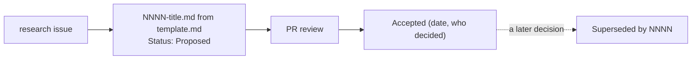

# Architecture decision records

Each record captures one significant decision as context → options → decision → consequences, mostly as tables and diagrams. A decision isn't changed after acceptance: a new decision gets a new record, and the old one is marked superseded. Records may be reformatted or corrected for accuracy (noted at the top) without changing the decision.

| # | Decision | Status |
|---|---|---|
| [0001](0001-static-go-cli.md) | A static Go binary is the capture engine | Accepted |
| [0002](0002-kernel-interfaces.md) | Read kernel interfaces directly, not other tools (amended by 0010: read-only queries to UPower on the system bus) | Accepted |
| [0003](0003-capture-format.md) | JSON capture format with raw IDs, additive schema (amended: published JSON Schema) | Accepted |
| [0004](0004-offline-id-databases.md) | Offline ID databases, newest source wins, signed sync (amended: also carries the advisor knowledge base) | Accepted |
| [0005](0005-privileged-rerun.md) | Root access by re-running under pkexec, no daemon | Accepted |
| [0006](0006-licence.md) | GPL-3.0-or-later | Accepted |
| [0007](0007-desktop-ui.md) | Desktop app in Rust with GTK4 and libadwaita, driving the CLI | Proposed |
| [0008](0008-device-detail-blocks.md) | Identity, firmware, driver and health blocks on every device | Accepted |
| [0009](0009-advisor.md) | Advisor: a separate command over captures, a sourced knowledge base, no network | Accepted |
| [0010](0010-peripheral-batteries.md) | Peripheral and UPS batteries: kernel interfaces, plus read-only queries to UPower (amends 0002) | Accepted |

New records: copy [template.md](template.md) to `NNNN-short-title.md` with the next number, add its row above, and fill its tables and diagram; prefer tables and Mermaid diagrams to prose.

A record starts from a research issue as *Proposed*, becomes *Accepted* when the owner decides, and is only ever superseded by a newer record, never edited into a different decision:

