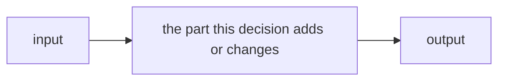

<!-- ADR template. Copy to docs/adr/NNNN-short-title.md (the next free number), add a row to docs/adr/README.md
     (scripts/check-adr-index.sh checks it), and fill each table: add rows, delete example rows, delete a
     diagram or table that doesn't apply. Lead with tables and diagrams; keep prose to one-line lead-ins.
     A decision isn't changed after acceptance: a new record supersedes it, and the old one's status says so. -->

# N. Decision in a few words

| | |
|---|---|
| **Status** | Proposed · Accepted (date, who decided) · Superseded by [NNNN](NNNN-title.md) |
| **Issue** | [#N](https://github.com/jiegui2025/hwspec/issues/N) |
| **Amends** | [ADR NNNN](NNNN-title.md), or none |

## Context

<!-- One or two sentences: what forces a decision now, and the rules it must respect (ARCHITECTURE.md › Rules). -->

| Fact | Source |
|---|---|
| | <!-- path/file.go:123, a command's output from a real run, or an upstream document you read; nothing from memory --> |

| Requirement | Why |
|---|---|
| | |

## Options

<!-- Every option considered, against the same criteria. Bold the chosen one. ✅ meets it, ⚠️ partly, ❌ doesn't. -->

| Option | Criterion 1 | Criterion 2 | New dependency | ARCHITECTURE rules |
|---|---|---|---|---|
| **A. …** | ✅ | ⚠️ … | none | hold |
| B. … | ✅ | ✅ | … | amended: … |
| C. … | ❌ … | ✅ | none | hold |

## Decision

<!-- The chosen option and the deciding reason, in one or two sentences, then how it works. -->

**A**, because …

| Part | Does | Never does | Where |
|---|---|---|---|
| | | | `internal/…` |

### Rule changes

<!-- Changes to ARCHITECTURE.md › Rules, depguard, SECURITY.md or the capture format. Delete if none. -->

| Rule | Before | After | Enforced by |
|---|---|---|---|
| | | | |

### Tests

| Behaviour | Test |
|---|---|
| | `TestName` |

## Consequences

| ✅ | ⚠️ |
|---|---|
| | |

| Follow-up | Issue |
|---|---|
| | #N |
