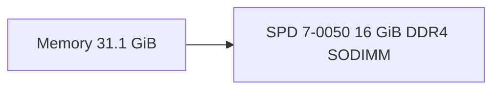
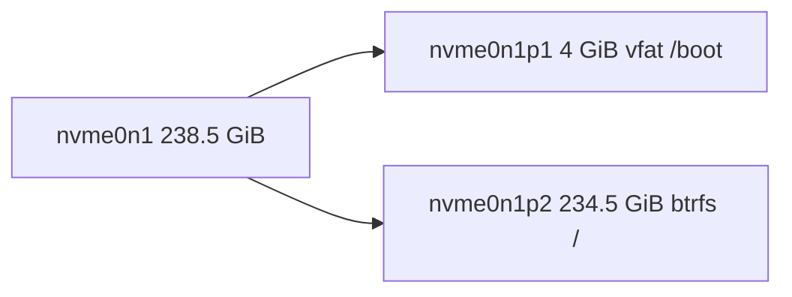
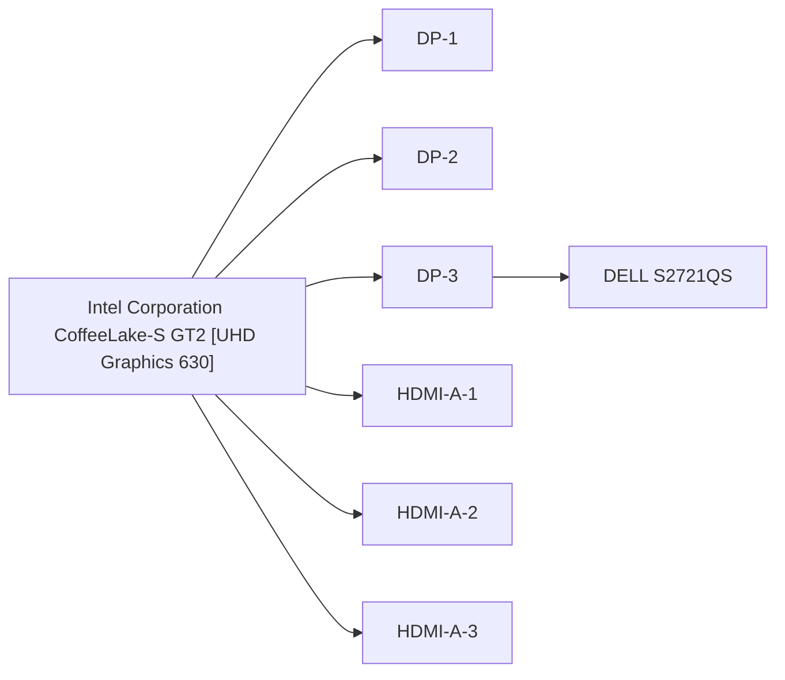
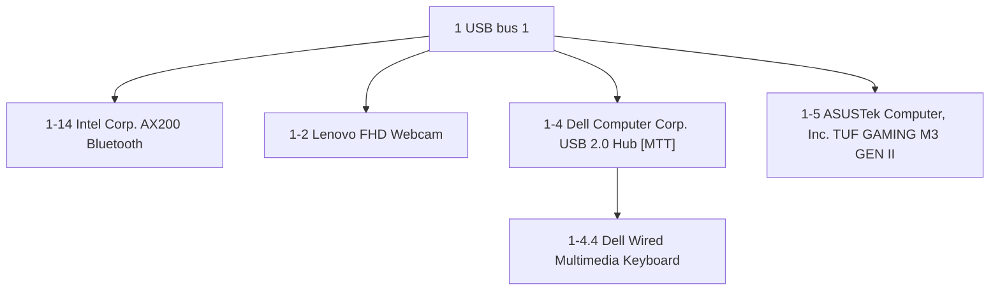

# Hardware report: HP EliteDesk 800 G5 Desktop Mini

Captured unknown by hwspec test on recorded · limited (not root): run with --full for the firmware's tables, serials and drive health

## Summary

|  |  |
|---|---|
| Machine | HP EliteDesk 800 G5 Desktop Mini |
| Board | HP 8595 |
| CPU | Intel(R) Core(TM) i5-9500T CPU @ 2.20GHz, 6 cores / 6 threads |
| Memory | 31.1 GiB usable |
| Storage | 1 (nvme0n1), 238.5 GiB |
| Graphics | Intel Corporation CoffeeLake-S GT2 \[UHD Graphics 630\] |
| OS | CachyOS 7.2.9-1-cachyos |

## System

|  |  |
|---|---|
| Machine | HP EliteDesk 800 G5 Desktop Mini |
| Family | 103C_53307F HP EliteDesk |
| Chassis | Mini Tower |
| Board | HP 8595 |
| Firmware | HP R21 Ver. 02.27.00 07/28/2026 |
| Management Engine | Intel 12.0.45.1509 |
| Embedded controller | 8.9 |
| TPM | TPM 2, fw 7.85.1166080 |
| RTC | driver batt_status okay (not evidence of a good coin cell on Intel chipsets) |
| OS | CachyOS |
| Kernel | 7.2.9-1-cachyos x86_64 |
| Boot | uefi, Secure Boot off |

## CPU

|  |  |
|---|---|
| Model | Intel(R) Core(TM) i5-9500T CPU @ 2.20GHz |
| Codename | Coffee Lake (Skylake cores) |
| Cores | 6 cores / 6 threads |
| Clock | 800–3700 MHz |
| Frequency driver | intel_pstate built in |
| Cache | L1d 32 KiB×6, L1i 32 KiB×6, L2 256 KiB×6, L3 9 MiB×1 |
| Microcode | 0xfa |
| Health | health OK, 0 throttle events |

## Memory

|  |  |
|---|---|
| Total | 31.1 GiB usable |
| Slots | needs --full (the firmware's table is root only) |

| Slot | Size | Type | Form factor | Maker | Part |
|---|---|---|---|---|---|
| SPD 7-0050 | 16 GiB | DDR4 | SODIMM | Avant Technology | J642GU44J2320NL |

## Storage

| Disk | Model | Size | Type | Transport | Firmware | Driver |
|---|---|---|---|---|---|---|
| nvme0n1 | SAMSUNG MZVLB256HAHQ-000L7 | 238.5 GiB | nvme | nvme | fw 1L2QEXD7 | nvme 1.0 |

## Graphics

| GPU | Model | Clocks | Firmware | Driver |
|---|---|---|---|---|
| 00:02.0 | Intel Corporation CoffeeLake-S GT2 \[UHD Graphics 630\] | 350–1100 MHz | firmware unknown (an Intel GPU has no video BIOS version; its GuC and HuC are firmware components (--full)) | i915 |

| Connector | Display | Native mode | Size | Output offers | Made |
|---|---|---|---|---|---|
| card1-DP-3 | DELL S2721QS | 3840×2160 @ 60 Hz | 27.0" | 3840×2160 (42 modes) | 2020-W38 |

## Network

| Interface | Device | Type | Radio | State | Speed | Firmware | Driver |
|---|---|---|---|---|---|---|---|
| eno1 | Intel Corporation Ethernet Connection (7) I219-LM | ethernet |  | up | 1000 Mb/s | fw 0.5-4 | e1000e |
| wlan0 | Intel Corporation Wi-Fi 6 AX200 | wireless | Wi-Fi 6, 2.4/5 GHz, 2×2, 2 streams | down |  | fw 77.8dbafb52.0 cc-a0-77.ucode | iwlwifi |

## Bluetooth

| Controller | Adapter | Version | Chip by | Radio | Firmware | Driver |
|---|---|---|---|---|---|---|
| hci0 | Intel Corp. AX200 Bluetooth | 5.2 | Intel Corp. | on | fw 0x21c1 | btusb 0.8 |

## Audio

| Card | Name | Codecs | Driver |
|---|---|---|---|
| 0 | Lenovo FHD Webcam |  | snd-usb-audio |
| 1 | HDA Intel PCH | Conexant CX20632, Intel Kabylake HDMI | snd_hda_intel |

## USB-C charging

| Port | Where | Power roles | Charging |
|---|---|---|---|
| port0 | top left upper | source | power out only, can't charge |

## Power

| Supply | Type | USB-C port | Powering the machine |
|---|---|---|---|
| ucsi-source-psy-USBC000:001 | usb | port0 | no |

Rating unknown: no supply in power_supply reports a rating (a barrel-jack adapter isn't exposed to the kernel).

| Domain | Zone | Limit | Value | Window | Enable bit (PL1) | Source |
|---|---|---|---|---|---|---|
| cpu-package | package-0 | PL1 | 35 W | 27.983872 s | on | intel-rapl |
| cpu-package | package-0 | PL2 | 69 W | 0.00244 s |  | intel-rapl |
| platform | psys | PL1 | 61 W | 7.995392 s | off | intel-rapl |
| platform | psys | PL2 | 69 W | 0.000976 s |  | intel-rapl |

## USB

| Path | Device | Firmware |
|---|---|---|
| 1-14 | Intel Corp. AX200 Bluetooth | fw 0.01 |
| 1-2 | Lenovo FHD Webcam | fw 50.02 |
| 1-4 | Dell Computer Corp. USB 2.0 Hub \[MTT\] | fw 32.98 |
| 1-4.4 | Dell Wired Multimedia Keyboard | fw 0.06 |
| 1-5 | ASUSTek Computer, Inc. TUF GAMING M3 GEN II | fw 5.43 |

## PCI

| Address | Device | Class | Driver | Behind |
|---|---|---|---|---|
| 00:00.0 | Intel Corporation 8th Gen Core Processor Host Bridge/DRAM Registers | Host bridge | skl_uncore |  |
| 00:02.0 | Intel Corporation CoffeeLake-S GT2 \[UHD Graphics 630\] | VGA compatible controller | i915 |  |
| 00:12.0 | Intel Corporation 300/C240 Series Chipset Family Thermal Subsystem | Signal processing controller | intel_pch_thermal |  |
| 00:14.0 | Intel Corporation 300/C240 Series Chipset Family USB 3.1 xHCI | USB controller | xhci_hcd |  |
| 00:14.2 | Intel Corporation 300/C240 Series Chipset Family Shared SRAM | RAM memory |  |  |
| 00:16.0 | Intel Corporation 300/C240 Series Chipset Family HECI #1 | Communication controller | mei_me |  |
| 00:16.3 | Intel Corporation 300/C240 Series Chipset Family Keyboard and Text (KT) Redirection | Serial controller | serial |  |
| 00:17.0 | Intel Corporation 300/C240 Series Chipset Family SATA Controller (AHCI) | SATA controller | ahci |  |
| 00:1b.0 | Intel Corporation 300/C240 Series Chipset Family PCIe Root Port #21 | PCI bridge | pcieport |  |
| 00:1c.0 | Intel Corporation 300/C240 Series Chipset Family PCIe Root Port #8 | PCI bridge | pcieport |  |
| 00:1f.0 | Intel Corporation Q370 Chipset LPC/eSPI Controller | ISA bridge |  |  |
| 00:1f.3 | Intel Corporation 300/C240 Series Chipset Family HD Audio | Audio device | snd_hda_intel |  |
| 00:1f.4 | Intel Corporation 300/C240 Series Chipset Family SMBus | SMBus | i801_smbus |  |
| 00:1f.5 | Intel Corporation 300/C240 Series Chipset Family SPI (Flash) Controller | Serial bus controller | intel-spi |  |
| 00:1f.6 | Intel Corporation Ethernet Connection (7) I219-LM | Ethernet controller | e1000e |  |
| 01:00.0 | Samsung Electronics Co Ltd NVMe SSD Controller SM981/PM981/PM983 | Non-Volatile memory controller | nvme | 00:1b.0 |
| 02:00.0 | Intel Corporation Wi-Fi 6 AX200 | Network controller | iwlwifi | 00:1c.0 |

## Sensors

| Chip | Sensor | Value | High |
|---|---|---|---|
| acpitz | temp1 | 30 C |  |
| nvme | Composite | 47.85 C | 80.85 C |
| nvme | Sensor 1 | 47.85 C |  |
| nvme | Sensor 2 | 49.85 C |  |
| pch_cannonlake | temp1 | 52 C |  |
| ucsi_source_psy_USBC000:001 | curr1 | 0 A |  |
| ucsi_source_psy_USBC000:001 | in0 | 0 V |  |
| coretemp | Package id 0 | 67 C | 94 C |
| coretemp | Core 0 | 68 C | 94 C |
| coretemp | Core 1 | 67 C | 94 C |
| coretemp | Core 2 | 71 C | 94 C |
| coretemp | Core 3 | 67 C | 94 C |
| coretemp | Core 4 | 68 C | 94 C |
| coretemp | Core 5 | 66 C | 94 C |

## Soldered or removable

| Part | What | Mounting |
|---|---|---|
| SPD 7-0050 | memory module | in a slot |
| 00:02.0 | Intel Corporation CoffeeLake-S GT2 \[UHD Graphics 630\] | part of the CPU: it changes only with the processor |
| 00:17.0 | Intel Corporation 300/C240 Series Chipset Family SATA Controller (AHCI) | unknown: the firmware's slot table needs root (run with --full) |
| 00:1f.3 | Intel Corporation 300/C240 Series Chipset Family HD Audio | unknown: the firmware's slot table needs root (run with --full) |
| 00:1f.6 | Intel Corporation Ethernet Connection (7) I219-LM | soldered on |
| 01:00.0 | Samsung Electronics Co Ltd NVMe SSD Controller SM981/PM981/PM983 | unknown: the firmware's slot table needs root (run with --full) |
| 02:00.0 | Intel Corporation Wi-Fi 6 AX200 | unknown: the firmware's slot table needs root (run with --full) |

## Not captured

- Intel GPU firmware (GuC, HuC): needs root (run with --full)
- SMBIOS table (memory modules and slots, CPU sockets, expansion slots, onboard devices): needs root (run with --full)
- dmi product_serial, product_uuid, chassis_serial, board_serial: needs root (run with --full)
- drive health (SMART): needs root (run with --full)
- kernel log (missing firmware): needs root (run with --full)
- memory: SPD modules total 16.0 GiB, less than the 31.1 GiB usable: some modules' SPD isn't exposed (a likely cause: the kernel registers SPD EEPROMs only at 0x50 + slot index), so they aren't listed; --full lists every module
