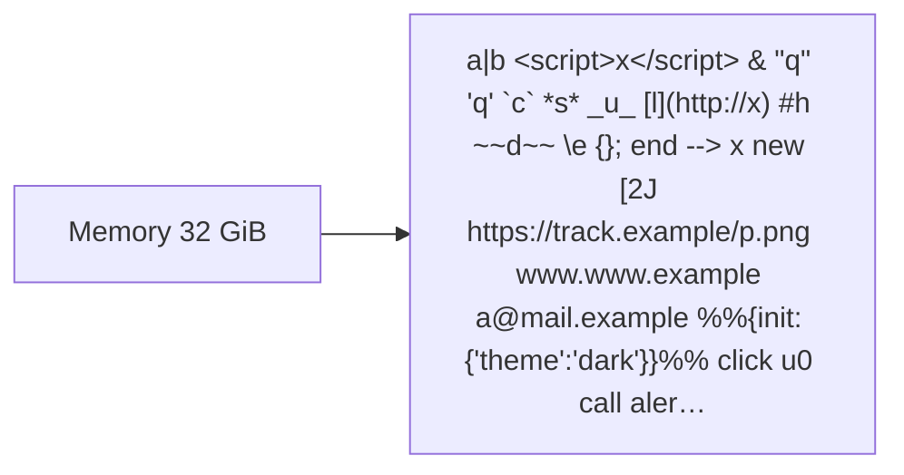
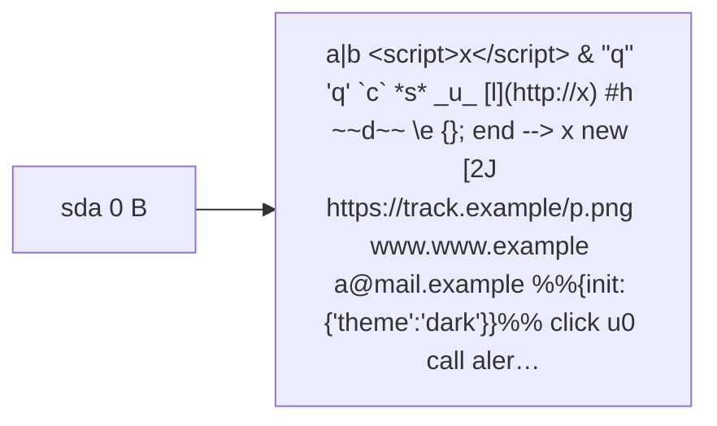
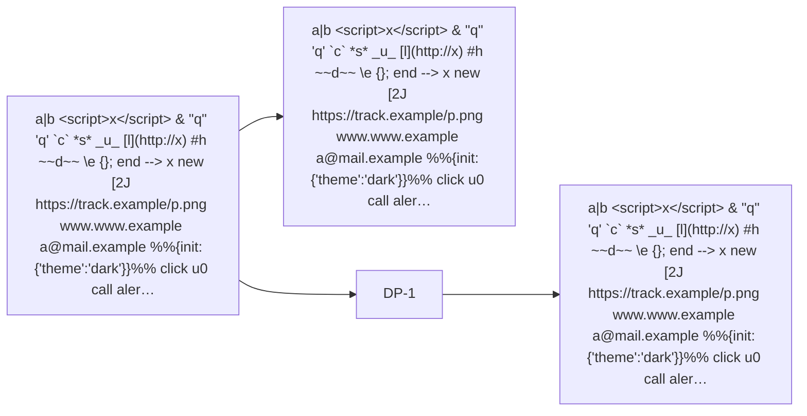
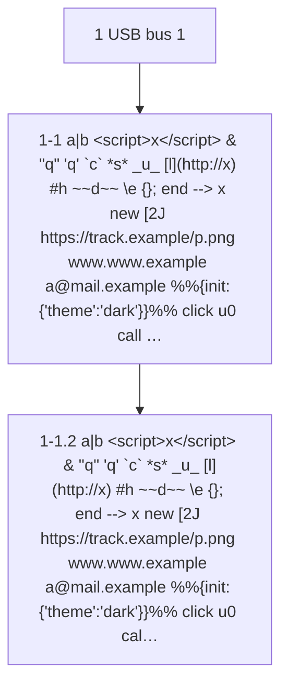

# Hardware report: a\|b &lt;script&gt;x&lt;/script&gt; &amp; "q" 'q' \`c\` \*s\* \_u\_ \[l\](http&#58;//x) \#h \~\~d\~\~ \\e {}; end --&gt; x new\[2J https&#58;//track.example/p.png www&#46;www&#46;example a&#64;mail.example %%{init: {'theme':'dark'}}%% click u0 call alert() Füße 日本 fl°lt¶ß \#\#

Captured 2026-10-05 12:00 UTC by hwspec test on a\|b &lt;script&gt;x&lt;/script&gt; &amp; "q" 'q' \`c\` \*s\* \_u\_ \[l\](http&#58;//x) #h \~\~d\~\~ \\e {}; end --&gt; x new\[2J https&#58;//track.example/p.png www&#46;www&#46;example a&#64;mail.example %%{init: {'theme':'dark'}}%% click u0 call alert() Füße 日本 fl°lt¶ß ## · limited (not root): run with --full for the firmware's tables, serials and drive health

## Summary

|  |  |
|---|---|
| Machine | a\|b &lt;script&gt;x&lt;/script&gt; &amp; "q" 'q' \`c\` \*s\* \_u\_ \[l\](http&#58;//x) #h \~\~d\~\~ \\e {}; end --&gt; x new\[2J https&#58;//track.example/p.png www&#46;www&#46;example a&#64;mail.example %%{init: {'theme':'dark'}}%% click u0 call alert() Füße 日本 fl°lt¶ß ## |
| Board | 8595 |
| CPU | CPU @ 2.20GHz, 0 cores / 0 threads |
| Memory | 32 GiB usable |
| Storage | 1 (sda), 0 B |
| Graphics | a\|b &lt;script&gt;x&lt;/script&gt; &amp; "q" 'q' \`c\` \*s\* \_u\_ \[l\](http&#58;//x) #h \~\~d\~\~ \\e {}; end --&gt; x new\[2J https&#58;//track.example/p.png www&#46;www&#46;example a&#64;mail.example %%{init: {'theme':'dark'}}%% click u0 call alert() Füße 日本 fl°lt¶ß ## |
| OS | a\|b &lt;script&gt;x&lt;/script&gt; &amp; "q" 'q' \`c\` \*s\* \_u\_ \[l\](http&#58;//x) #h \~\~d\~\~ \\e {}; end --&gt; x new\[2J https&#58;//track.example/p.png www&#46;www&#46;example a&#64;mail.example %%{init: {'theme':'dark'}}%% click u0 call alert() Füße 日本 fl°lt¶ß ## |

## System

|  |  |
|---|---|
| Machine | a\|b &lt;script&gt;x&lt;/script&gt; &amp; "q" 'q' \`c\` \*s\* \_u\_ \[l\](http&#58;//x) #h \~\~d\~\~ \\e {}; end --&gt; x new\[2J https&#58;//track.example/p.png www&#46;www&#46;example a&#64;mail.example %%{init: {'theme':'dark'}}%% click u0 call alert() Füße 日本 fl°lt¶ß ## |
| Board | 8595 |
| Firmware | R21 |
| Management Engine | Intel 12.0.45.1509 |
| Embedded controller | 8.9 |
| TPM | TPM 2 |
| OS | a\|b &lt;script&gt;x&lt;/script&gt; &amp; "q" 'q' \`c\` \*s\* \_u\_ \[l\](http&#58;//x) #h \~\~d\~\~ \\e {}; end --&gt; x new\[2J https&#58;//track.example/p.png www&#46;www&#46;example a&#64;mail.example %%{init: {'theme':'dark'}}%% click u0 call alert() Füße 日本 fl°lt¶ß ## |
| Kernel | unknown |
| Boot | boot mode unknown, Secure Boot on |

## CPU

|  |  |
|---|---|
| Model | CPU @ 2.20GHz |
| Cores | 0 cores / 0 threads |

## Memory

|  |  |
|---|---|
| Total | 32 GiB usable |
| Slots | needs --full (the firmware's table is root only) |

| Slot | Size | Type | Maker |
|---|---|---|---|
| a\|b &lt;script&gt;x&lt;/script&gt; &amp; "q" 'q' \`c\` \*s\* \_u\_ \[l\](http&#58;//x) #h \~\~d\~\~ \\e {}; end --&gt; x new\[2J https&#58;//track.example/p.png www&#46;www&#46;example a&#64;mail.example %%{init: {'theme':'dark'}}%% click u0 call alert() Füße 日本 fl°lt¶ß ## | 8 GiB | a\|b &lt;script&gt;x&lt;/script&gt; &amp; "q" 'q' \`c\` \*s\* \_u\_ \[l\](http&#58;//x) #h \~\~d\~\~ \\e {}; end --&gt; x new\[2J https&#58;//track.example/p.png www&#46;www&#46;example a&#64;mail.example %%{init: {'theme':'dark'}}%% click u0 call alert() Füße 日本 fl°lt¶ß ## | a\|b &lt;script&gt;x&lt;/script&gt; &amp; "q" 'q' \`c\` \*s\* \_u\_ \[l\](http&#58;//x) #h \~\~d\~\~ \\e {}; end --&gt; x new\[2J https&#58;//track.example/p.png www&#46;www&#46;example a&#64;mail.example %%{init: {'theme':'dark'}}%% click u0 call alert() Füße 日本 fl°lt¶ß ## |

## Storage

| Disk | Model | Size | Health |
|---|---|---|---|
| sda | a\|b &lt;script&gt;x&lt;/script&gt; &amp; "q" 'q' \`c\` \*s\* \_u\_ \[l\](http&#58;//x) #h \~\~d\~\~ \\e {}; end --&gt; x new\[2J https&#58;//track.example/p.png www&#46;www&#46;example a&#64;mail.example %%{init: {'theme':'dark'}}%% click u0 call alert() Füße 日本 fl°lt¶ß ## | 0 B | health FAILING |

## Graphics

| GPU | Model |
|---|---|
| 00:02.0 | a\|b &lt;script&gt;x&lt;/script&gt; &amp; "q" 'q' \`c\` \*s\* \_u\_ \[l\](http&#58;//x) #h \~\~d\~\~ \\e {}; end --&gt; x new\[2J https&#58;//track.example/p.png www&#46;www&#46;example a&#64;mail.example %%{init: {'theme':'dark'}}%% click u0 call alert() Füße 日本 fl°lt¶ß ## |

| Connector | Display |
|---|---|
| card0-DP-1 | a\|b &lt;script&gt;x&lt;/script&gt; &amp; "q" 'q' \`c\` \*s\* \_u\_ \[l\](http&#58;//x) #h \~\~d\~\~ \\e {}; end --&gt; x new\[2J https&#58;//track.example/p.png www&#46;www&#46;example a&#64;mail.example %%{init: {'theme':'dark'}}%% click u0 call alert() Füße 日本 fl°lt¶ß ## |

## Network

| Interface | Device |
|---|---|
| eth0 | unknown |

## USB

| Path | Device |
|---|---|
| 1-1 | a\|b &lt;script&gt;x&lt;/script&gt; &amp; "q" 'q' \`c\` \*s\* \_u\_ \[l\](http&#58;//x) #h \~\~d\~\~ \\e {}; end --&gt; x new\[2J https&#58;//track.example/p.png www&#46;www&#46;example a&#64;mail.example %%{init: {'theme':'dark'}}%% click u0 call alert() Füße 日本 fl°lt¶ß ## |
| 1-1.2 | a\|b &lt;script&gt;x&lt;/script&gt; &amp; "q" 'q' \`c\` \*s\* \_u\_ \[l\](http&#58;//x) #h \~\~d\~\~ \\e {}; end --&gt; x new\[2J https&#58;//track.example/p.png www&#46;www&#46;example a&#64;mail.example %%{init: {'theme':'dark'}}%% click u0 call alert() Füße 日本 fl°lt¶ß ## |

## Needs attention (as recorded in this capture)

- FAILING disk sda: a\|b &lt;script&gt;x&lt;/script&gt; &amp; "q" 'q' \`c\` \*s\* \_u\_ \[l\](http&#58;//x) #h \~\~d\~\~ \\e {}; end --&gt; x new\[2J https&#58;//track.example/p.png www&#46;www&#46;example a&#64;mail.example %%{init: {'theme':'dark'}}%% click u0 call alert() Füße 日本 fl°lt¶ß ##

## Not captured

- a\|b &lt;script&gt;x&lt;/script&gt; &amp; "q" 'q' \`c\` \*s\* \_u\_ \[l\](http&#58;//x) #h \~\~d\~\~ \\e {}; end --&gt; x new\[2J https&#58;//track.example/p.png www&#46;www&#46;example a&#64;mail.example %%{init: {'theme':'dark'}}%% click u0 call alert() Füße 日本 fl°lt¶ß ##
- \---
- 2024\. a year
- 1\) one
- \+ plus
- \= setext
