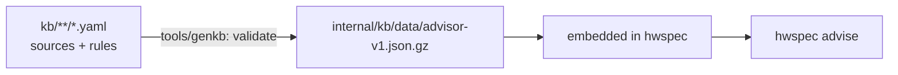

# Advisor knowledge base

The rules `hwspec advise` applies, and the sources they rest on ([ADR 0009](../docs/adr/0009-advisor.md)). `make gen-kb` compiles every YAML file here into `internal/kb/data/advisor-v1.json.gz`, which is embedded in the binary.



Each `.yaml` file (not `.yml`) is one YAML document: a mapping with `sources` (ID → source), `rules` (a list) and the data sections `models`, `devices`, `cpus` and `allowlists` (ID → entry). A rule cites sources by ID; every value in its `data` is a claim list, `[{value: …, src: …}]`. A claim may add a `note`: a caveat in words (the units a value holds for, a page that qualifies it), printed beside its source in the answer. A note never changes what a check does; a condition a check must apply is its own data key. Values are kept as written: quote anything that starts with a zero (`"0403"`), and leave a key out rather than writing `null`.

**Sources**

| Field | Required | Meaning |
|---|---|---|
| key | ✅ | the source's ID: lower-case words joined by `.` or `-`, unique across files |
| `url` | ✅ | an https document someone can open |
| `mirror` | | an https copy, for when the URL fails |
| `title`, `doc`, `edition`, `published` | | the document's title, number, revision and date (`"YYYY-MM-DD"`, `"YYYY-MM"` or `"YYYY"`) |
| `retrieved` | ✅ | when you read it (`"YYYY-MM-DD"`) |
| `licence` | ✅ | the document's licence (SPDX, e.g. `GPL-2.0-only`) or terms: a quote stays under it |
| `confidence` | ✅ | `oem-doc`, `upstream-doc`, `measured` or `community` |
| `quote` | ✅ unless link-only | the words that support the claim, as written |
| `link_only`, `locator` | | for terms that don't allow quoting (e.g. non-commercial): no quote, and a page or section instead |

**Rules**

| Field | Required | Meaning |
|---|---|---|
| `id` | ✅ | lower-case words joined by `.` or `-`, unique, e.g. `pci.no-driver` |
| `check` | ✅ | the Go check in `internal/advisor` that applies the rule |
| `category` | ✅ | `needs-attention`, `performance`, `upgrade`, `firmware` or `maintenance` |
| `severity` | ✅ | `critical`, `warning` or `info` |
| `title`, `detail` | title ✅ | what's wrong and why it matters, in plain words |
| `match` | per check | raw IDs only, never display names: `pci_class` (class code prefixes, 2, 4 or 6 lower-case hex digits, quoted) and `usb_class` (a USB interface's class, subclass and protocol, prefixes the same way). Only the keys the rule's check honours (`pci-without-driver` and the `pci-driver-*` checks: `pci_class`, required; `usb-without-driver` and the `usb-driver-*` checks: `usb_class`, required); `genkb` refuses any other, since the check would ignore it and apply the rule more broadly |
| `data` | per check | the check's settings, every value a claim list, decoded strictly by the check: `genkb` refuses a key it doesn't read, and data for a check that takes none (`pci-without-driver` takes none). `firmware-load-failed` takes `packages`: the file the kernel asks for (a `path.Match` glob, or a directory ending in `/`; the longest key that covers a file wins) → os-release `ID` → the package that ships it, each a claim citing the package's file list |
| `actions` | | `{distro, text, commands, risk, undo}`: what to do, what can go wrong, how to go back; `distro` is an os-release `ID` or `ID_LIKE` value, and an action with one is shown only for a capture of that distro (its `ID` or one of its `ID_LIKE` words). Commands are shown, never run; a command may name only the values its check fills (`pci-without-driver`: `{modalias}`, built from the capture's hex IDs; `usb-without-driver`: `{modalias}`, the interface's own, in the kernel's exact form only; the `pci-driver-*` and `usb-driver-*` checks: `{module}`, a candidate module name of `[a-z0-9_]` only; `firmware-load-failed`: `{file}`, a relative path of plain characters without `..`, and `{package}`, from the rule's data); `genkb` refuses any other |
| `src` | ✅ | the IDs of the sources the rule rests on |

**Data sections** ([ADR 0009 › amendment](../docs/adr/0009-advisor.md#amendment-2026-10-06-the-data-sections-and-the-processor-number-key), #25)

```yaml
models:
  hp.elitedesk-800-g5-mini:            # the entry's ID is its key
    match: {sys_vendor: HP, product_name: "HP EliteDesk 800 G5 Desktop Mini", board_name: "8595"}
    data:
      memory:
        max_total_gb: [{value: 64, src: hp-ds-2019-12}, {value: 32, src: hp-msg-2019-09}]   # both kept
```

| Section | `match` | `data` groups |
|---|---|---|
| `models` | `sys_vendor`, `product_name` (both required), `board_name`, `sku`: DMI names as the kernel gives them | `allowlist`, `chipset`, `cpu_support`, `display_ports`, `form_factor`, `gpu_slot`, `launch`, `memory`, `overclocking`, `parts`, `power`, `rtc_battery`, `storage_slots`, `vendor_firmware`, `wlan_slot` |
| `devices` | `bus` (`pci`, `usb`), `id` (`vendor:device[:subvendor:subdevice]`, lower-case hex) | `display_outputs`, `rated`, `wifi` |
| `cpus` | `vendor` (`intel`), `processor` (e.g. `i5-9500T`) | `display_outputs`, `launch`, `memory_channels`, `memory_max_gb`, `memory_max_mts`, `memory_types`, `package`, `socket`, `tdp_w`, `unlocked` |
| `allowlists` | `sys_vendor`, and `product_name` (list), `family` or `board_name` (list); optionally `bios_version: {from, to}` (HP's `"R21 Ver. 02.27.00"` form, three parts; from included, to excluded) | `approved`, `behaviour`, `checks`, `error_text`, `restricted`, `restricts`, `soft` |

A model's `memory` group is read by the `memory-upgrade` and `memory-below-minimum` checks (#107; rules in `rules/upgrade.yaml`), strictly: `genkb` refuses a leaf or code they don't read.

A model's `storage_slots` group is read by the `storage-upgrade` check (#108; rule in `rules/upgrade.yaml`), as strictly: `m2.count` (the M.2 slots for storage, not the WLAN's), `m2.lengths` (2230, 2242, 2260, 2280, 22110) and `m2.interfaces` (`nvme`, `sata`). `interfaces` lists what the documents say the slots take: `[nvme]` from a datasheet that lists NVMe parts doesn't mean NVMe only, so record `sata` only when a document says so, and a SATA-only claim only when one says the slots don't take NVMe. A group with no claim is refused: leave it out. The drive's bus path and its limits come from the capture; which slot holds it from the firmware's slot table (`--full`). The SSD allow-list answer reads the `allowlists` policies whose `restricts` claims name `ssd`, or that have none.

A model's `wlan_slot` group is the WLAN's slot (#25 part 3), read by the `wifi-upgrade` check (#110) as strictly: `m2.count`, `m2.lengths` (as `storage_slots`), `m2.interfaces` (`pcie`, `cnvi`, `usb`: what a document says the slot itself takes, not what its cards are labelled), `antennas` (how many antenna cables reach the slot) and `factory_options` (`[{name, generation, chains}]`: the cards the vendor fitted, `generation` one of `Wi-Fi 4`, `Wi-Fi 5`, `Wi-Fi 6`, `Wi-Fi 6E`, `Wi-Fi 7`, `chains` as `NxM`). Record a slot's M.2 key only from a document that gives it. A group with no claim is refused.

A `display_outputs` group is the most a GPU drives on each output type (#25 part 4), read by the `display-upgrade` check (#109) as strictly: `outputs` (`[{type, width, height, refresh_hz}]`, `type` one of `dp`, `hdmi`, `edp`, `dvi`, `vga`, at most once per claim; the maximum as the vendor gives it, at the refresh rate it gives) and `max_displays` (how many displays it drives at once). An integrated GPU's goes on its **processor's** `cpus` entry, since Intel publishes the maxima per processor and one GPU ID serves many processors: a processor without its own entry gets "unknown", never another's figures. An Intel GPU at `00:02.0` is taken as the processor's. A discrete GPU's goes on its `devices` entry, matched by PCI ID (an entry with the subsystem IDs wins over one for the chip). Where sources disagree, the smallest maximum (by area, then width) decides.

A model's `display_ports` group is its display ports (#25 part 4), read by the same check: `ports` (`[{type, version, count, optional}]`, `type` one of `dp`, `hdmi`, `dvi`, `vga`, `usb-c` (a USB-C port that carries DisplayPort), `version` as `N.N` when the document gives one, `optional` for a factory option rather than a fitted port). Which port a DRM connector is can't be told from a capture, so the ports are listed beside the GPU's maximum, not matched to it: a larger display within the GPU's maximum is "possible if the port and cable carry it", naming the model's ports of that type, and stays unknown.

A model's `vendor_firmware` group is firmware LVFS doesn't carry, read by the `vendor-firmware` check (#227; rule in `rules/firmware.yaml`), as strictly: `system_bios` has the BIOS `family` (HP's `R21`) and the `latest` release the vendor's page lists, each value `{version: "02.27.00", date: "2026-08-11"}` (both required). The finding gives the page (the claim's source) and the date it was read (its `retrieved`), and says to check it: newer releases aren't known here. It names the BIOS by the capture's family, says nothing for a BIOS of a family the entry doesn't list, and stands down when LVFS carries the machine's system firmware (an ESRT system entry with an LVFS component). `genkb` refuses a release dated after its source's `retrieved`. Update the claim and `retrieved` when the page changes.

| Leaf | Value |
|---|---|
| `slots` | how many memory slots (a positive number) |
| `slot_map` | `[{locator, channel}]`: each slot by the locator the firmware gives it (SMBIOS type 17, e.g. `DIMM1`), and its channel (`A`, `B`) |
| `type`, `module_form_factor` | e.g. `DDR4`, `SODIMM` |
| `max_total_gb` | the largest total, in GB |
| `speed_mts` | `max`, `min`: supported speeds in MT/s; `compliance`: the speed of the modules the vendor qualified, which isn't a minimum |
| `speed_set_by` | `processor`: modules run at the speed the processor sets |
| `speed_rule` | `slowest-module`: the slowest module sets the speed for all |
| `population` | rule codes: `one-channel-single-mode`, `equal-capacity-dual-channel`, `unequal-capacity-flex-mode`, `larger-in-channel-a` |
| `constraints` | `unbuffered`, `non-ecc`, `no-x4-sdram`, `1.2-volt`, `260-pin` |

`genkb` refuses an unknown group or field, two entries with the same match, and a BIOS range it can't read. A "no" is a claim too (`restricted: [{value: false, src: …}]`): silence means unknown. An allow-list is shown as confirmed only when every claim cites an `oem-doc` source.

| Rule | Why |
|---|---|
| Every rule and value cites a source | anyone can check a claim; `genkb` refuses uncited ones |
| A finding's confidence is its weakest source's | a forum post doesn't become an OEM fact by sitting next to one |
| Where sources disagree, keep both claims | the reader decides; nothing is averaged or guessed |
| Run `make gen-kb` and commit the result with the YAML | `go test ./tools/genkb` fails while they differ. The file's `version` is the UTC time its content last changed, and is kept until it changes again; CI fails a changed file that kept an old version (`genkb later`) |
| `genkb` is strict, `hwspec` lenient | a binary skips, with a warning, a rule using a field or value it doesn't know (the weekly bundle reaches older binaries, #81); `genkb` refuses to build one |

Contributions to this directory are licensed GPL-3.0-or-later, like the code ([ADR 0006](../docs/adr/0006-licence.md)); quoted text keeps its source's licence.
